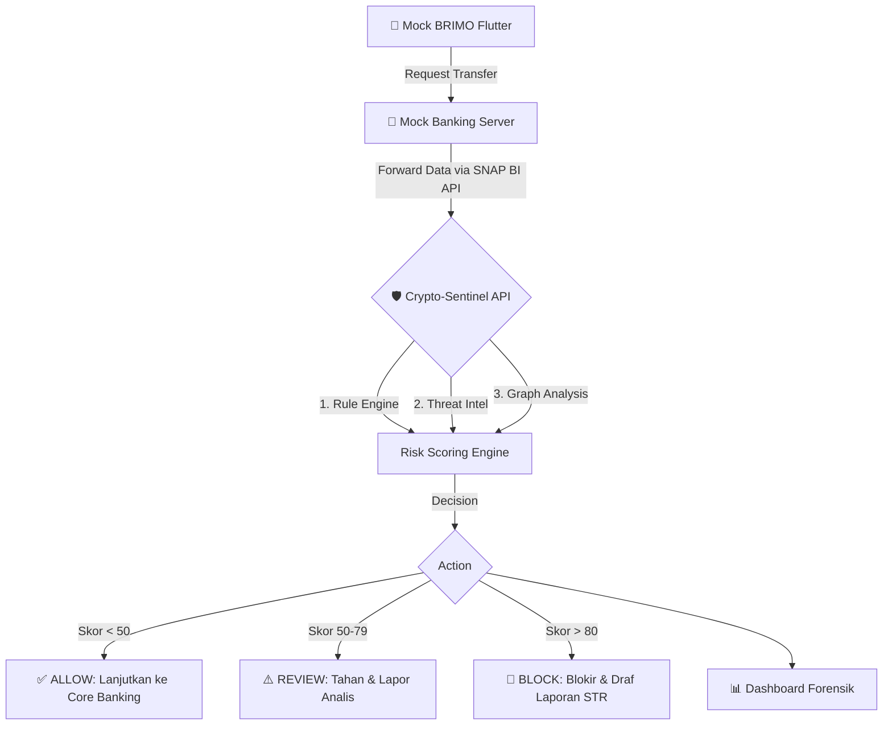

# 🛡️ Crypto-Sentinel API

**Security Middleware Layer for Fraud Detection, Anti-Money Laundering, and Crypto Transaction Monitoring.**

Proyek ini adalah bagian dari kompetisi **Digdaya PIDI x Hackathon 2026** oleh Tim **EXPRESSO**. Crypto-Sentinel berfungsi sebagai *Smart Circuit Breaker* berbasis API yang memotong jalur pelarian dana hasil kejahatan menuju *crypto exchange* internasional dalam hitungan milidetik (< 50ms). 

Sistem ini **bukanlah pengganti Core Banking**, melainkan **Security Middleware Layer** yang menyaring transaksi mencurigakan melalui integrasi standar **SNAP BI**.

---

## 🏗️ Arsitektur Sistem



---

## 👥 Tim Pengembang (EXPRESSO)
- **Billy Jonathan** (Ketua Tim) – Strategi Produk & Cyber Security.
- **Rifki Firmansyah** (AI Architect) – Model Graph Neural Networks (GNN) & Middleware Security API.
- **Desta Erlangga** (Backend & Integration Developer) – Mock Banking Server, Integrasi SNAP BI & ISO 20022.
- **Aam Setiana** (Frontend & Product Analyst) – Desain UI/UX & Dashboard Forensik.

---

## 🚀 Status Saat Ini & Roadmap (Checklist)

Saat ini, kita sedang berada di **Tahap 8: Integrasi dengan Tim**. *Middleware API* dasar sudah berjalan, dan fokus utama saat ini adalah menyambungkan seluruh komponen aplikasi.

### Fase 1: MVP & Fondasi (Selesai) ✅
- [x] Setup FastAPI Middleware.
- [x] Endpoint Analisis Transaksi (`/analyze-transaction`).
- [x] *Rule-Based Risk Scoring* dasar.
- [x] Simulator Data *Threat Intelligence*.
- [x] Simulasi Transaksi (Mule Account, Balance Drained).
- [x] *Explainable Risk Reasoning* sederhana.

### Fase 2: Integrasi Komponen (Sedang Dikerjakan) ⏳
- [ ] Implementasi CORS di FastAPI agar bisa diakses Dashboard.
- [ ] Menyepakati format kontrak JSON standar untuk semua layanan.
- [ ] Uji coba *request* dari Flutter Mock BRIMO ke Mock Banking Server.
- [ ] Uji coba integrasi Mock Banking Server ke Crypto-Sentinel API.
- [ ] Uji coba *fetch* data ke *Dashboard Forensik* (endpoint `/alerts`, `/statistics`).
- [ ] Setup *Persistent Database* (SQLite/PostgreSQL) agar log transaksi tidak hilang.

### Deployment Render
Repository ini sudah disiapkan untuk deploy ke Render sebagai public API.

1. Buat Web Service baru di Render dari repo ini.
2. Render akan membaca [render.yaml](render.yaml) untuk `buildCommand` dan `startCommand`.
3. Endpoint utama bisa diakses dari `/`, `/analyze-transaction`, `/alerts`, dan `/statistics`.

### Quick Start Lokal
Kalau ingin menjalankan secara lokal, pakai:

```bash
uvicorn app.main:app --reload
```

Kalau frontend dashboard ada di domain tertentu, set `CORS_ORIGINS` di environment, misalnya:

```bash
CORS_ORIGINS=https://dashboard.example.com,https://app.example.com
```

Jika ingin benar-benar dibuka sebagai open source project, repo ini sudah menyertakan lisensi di [LICENSE](LICENSE).

### Fase 3: Peningkatan Indikator Risiko (15 Indikator Utama) 📅
*Behavioral Signals*
- [ ] 1. *Transaction Velocity* (Transaksi berulang secara cepat).
- [ ] 2. *Odd-Hour Activity* (Aktivitas anomali di jam tidak wajar).
- [ ] 3. *Dormant Account Activation* (Rekening tidur tiba-tiba aktif).
- [ ] 4. *Profile Anomaly* (Penyimpangan dari perilaku transaksi normal pengguna).
- [x] 5. *Balance Drained* (Saldo langsung terkuras setelah transaksi masuk).

*Relational Graph Intelligence*
- [x] 6. *Mule Ring Detection* (Banyak akun mengirim dana ke satu akun penampung).
- [ ] 7. *Layering Detection* (Dana berpindah secara berantai untuk mengaburkan jejak).
- [x] 8. *Blacklisted Wallet Linkage* (Keterkaitan dengan dompet kripto yang masuk daftar hitam).
- [ ] 9. *Fan-Out Pattern* (Satu akun mendistribusikan dana ke banyak akun).
- [ ] 10. *Circular Transaction* (Dana diputar dan kembali ke akun awal).

*Purpose & Transaction Signals*
- [ ] 11. *Purpose Mismatch* (Tujuan transfer tidak sesuai dengan profil pengirim/penerima).
- [ ] 12. *Ledger Mismatch* (Ketidaksesuaian atau anomali pada pencatatan *ledger*).
- [ ] 13. *Crypto Cash-Out Pattern* (Uang masuk ke *mule* dan langsung keluar ke bursa kripto).

*Technical Signals*
- [ ] 14. *Geo/IP Anomaly* (Akses dari lokasi yang tidak wajar atau menggunakan VPN/Proxy).
- [ ] 15. *Device Anomaly* (Penggantian perangkat tiba-tiba atau *device fingerprint* mencurigakan).

### Fase 4: *Advanced Intelligence* & GNN (Future Work) 🚀
- [ ] Integrasi model Machine Learning Baseline (Random Forest/XGBoost).
- [ ] *Graph Feature Engineering* (PageRank, Centrality).
- [ ] *Graph Neural Network (GNN)* Prototype untuk *Fraud Ring Detection*.
- [ ] *Explainable AI (XAI)* terintegrasi dengan visualisasi SHAP di Dashboard.

---

## 🔌 Tata Cara Integrasi Sistem

Berikut adalah panduan bagi seluruh anggota tim untuk mengintegrasikan layanannya masing-masing dengan ekosistem Crypto-Sentinel.

### 1. Integrasi Flutter Mock BRIMO 📱
Aplikasi Flutter bertindak sebagai *frontend* nasabah. Aplikasi ini **tidak langsung memanggil Crypto-Sentinel**, melainkan mengirim permintaan ke **Mock Banking Server**.
* **Endpoint Tujuan**: URL Mock Banking Server (e.g., `POST /api/v1/transfer`)
* **Payload Format**: Harus memuat rincian transaksi lengkap sesuai simulasi ISO 20022.
* **Response Handling**: Menampilkan pesan sukses atau gagal (misal: "Transaksi diblokir karena indikasi penipuan").

### 2. Integrasi Mock Banking Server (Database Bank) 🏦
Server ini menyimulasikan sistem *Core Banking*. Saat ada *request* transfer masuk, sistem bank harus memanggil API Crypto-Sentinel untuk verifikasi keamanan sebelum memutasi database.
* **Alur**: Terima *request* dari Flutter ➔ Panggil `POST /analyze-transaction` (Crypto-Sentinel) ➔ Jika `ALLOW`, jalankan mutasi database ➔ Kembalikan *response* ke Flutter.
* **Format Request ke Sentinel**:
  ```json
  {
    "senderAccount": "A001",
    "destinationAccount": "C666666666",
    "type": "TRANSFER",
    "amount": 5000000,
    "oldbalanceOrg": 5000000,
    "newbalanceOrig": 0
  }
  ```
* **Contoh Response dari Sentinel**:
  ```json
  {
    "risk_score": 85,
    "risk_level": "HIGH",
    "decision": "BLOCK",
    "reason": ["Threat Intel Match", "Balance Drained"]
  }
  ```

### 3. Integrasi Dashboard Forensik 📊
Dashboard bertugas menampilkan *monitoring* secara *real-time* kepada analis bank. 
* **CORS**: API FastAPI Crypto-Sentinel harus telah dikonfigurasi dengan *CORS Middleware* yang mengizinkan origin domain dari Dashboard.
* **Endpoint yang digunakan**:
  * `GET /alerts`: Mengambil daftar peringatan ancaman risiko tinggi secara *real-time*.
  * `GET /statistics`: Mengambil ringkasan aktivitas (jumlah *ALLOW*, *BLOCK*, total nilai uang terselamatkan).
  * `GET /logs`: Mengambil riwayat lengkap transaksi tersaring.
  * `GET /graph` atau `/demo-graph`: Memuat visualisasi jaringan rekening untuk fitur *Explainable AI*.

---

## 📖 Referensi API (Endpoints Utama)

| Method | Endpoint | Deskripsi |
|---|---|---|
| `GET` | `/` | Health check (Status API). |
| `POST` | `/analyze-transaction` | Endpoint utama deteksi risiko transaksi. |
| `GET` | `/threat-intel` | Mengambil data watchlist simulasi. |
| `GET` | `/alerts` | Mengambil daftar transaksi terblokir / berisiko. |
| `GET` | `/statistics` | Mengambil data metrik performa sistem. |
| `GET` | `/graph` | Data relasional GNN (untuk visualisasi). |
| `POST` | `/simulate-demo` | Menjalankan skenario *money laundering* tes. |

**Catatan Khusus Arsitektur Keputusan:**
Sistem ini menggunakan algoritma berbasis *Rule-Engine* sebagai penentu akhir (*Final Decision Maker*). Machine Learning dan GNN hanya bertugas memberikan skor probabilitas *fraud* (sebagai *Intelligence Support*) guna memastikan setiap pemblokiran dana bisa dijelaskan secara logis kepada nasabah maupun otoritas (PPATK / OJK).