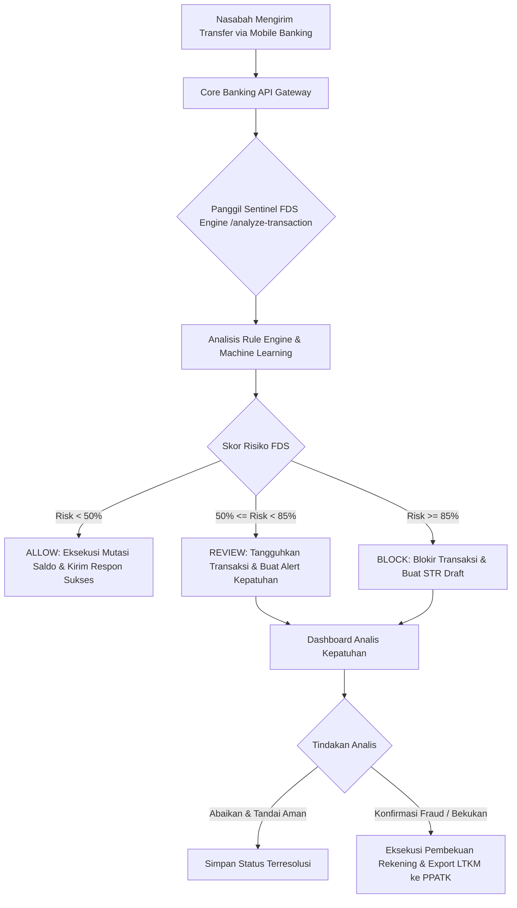

# 03 - Business Process & Workflow Specifications

## 1. End-to-End Business Flow Diagram

## 2. Deskripsi Tahapan Proses Bisnis

### Tahap 1: Inisiasi & Interception Transaksi
* Nasabah memasukkan parameter transfer (rekening pengirim, rekening penerima, nominal, metode BI-FAST).
* Core Banking menghentikan sementara proses mutasi dan mengirim payload transaksi ke Sentinel FDS.

### Tahap 2: Evaluasi Keamanan Real-Time
* **Step 2.1**: Verifikasi profil risiko pengirim & penerima.
* **Step 2.2**: Pencocokan dengan *Threat Intelligence Blacklist*.
* **Step 2.3**: Inferensi *Random Forest Model* & *GNN Graph Metrics*.
* **Step 2.4**: Perhitungan *Hybrid Fusion Risk Score*.

### Tahap 3: Eksekusi Keputusan & Respon
* **Keputusan ALLOW**: Core Banking menyelesaikan transaksi, resi sukses ditampilkan ke nasabah.
* **Keputusan REVIEW**: Core Banking menangguhkan dana, resi "Transfer Ditangguhkan" ditampilkan, Alert kuning dikirim ke Dasbor.
* **Keputusan BLOCK**: Core Banking menggagalkan transaksi, pesan pemblokiran FDS ditampilkan, Alert merah & Draft STR dibuat.

### Tahap 4: Investigasi & Pelaporan Kepatuhan
* Analis Kepatuhan meneliti graf jaringan GNN di dasbor.
* Analis memilih untuk menyelesaikan (*Resolve*) atau meneruskan Laporan Transaksi Keuangan Mencurigakan (LTKM) ke PPATK.
