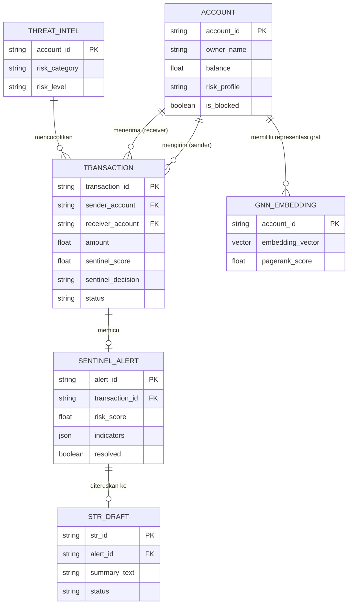

# 05 - Conceptual Entity Relationship Diagram (ERD)

## 1. Overview Konseptual Entitas
Sistem Crypto-Sentinel 2026 berpusat pada hubungan antara **Rekening Nasabah (Accounts)**, **Transaksi Financial (Transactions)**, **Ancaman Intelijen (Threat Intel)**, **Alert FDS (Sentinel Alerts)**, dan **Laporan Keuangan Mencurigakan (STR Drafts)**.

## 2. Diagram ERD Konseptual (Mermaid)

## 3. Penjelasan Hubungan Entitas
1. **Account -> Transaction**: Satu rekening nasabah dapat melakukan banyak transaksi baik sebagai pengirim (*sender*) maupun penerima (*receiver*).
2. **Transaction -> Sentinel Alert**: Transaksi yang ditandai berrisiko (`REVIEW` atau `BLOCK`) akan menghasilkan 1 baris entitas Alert.
3. **Sentinel Alert -> STR Draft**: Alert dengan keputusan `BLOCK` secara otomatis membuat 1 draft laporan STR (LTKM).
4. **Threat Intel -> Transaction**: Rekening tujuan transaksi dicocokkan dengan entitas intelijen ancaman (*blacklist/mule*).
5. **Account -> GNN Embedding**: Setiap entitas rekening diekstrak fitur grafisnya menjadi vektor embedding 128-dimensi.
