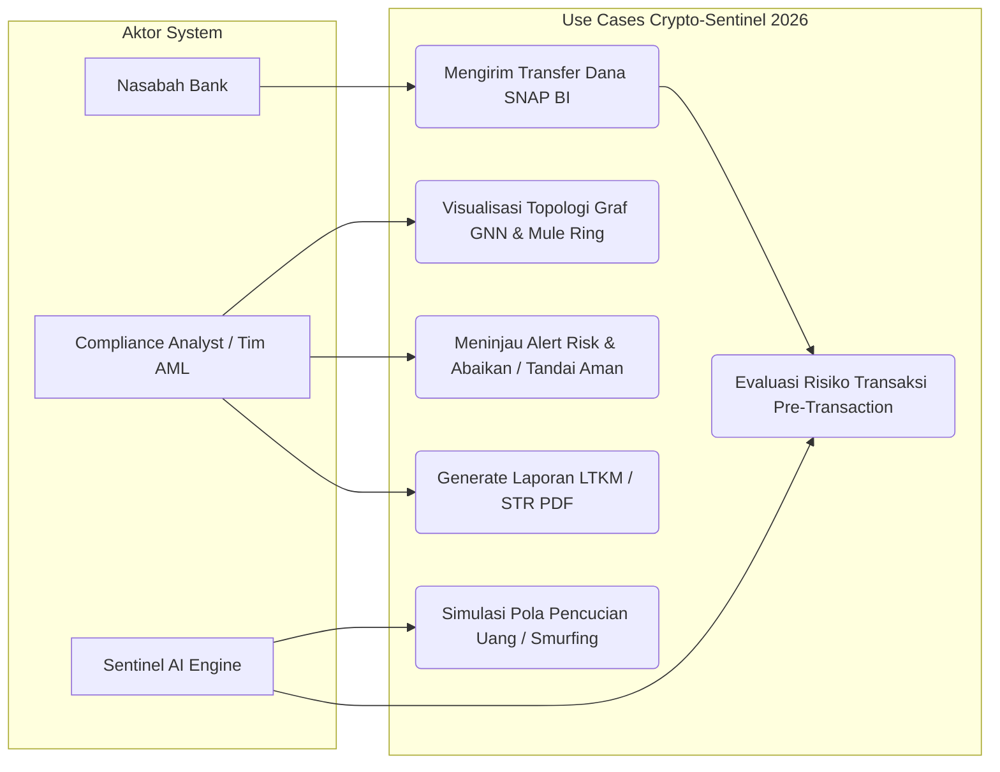

# 09 - Use Case Specification & Diagrams

## 1. Use Case Diagram (Mermaid)

## 2. Tabel Spesifikasi Use Case Utama

### Use Case UC-02: Evaluasi Risiko Transaksi Pre-Transaction
* **Aktor Utama**: Sentinel FDS AI Engine
* **Pre-condition**: Payload transfer diterima via endpoint `POST /analyze-transaction`.
* **Main Flow**:
  1. Engine membaca data pengirim, penerima, nominal, dan IP address.
  2. Engine mengecek pencocokan *Threat Intelligence Blacklist*.
  3. Engine mengeksekusi inferensi model *Random Forest* & *GNN Embeddings*.
  4. Engine menghitung *Hybrid Risk Score*.
  5. Engine mengembalikan keputusan (`ALLOW`, `REVIEW`, `BLOCK`).
* **Post-condition**: Keputusan dikirimkan ke Core Banking API untuk mengeksekusi atau membatalkan mutasi saldo.

### Use Case UC-04: Meninjau Alert Risk & Resolve
* **Aktor Utama**: Compliance Analyst / Tim AML
* **Pre-condition**: Alert berrisiko (`REVIEW`/`BLOCK`) tampil di Dasbor Web.
* **Main Flow**:
  1. Analis melihat detail indikator risiko dan nilai SHAP explainability.
  2. Analis menekan tombol "Abaikan & Tandai Aman".
  3. Sistem mengirimkan request `POST /api/v1/sentinel/alerts/resolve/{tx_id}`.
  4. ID Alert disimpan dalam daftar terresolusi (DB & LocalStorage) dan dihapus permanen dari daftar aktif.
* **Post-condition**: Jumlah ancaman aktif berkurang, status tersimpan permanen.
