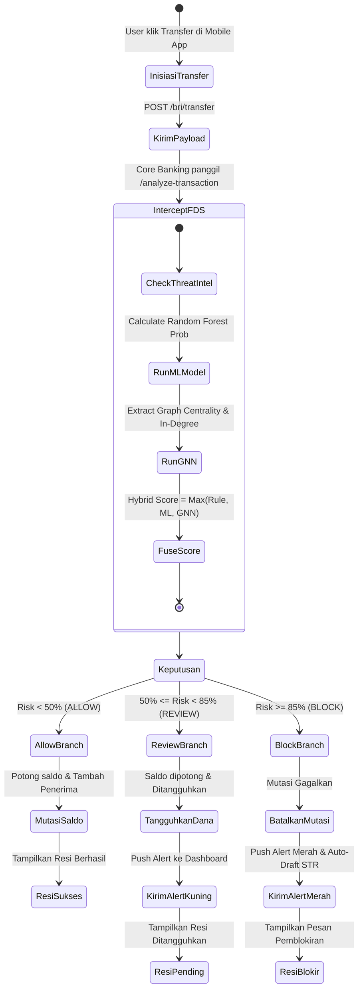
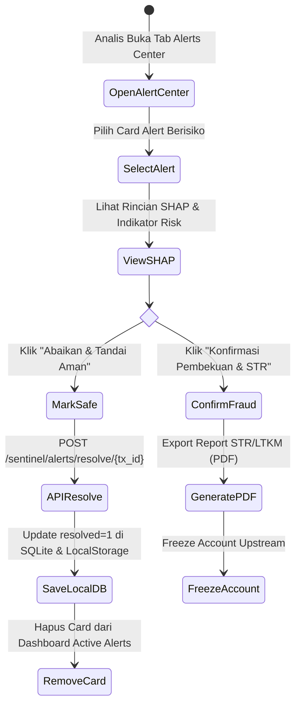

# 10 - Activity Diagrams

## 1. Activity Diagram: Transfer Processing & Interception

```mermaid
stateDiagram-v2
    [*] --> InisiasiTransfer: User klik Transfer di Mobile App
    InisiasiTransfer --> KirimPayload: POST /bri/transfer
    KirimPayload --> InterceptFDS: Core Banking panggil /analyze-transaction
    
    state InterceptFDS {
        [*] --> CheckThreatIntel
        CheckThreatIntel --> RunMLModel: Calculate Random Forest Prob
        RunMLModel --> RunGNN: Extract Graph Centrality & In-Degree
        RunGNN --> FuseScore: Hybrid Score = Max(Rule, ML, GNN)
        FuseScore --> [*]
    }

    InterceptFDS --> Keputusan
    
    state Keputusan <<choice>>
    Keputusan --> AllowBranch: Risk < 50% (ALLOW)
    Keputusan --> ReviewBranch: 50% <= Risk < 85% (REVIEW)
    Keputusan --> BlockBranch: Risk >= 85% (BLOCK)

    AllowBranch --> MutasiSaldo: Potong saldo & Tambah Penerima
    MutasiSaldo --> ResiSukses: Tampilkan Resi Berhasil

    ReviewBranch --> TangguhkanDana: Saldo dipotong & Ditangguhkan
    TangguhkanDana --> KirimAlertKuning: Push Alert ke Dashboard
    KirimAlertKuning --> ResiPending: Tampilkan Resi Ditangguhkan

    BlockBranch --> BatalkanMutasi: Mutasi Gagalkan
    BatalkanMutasi --> KirimAlertMerah: Push Alert Merah & Auto-Draft STR
    KirimAlertMerah --> ResiBlokir: Tampilkan Pesan Pemblokiran
```

## 2. Activity Diagram: Resolve Alert & Compliance Action

```mermaid
stateDiagram-v2
    [*] --> OpenAlertCenter: Analis Buka Tab Alerts Center
    OpenAlertCenter --> SelectAlert: Pilih Card Alert Berisiko
    SelectAlert --> ViewSHAP: Lihat Rincian SHAP & Indikator Risk
    
    state DecisionChoice <<choice>>
    ViewSHAP --> DecisionChoice
    
    DecisionChoice --> MarkSafe: Klik "Abaikan & Tandai Aman"
    DecisionChoice --> ConfirmFraud: Klik "Konfirmasi Pembekuan & STR"
    
    MarkSafe --> APIResolve: POST /sentinel/alerts/resolve/{tx_id}
    APIResolve --> SaveLocalDB: Update resolved=1 di SQLite & LocalStorage
    SaveLocalDB --> RemoveCard: Hapus Card dari Dashboard Active Alerts
    
    ConfirmFraud --> GeneratePDF: Export Report STR/LTKM (PDF)
    GeneratePDF --> FreezeAccount: Freeze Account Upstream
```
