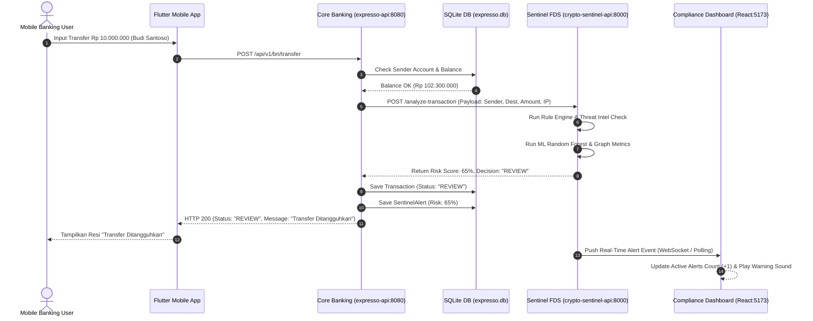
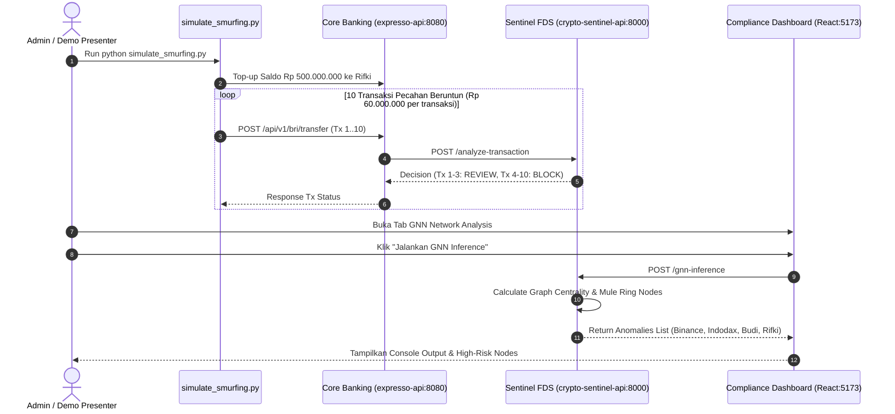

# 11 - Sequence Diagrams

## 1. Sequence Diagram: Pre-Transaction Real-Time Analysis

```mermaid
sequenceDiagram
    autonumber
    actor MobileUser as Mobile Banking User
    participant App as Flutter Mobile App
    participant CoreAPI as Core Banking (expresso-api:8080)
    participant DB as SQLite DB (expresso.db)
    participant FDS as Sentinel FDS (crypto-sentinel-api:8000)
    participant Dashboard as Compliance Dashboard (React:5173)

    MobileUser->>App: Input Transfer Rp 10.000.000 (Budi Santoso)
    App->>CoreAPI: POST /api/v1/bri/transfer
    CoreAPI->>DB: Check Sender Account & Balance
    DB-->>CoreAPI: Balance OK (Rp 102.300.000)
    
    CoreAPI->>FDS: POST /analyze-transaction (Payload: Sender, Dest, Amount, IP)
    FDS->>FDS: Run Rule Engine & Threat Intel Check
    FDS->>FDS: Run ML Random Forest & Graph Metrics
    FDS-->>CoreAPI: Return Risk Score: 65%, Decision: "REVIEW"
    
    CoreAPI->>DB: Save Transaction (Status: "REVIEW")
    CoreAPI->>DB: Save SentinelAlert (Risk: 65%)
    CoreAPI-->>App: HTTP 200 (Status: "REVIEW", Message: "Transfer Ditangguhkan")
    
    App-->>MobileUser: Tampilkan Resi "Transfer Ditangguhkan"
    
    FDS->>Dashboard: Push Real-Time Alert Event (WebSocket / Polling)
    Dashboard-->>Dashboard: Update Active Alerts Count (+1) & Play Warning Sound
```

## 2. Sequence Diagram: Automated Smurfing Simulation

```mermaid
sequenceDiagram
    autonumber
    actor Admin as Admin / Demo Presenter
    participant Script as simulate_smurfing.py
    participant CoreAPI as Core Banking (expresso-api:8080)
    participant FDS as Sentinel FDS (crypto-sentinel-api:8000)
    participant Dashboard as Compliance Dashboard (React:5173)

    Admin->>Script: Run python simulate_smurfing.py
    Script->>CoreAPI: Top-up Saldo Rp 500.000.000 ke Rifki
    
    loop 10 Transaksi Pecahan Beruntun (Rp 60.000.000 per transaksi)
        Script->>CoreAPI: POST /api/v1/bri/transfer (Tx 1..10)
        CoreAPI->>FDS: POST /analyze-transaction
        FDS-->>CoreAPI: Decision (Tx 1-3: REVIEW, Tx 4-10: BLOCK)
        CoreAPI-->>Script: Response Tx Status
    end
    
    Admin->>Dashboard: Buka Tab GNN Network Analysis
    Admin->>Dashboard: Klik "Jalankan GNN Inference"
    Dashboard->>FDS: POST /gnn-inference
    FDS->>FDS: Calculate Graph Centrality & Mule Ring Nodes
    FDS-->>Dashboard: Return Anomalies List (Binance, Indodax, Budi, Rifki)
    Dashboard-->>Admin: Tampilkan Console Output & High-Risk Nodes
```
