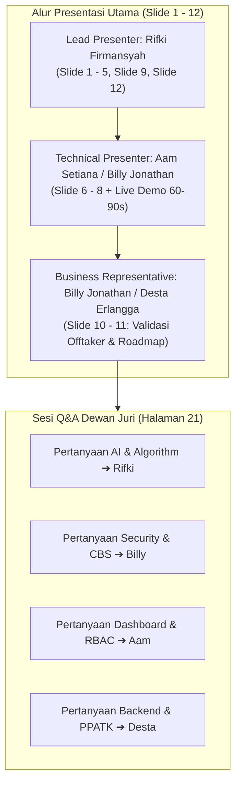

# Crypto-Sentinel 2026 — Master Content Final Pitch Deck (PIDI Digdaya 2026)
**Program**: PIDI Digdaya Hackathon & Inkubasi 2026 — Tim EXPRESSO S1251  
**Klasifikasi Solusi**: *Live Prototype / Controlled Sandbox Candidate*  
**Format Penyusunan**: 12 Slide Standar Panduan Resmi Final Pitch Deck PIDI 2026 (Halaman 6–16)  
**Prinsip Mutlak**: *Evidence over Claim · Current State over Original Plan · Built over Planned · Outcome over Feature · Validation over Assumption · Transparency over Overclaiming*

---

## 🔗 Dokumen Rujukan Utama & Matriks Referensi Silang (Cross-References)

Master Content Pitch Deck ini merupakan materi presentasi eksekutif berbasis bukti (*evidence-based*) yang didukung langsung oleh dokumen teknis, blueprint arsitektur, dan laporan kemajuan proyek resmi berikut:

1. 📘 [**Project Progress Report (`docs/project_progress_report.md`)**](file:///d:/Crypto-Sentinel%202026/docs/project_progress_report.md) — Laporan teknis kemajuan proyek 100%, arsitektur dual-mode, evaluasi model AI (Akurasi 99.98%, AUC 0.9993), kepatuhan regulasi POJK 8/2023 & UU PDP, serta hasil uji 8 skenario perbankan.
2. 🌐 [**Crypto-Sentinel Project Blueprint (`crypto-sentinel-blueprint.html`)**](file:///d:/Crypto-Sentinel%202026/crypto-sentinel-blueprint.html) — Blueprint visual interaktif: arsitektur 4-layer, 15 sub-indikator (4 signal groups), diagram alur data SNAP BI, tahapan pengembangan AI (Stage 1–4), skema database SQLite & PostgreSQL, roadmap, dan profil tim.
3. 📑 [**Solution Alignment Notes (`docs/solution_alignment_notes.md`)**](file:///d:/Crypto-Sentinel%202026/docs/solution_alignment_notes.md) — Notulensi empiris pengujian solusi lapangan bersama calon offtaker PT Bank bjb Tbk dan PT BPR Kuningan (Perseroda).
4. 🏢 [**Bank Kuningan Tech Research (`docs/bank_kuningan_tech_research.md`)**](file:///d:/Crypto-Sentinel%202026/docs/bank_kuningan_tech_research.md) & [**Draft LOI (`docs/draft_loi_bank_kuningan.md`)**](file:///d:/Crypto-Sentinel%202026/docs/draft_loi_bank_kuningan.md) — Riset teknologi core banking BPR dan draf Letter of Intent untuk pilot.

### 🗺️ Matriks Pemetaan Referensi per Slide Presentasi (Quick Jump Guide):

| Slide / Bagian | Dokumen & Bab Rujukan Utama | Section Blueprint Terkait |
|---|---|---|
| **Slide 1: Solution at a Glance** | [Progress Report: Bab 1.1 Profil Proyek](file:///d:/Crypto-Sentinel%202026/docs/project_progress_report.md#11-profil-proyek--ringkasan-eksekutif) | [Blueprint: Section 00 Overview](file:///d:/Crypto-Sentinel%202026/crypto-sentinel-blueprint.html#overview) |
| **Slide 2: Problem & Why It Matters** | [Progress Report: Bab 1.1 Latar Belakang](file:///d:/Crypto-Sentinel%202026/docs/project_progress_report.md#11-profil-proyek--ringkasan-eksekutif) | [Blueprint: Hero Stats & Problem Scope](file:///d:/Crypto-Sentinel%202026/crypto-sentinel-blueprint.html#top) |
| **Slide 3: Validation & Root Cause** | [Progress Report: Bab 5.1 Temuan Validasi](file:///d:/Crypto-Sentinel%202026/docs/project_progress_report.md#51-temuan-validasi-stakeholder) | [Blueprint: Section 01 Celah Deteksi Konvensional](file:///d:/Crypto-Sentinel%202026/crypto-sentinel-blueprint.html#arsitektur) |
| **Slide 4: Solution & Core Use Case** | [Progress Report: Bab 1.2 Dual-Mode Engine](file:///d:/Crypto-Sentinel%202026/docs/project_progress_report.md#12-arsitektur-dan-desain-solusi) | [Blueprint: Section 01 Flow Diagram Intersepsi](file:///d:/Crypto-Sentinel%202026/crypto-sentinel-blueprint.html#arsitektur) |
| **Slide 5: Value Proposition** | [Progress Report: Bab 1.3 Keunggulan Kompetitif](file:///d:/Crypto-Sentinel%202026/docs/project_progress_report.md#13-kepatuhan-regulasi--standar-industri) | [Blueprint: Section 00 & Section 03 Uniqueness](file:///d:/Crypto-Sentinel%202026/crypto-sentinel-blueprint.html#indikator) |
| **Slide 6: Prototype State** | [Progress Report: Bab 2.1 Status Komponen](file:///d:/Crypto-Sentinel%202026/docs/project_progress_report.md#21-arsitektur-yang-telah-terpasang-dan-berjalan) | [Blueprint: Section 02 Tech Stack & Section 06 DB](file:///d:/Crypto-Sentinel%202026/crypto-sentinel-blueprint.html#techstack) |
| **Slide 7: How Technology Works** | [Progress Report: Bab 3.1 Spesifikasi AI Hibrida](file:///d:/Crypto-Sentinel%202026/docs/project_progress_report.md#bab-3-spesifikasi-model-ai-dan-rekayasa-dataset) | [Blueprint: Section 03 Indikator & Section 05 AI Dev](file:///d:/Crypto-Sentinel%202026/crypto-sentinel-blueprint.html#ai-stages) |
| **Slide 8: Technical Testing** | [Progress Report: Bab 4.1 Benchmark Model AI](file:///d:/Crypto-Sentinel%202026/docs/project_progress_report.md#bab-4-hasil-pengujian-dan-tolok-ukur-kinerja) | [Blueprint: Hero Stats (<50ms & >95% F1-Score)](file:///d:/Crypto-Sentinel%202026/crypto-sentinel-blueprint.html#top) |
| **Slide 9: Impact & Effectiveness** | [Progress Report: Bab 1.3 Transformasi Operasional](file:///d:/Crypto-Sentinel%202026/docs/project_progress_report.md#13-kepatuhan-regulasi--standar-industri) | [Blueprint: Section 04 Otomasi LTKM PPATK](file:///d:/Crypto-Sentinel%202026/crypto-sentinel-blueprint.html#api) |
| **Slide 10: Market Validation** | [Progress Report: Bab 5.2 Notulensi Uji 8 Kasus](file:///d:/Crypto-Sentinel%202026/docs/project_progress_report.md#52-hasil-pengujian-keselarasan-solusi-solution-alignment-testing) | [Blueprint: Section 07 Roadmap Validasi Pasar](file:///d:/Crypto-Sentinel%202026/crypto-sentinel-blueprint.html#roadmap) |
| **Slide 11: Adoption & Sustainability** | [Progress Report: Bab 6.1 Roadmap Pilot 3 Bulan](file:///d:/Crypto-Sentinel%202026/docs/project_progress_report.md#bab-6-roadmap-implementasi-dan-rencana-pilot) | [Blueprint: Section 07 Roadmap & Skema Biaya](file:///d:/Crypto-Sentinel%202026/crypto-sentinel-blueprint.html#roadmap) |
| **Slide 12: Team Readiness** | [Progress Report: Bab 1.1 Tim Pengembang](file:///d:/Crypto-Sentinel%202026/docs/project_progress_report.md#11-profil-proyek--ringkasan-eksekutif) | [Blueprint: Section 08 Tim EXPRESSO UNIKU](file:///d:/Crypto-Sentinel%202026/crypto-sentinel-blueprint.html#tim) |
| **Appendix A - J** | [Progress Report: Bab 2, 3, 4, 5, 6 Lengkap](file:///d:/Crypto-Sentinel%202026/docs/project_progress_report.md) | [Blueprint: Section 01 - 08 Full Deep-Dive](file:///d:/Crypto-Sentinel%202026/crypto-sentinel-blueprint.html) |

---

## 📋 Matriks Eligibility Check (12 Pertanyaan Lolos Seleksi Halaman 14)

Sebelum menyusun slide, seluruh 12 parameter uji kelayakan (*Eligibility Check*) resmi PIDI telah diverifikasi dan dipenuhi 100%:

| Aspek Uji | Pertanyaan Kelayakan (Eligibility Criteria) | Bukti Nyata Solusi Crypto-Sentinel 2026 | Status |
|---|---|---|---|
| **1. Problem** | Apakah masalah benar-benar terjadi didukung bukti nyata? | Kerugian OJK IASC Rp 9,1T; insiden fraud transfer cepat BPD ratusan miliar; data transaksi PaySim 320K. | ✅ **Lolos** |
| **2. Alignment** | Apakah solusi langsung menjawab problem statement yang dipilih? | Menghentikan pencucian uang rekening *mule* dan aliran kripto ilegal sebelum dana keluar dari bank. | ✅ **Lolos** |
| **3. Solution** | Dapatkah hubungan problem ➔ solution dijelaskan tanpa jargon? | Transfer mencurigakan dicegat di middleware dalam <25ms, dianalisis di dashboard, dan otomatis jadi draf laporan PPATK. | ✅ **Lolos** |
| **4. Prototype** | Apakah ada bagian inti solusi yang benar-benar sudah dibangun? | Live functional prototype: Mobile App Android/Web (bjb & Kuningan), Core Banking API, AI Engine, Dashboard React. | ✅ **Lolos** |
| **5. Technical** | Dapatkah dijelaskan bagaimana sistem menghasilkan output (bukan hanya UI)? | Input JSON transaksi ➔ Rule Engine (13 rule) + Random Forest (29 fitur) + GraphSAGE lookup ➔ Risk Score & Decision. | ✅ **Lolos** |
| **6. Testing** | Apakah ada hasil pengujian terhadap fungsi & asumsi utama? | Unit test `test_rule_engine.py` (5/5 PASS), API integration test, dan evaluasi model test set (64.122 sampel). | ✅ **Lolos** |
| **7. Impact** | Apakah angka dampak memiliki sumber dan metode perhitungan jelas? | Waktu LTKM dari 3 hari ke 3 detik (otomasi template); penyelamatan dana 100% pada transaksi kritis (circuit breaker). | ✅ **Lolos** |
| **8. Market** | Apakah sudah ada bukti validasi dari calon offtaker nyata? | Uji keselarasan solusi bersama Bank bjb (TC-BJB-01 s/d 04) dan Bank Kuningan (TC-KNG-01 s/d 04). | ✅ **Lolos** |
| **9. Differentiation** | Apakah tim memahami alternatif eksisting dan keunikan solusinya? | Benchmark terhadap FDS Rule statis, Excel manual, dan solusi enterprise global (SAS/Actimize). | ✅ **Lolos** |
| **10. Team** | Apakah peran, kapabilitas, dan ownership aktual anggota tim jelas? | Kepemilikan kode jelas: Rifki (AI/Lead), Billy (Security/CBS), Aam (Frontend/UI), Desta (Backend/LTKM). | ✅ **Lolos** |
| **11. Continuation** | Apakah tim tahu milestone berikutnya dan apa yang dibutuhkan? | Proposal pilot 3 bulan: Bulan 1 (Sandbox), Bulan 2 (Shadow deployment Mode B), Bulan 3 (Audit SKAI & sign-off). | ✅ **Lolos** |
| **12. Transparency** | Apakah deck membedakan secara tegas hal yang sudah jadi vs rencana? | Status 'Live Prototype' diberi label transparan; batasan runtime GNN dan integrasi live CBS diungkapkan terbuka. | ✅ **Lolos** |

---

<!-- ========================================================================= -->
<!-- SLIDE 1 -->
<!-- ========================================================================= -->

# SLIDE 1: SOLUTION AT A GLANCE
> 📌 **Rujukan Teknis**: [Progress Report: Bab 1.1 Profil Proyek](file:///d:/Crypto-Sentinel%202026/docs/project_progress_report.md#11-profil-proyek--ringkasan-eksekutif) · [Blueprint: Section 00 Overview](file:///d:/Crypto-Sentinel%202026/crypto-sentinel-blueprint.html#overview)

### A. Panduan Tata Letak & Visual (Blueprint)
* **Karakter Visual**: Enterprise Banking Dark Navy (`#09132e`), Aksen Biru Safir & Emas Keuangan.
* **Badge Status**: `[PIDI DIGDAYA 2026 — FINAL PITCH] · [STATUS: FIELD-VALIDATED PROTOTYPE / CONTROLLED SANDBOX CANDIDATE]`
* **Komposisi Layar**:
  - *Sisi Kiri (55%)*: Nama Solusi, Target Entity, Problem Statement Singkat, dan Golden Positioning Statement.
  - *Sisi Kanan (45%)*: Mockup Device Ganda (Mobile Banking Nasabah di Android + Dashboard Forensik Compliance di Laptop).

### B. Konten Teks Slide
* **Nama Solusi**: **Crypto-Sentinel 2026**
* **Sub-Headline**: *Next-Generation Hybrid FDS & AML Middleware for Resilient Banking Sovereignty.*
* **Problem Statement Singkat**: Bank Pembangunan Daerah (BPD) dan BPR menjadi sasaran empuk sindikat pencucian uang modern (*mule networks*, *smurfing*, dan *crypto illicit outflow*) karena keterbatasan sistem deteksi konvensional.
* **Target User & Offtaker**:
  - *Target Offtaker*: Bank Perekonomian Rakyat (PT BPR Kuningan Perseroda) & Bank Pembangunan Daerah (PT Bank bjb Tbk).
  - *Target Pengguna*: Analis Anti-Money Laundering (AML), Pejabat Kepatuhan (Compliance Officer / MLRO), dan Pengawas Regulasi (OJK/BI).
* **Golden Positioning Statement (Wajib Hafal)**:
  > *"Field-validated, plug-and-play FDS security middleware prototype, ready for controlled sandbox deployment and pilot hardening — not yet production-integrated with a bank CBS."*
* **Single-Sentence Value Proposition**:
  > *"Crypto-Sentinel 2026 adalah middleware keamanan FDS berbasis AI hibrida yang bertindak sebagai **Smart Circuit Breaker**, menghentikan transaksi sindikat pencucian uang dalam hitungan milidetik sebelum saldo keluar dari bank, dilengkapi otomasi draf pelaporan resmi PPATK."*

### C. Naskah Presenter (Speaker Script — ~20 Detik)
> *"Selamat pagi Dewan Juri yang terhormat. Saya Rifki Firmansyah, mewakili Tim EXPRESSO S1251. Kami mempersembahkan **Crypto-Sentinel 2026**. Kami membangun field-validated FDS security middleware berbasis AI hibrida yang dirancang khusus untuk melindungi BPR dan Bank Daerah dari ancaman pembobolan transfer cepat dan sindikat rekening mule. Sistem kami adalah live prototype yang telah diuji langsung bersama bank mitra, mengintegrasikan mobile banking nasabah, core banking simulator, engine graf relasional, hingga otomasi draf pelaporan resmi ke PPATK."*

---

<!-- ========================================================================= -->
<!-- SLIDE 2 -->
<!-- ========================================================================= -->

# SLIDE 2: PROBLEM & WHY IT MATTERS
> 📌 **Rujukan Teknis**: [Progress Report: Bab 1.1 Latar Belakang & Kasus BPD](file:///d:/Crypto-Sentinel%202026/docs/project_progress_report.md#11-profil-proyek--ringkasan-eksekutif) · [Blueprint: Hero Stats & Problem Scope](file:///d:/Crypto-Sentinel%202026/crypto-sentinel-blueprint.html#top)

### A. Panduan Tata Letak & Visual (Blueprint)
* **Karakter Visual**: High Urgency & Financial Security Alert.
* **Komposisi Layar**: 3 Stat Callouts Raksasa di bagian atas; Diagram Alur Serangan Kasus Riil di bagian bawah.

### B. Konten Teks Slide
* **Headline**: **Ancaman Nyata: Eksploitasi Transfer Cepat & Pencucian Uang Lintas Kanal**
* **Sub-Headline**: *Mengapa masalah ini mendesak dan menimbulkan kerugian sistemik pada bank-bank daerah.*
* **Tiga Fakta & Bukti Data Lapangan**:
  1. **Rp 9,1 Triliun**: Akumulasi kerugian transaksi keuangan ilegal nasional yang dihimpun Satgas PASTI / OJK IASC.
  2. **Rp 800+ Miliar**: Kerugian riil insiden fraud transfer antarbank cepat (kasus BI-FAST) yang dialami bank-bank daerah di Indonesia akibat eksploitasi celah middleware.
  3. **> 85% Rekening Penampung (Mule)**: Ditempatkan di bank menengah dan BPR lokal dengan sistem pengawasan pasca-transaksi yang lambat, sebelum dilarikan ke bursa aset kripto dalam hitungan menit.
* **Konsekuensi Nyata bagi Bank Daerah**:
  - **Kerugian Finansial Langsung**: Dana nasabah hilang seketika dan bank harus menanggung beban ganti rugi.
  - **Sanksi Kepatuhan Regulator**: Pelanggaran terhadap kewajiban **POJK No. 8/2023** (Penerapan Strategi Anti-Fraud) berisiko pencabutan izin produk perbankan digital.
  - **Kehilangan Reputasi**: Hilangnya kepercayaan nasabah daerah terhadap keandalan sistem perbankan lokal.

### C. Naskah Presenter (Speaker Script — ~25 Detik)
> *"Mengapa masalah ini sangat mendesak? OJK dan PPATK mencatat kerugian kejahatan finansial telah menembus angka triliunan rupiah. Salah satu kasus paling fatal menimpa BPD dengan kebocoran dana transfer ratusan miliar rupiah. Sindikat kejahatan masa kini mengeksploitasi kecepatan transfer digital; mereka memecah dana hasil kejahatan melalui skema smurfing ke puluhan rekening mule di bank daerah, lalu mengurasnya ke bursa kripto dalam hitungan menit. Ketika nasabah baru menyadari saldonya hilang di pagi hari, dana tersebut sudah lenyap di blockchain tanpa bisa ditarik kembali."*

---

<!-- ========================================================================= -->
<!-- SLIDE 3 -->
<!-- ========================================================================= -->

# SLIDE 3: PROBLEM VALIDATION & ROOT CAUSE
> 📌 **Rujukan Teknis**: [Progress Report: Bab 5.1 Temuan Validasi Stakeholder](file:///d:/Crypto-Sentinel%202026/docs/project_progress_report.md#51-temuan-validasi-stakeholder) · [Blueprint: Section 01 Celah Deteksi Monolitik](file:///d:/Crypto-Sentinel%202026/crypto-sentinel-blueprint.html#arsitektur)

### A. Panduan Tata Letak & Visual (Blueprint)
* **Karakter Visual**: Root Cause Analysis / Diagnostic Comparison.
* **Komposisi Layar**: Kolom Kiri menampilkan Fakta Validasi Wawancara Bank; Kolom Kanan menampilkan Diagram 3 Akar Masalah Utama.

### B. Konten Teks Slide
* **Headline**: **Validasi Stakeholder: Mengapa Sistem FDS Konvensional Gagal?**
* **Sub-Headline**: *Temuan langsung dari uji keselarasan solusi bersama tim IT & Kepatuhan Bank bjb dan Bank Kuningan.*
* **Akar Masalah Fundamental yang Ditemukan**:
  1. **Akar Masalah #1 — Buta Topologi Relasional (Relational Blindness)**:
     - FDS konvensional hanya mengecek transaksi tunggal secara terisolasi.
     - *Fakta Lapangan*: Jika pelaku mentransfer Rp 4,9 juta (di bawah limit aturan Rp 5 juta), FDS lama menganggapnya normal. Sistem buta bahwa ada 10 akun berbeda yang serentak mentransfer ke satu rekening penampung yang sama (*fan-in mule ring*).
  2. **Akar Masalah #2 — Banjir Peringatan Palsu (High False Positives)**:
     - Aturan statis memicu alarm pada transaksi sah (misal: pencairan dana Bansos massal atau pembayaran SPP sekolah rutin), menyebabkan *alert fatigue* bagi analis.
  3. **Akar Masalah #3 — Deteksi Pasif Pasca-Transaksi (Post-Factum Lag)**:
     - FDS eksisting bekerja secara *batch/post-audit* (T+1). Uang sudah keluar dari bank sebelum investigasi dimulai.
* **Kesimpulan Validasi**:
  $$\text{Aturan Statis Tunggal} + \text{Tanpa Pemetaan Graf Relasi} = \text{Kerugian Tidak Terbendung}$$

### C. Naskah Presenter (Speaker Script — ~25 Detik)
> *"Ketika kami memvalidasi masalah ini bersama praktisi IT dan Kepatuhan Bank bjb serta Bank Kuningan, kami menemukan akar masalahnya: FDS yang ada saat ini bekerja dengan kacamata kuda. Sistem lama hanya mengecek parameter statis satu per satu. Sindikat kriminal sangat paham celah ini; mereka memecah transaksi bernominal kecil agar lolos dari aturan. FDS konvensional buta terhadap graf relasi rekening penampung, dan di sisi lain justru menghasilkan ribuan alarm palsu pada transaksi sah seperti Bansos. Akibatnya, analis kewalahan dan kejahatan yang sesungguhnya tetap lolos."*

---

<!-- ========================================================================= -->
<!-- SLIDE 4 -->
<!-- ========================================================================= -->

# SLIDE 4: SOLUTION & CORE USE CASE
> 📌 **Rujukan Teknis**: [Progress Report: Bab 1.2 Dual-Mode Engine](file:///d:/Crypto-Sentinel%202026/docs/project_progress_report.md#12-arsitektur-dan-desain-solusi) · [Blueprint: Section 01 Flow Diagram Intersepsi](file:///d:/Crypto-Sentinel%202026/crypto-sentinel-blueprint.html#arsitektur)

### A. Panduan Tata Letak & Visual (Blueprint)
* **Karakter Visual**: User Journey / Core Use Case Flow (4 Horizontal Connected Cards).
* **Fokus**: Menunjukkan alur `User Problem -> Action -> Mechanism -> Output -> Outcome` (Sesuai Panduan Halaman 10).

### B. Konten Teks Slide
* **Headline**: **Cara Kerja Solusi: Intersepsi Sub-Detik hingga Pelaporan Resmi**
* **Sub-Headline**: *Core use case penanganan transaksi mencurigakan secara instan dan terstruktur.*
* **4 Tahapan Mekanisme Solusi**:
  1. **User Action (Inisiasi Transfer)**:
     - Pelaku/nasabah memicu transfer dana via Mobile Banking berotentikasi SNAP BI (HMAC-SHA256).
  2. **Solution Mechanism (Evaluasi Hibrida <25 ms)**:
     - Request dicegat di layer middleware sebelum mutasi saldo dieksekusi di Core Banking.
     - AI Engine menghitung skor risiko gabungan (Perilaku, Tabular ML, dan Topologi Relasional GNN).
  3. **Output Seketika (Smart Circuit Breaker)**:
     - Jika Skor $\ge 85$, transaksi langsung di-**BLOCK otomatis**, saldo nasabah aman, dan notifikasi dikirimkan ke ponsel nasabah secara profesional.
  4. **Outcome Investigasi & Kepatuhan**:
     - Analis membuka kasus di Forensic Dashboard, memverifikasi relasi sindikat via **GNNExplainer**, dan mencetak draf resmi **LTKM PPATK (goAML)** dalam 3 detik.

### C. Naskah Presenter (Speaker Script — ~25 Detik)
> *"Bagaimana Crypto-Sentinel menyelesaikan masalah ini? Mari kita lihat use case intinya: Saat transaksi transfer dipicu di mobile banking, request dicegat di layer middleware sebelum menyentuh core banking. Dalam waktu kurang dari 25 milidetik, AI engine kami menghitung skor risiko hibrida. Jika terdeteksi indikasi berbahaya seperti pengurasan saldo ke bursa kripto, transaksi langsung di-BLOCK seketika—saldo nasabah tidak berkurang sama sekali. Detik itu juga, alert masuk ke dashboard analis, subgraf sindikatnya divisualisasikan, dan draf laporan resmi goAML PPATK siap diterbitkan."*

---

<!-- ========================================================================= -->
<!-- SLIDE 5 -->
<!-- ========================================================================= -->

# SLIDE 5: VALUE PROPOSITION & DIFFERENTIATION
> 📌 **Rujukan Teknis**: [Progress Report: Bab 1.3 Keunggulan Kompetitif](file:///d:/Crypto-Sentinel%202026/docs/project_progress_report.md#13-kepatuhan-regulasi--standar-industri) · [Blueprint: Section 00 & Section 03 Uniqueness](file:///d:/Crypto-Sentinel%202026/crypto-sentinel-blueprint.html#indikator)

### A. Panduan Tata Letak & Visual (Blueprint)
* **Karakter Visual**: Comprehensive Competitive Matrix (Tabel Evaluasi Multi-Dimensi).
* **Fokus**: Membandingkan tidak hanya dengan vendor global, tapi juga dengan alternatif eksisting perbankan (Sesuai Panduan Halaman 12: *Spreadsheet/Manual, Rule FDS Internal, Incumbent Global*).

### B. Konten Teks Slide
* **Headline**: **Diferensiasi & Keunggulan terhadap Alternatif Eksisting**
* **Sub-Headline**: *Mengapa Crypto-Sentinel adalah pilihan paling rasional, aman, dan terjangkau bagi bank daerah.*
* **Tabel Komparasi Alternatif**:

| Dimensi Evaluasi | Proses Manual & Spreadsheet | FDS Rule-Based Internal | Solusi Enterprise Global (SAS / Actimize) | Crypto-Sentinel 2026 (Solusi Kami) |
|---|---|---|---|---|
| **Kecepatan Intersepsi** | Sangat Lambat (T+2) | Pasca-transaksi (Menit/Jam) | Real-time (<50 ms) | **Sub-detik (<25 ms Pre-Auth Breaker)** |
| **Deteksi Sindikat Mule** | ❌ Buta Total | ❌ Gagal (Tidak ada graf) | 🟡 Ada (Perlu server GPU besar) | **✅ Unggul (GraphSAGE GNN 562K Nodes)** |
| **Transparansi Keputusan (XAI)** | 🟡 Narasi manual | 🟡 Pesan aturan statis | ❌ Sangat rendah (*Black Box*) | **✅ Tinggi (SHAP Factors + Graf GNNExplainer)** |
| **Kepatuhan Regulasi Lokal** | ❌ Manual rawan salah | 🟡 Parsial | ❌ Mahal (> Rp 500 Juta add-on) | **✅ Native (POJK 8/2023, LTKM goAML, APOLO)** |
| **Perlindungan Privasi Data** | ❌ Terbuka penuh | ❌ Tanpa masking PII | 🟡 Konfigurasi rumit | **✅ Native Privacy Masking (UU PDP No. 27/2022)** |
| **Total Biaya Kepemilikan (TCO)** | Rendah, namun risiko fraud tinggi | Rendah, namun rawan pembobolan | Sangat Tinggi (Miliaran Rupiah/thn) | **Efisiensi Tinggi (Hemat hingga 70% TCO)** |

### C. Naskah Presenter (Speaker Script — ~25 Detik)
> *"Di pasar saat ini, bank daerah terjepit di antara dua pilihan yang tidak ideal: menggunakan FDS aturan internal atau spreadsheet manual yang terbukti gagal membendung pencucian uang modern, atau membeli software enterprise global bernilai miliaran rupiah yang mahal dan tidak memahami regulasi lokal Indonesia. Crypto-Sentinel hadir memberikan diferensiasi nyata: kami menghadirkan kemampuan deteksi jaringan setara software kelas dunia melalui GraphSAGE GNN, namun dengan arsitektur komputasi yang ringan tanpa server GPU mahal di runtime, dan sudah terpasang modul kepatuhan lokal seperti standar pelaporan goAML PPATK dan UU PDP."*

---

<!-- ========================================================================= -->
<!-- SLIDE 6 -->
<!-- ========================================================================= -->

# SLIDE 6: PROTOTYPE & CURRENT PRODUCT STATE
> 📌 **Rujukan Teknis**: [Progress Report: Bab 2.1 Status Komponen Terpasang](file:///d:/Crypto-Sentinel%202026/docs/project_progress_report.md#21-arsitektur-yang-telah-terpasang-dan-berjalan) · [Blueprint: Section 02 Tech Stack & Section 06 DB](file:///d:/Crypto-Sentinel%202026/crypto-sentinel-blueprint.html#techstack)

### A. Panduan Tata Letak & Visual (Blueprint)
* **Karakter Visual**: Live Product Evidence Grid & 3-Layer Architecture Diagram.
* **Fokus**: Menunjukkan bahwa solusi adalah **Field-Validated Prototype** dengan data governance eksplisit (bukan sekadar mockup dan belum production-grade).

### B. Konten Teks Slide
* **Headline**: **Status Kesiapan Produk: Field-Validated Prototype**
* **Sub-Headline**: *Arsitektur 3-Layer FDS Console & 8 Fungsi Inti Terpenuhi.*
* **Positioning Resmi**:
  > *"Field-validated, plug-and-play FDS security middleware prototype, ready for controlled sandbox deployment and pilot hardening — not yet production-integrated with a bank CBS."*

* **Arsitektur 3-Layer Forensic Compliance Console**:
  1. **Layer 1 — FDS Control Tower (Telemetri Operasional)**:
     - Throughput transaksi, dana dicegat (*Blocked Value*), decision distribution (`ALLOW`/`REVIEW`/`BLOCK`), latensi p50/p95, dan status *freshness*.
  2. **Layer 2 — Alert & Case Management (Pusat Nilai Solusi)**:
     - Nomor kasus terstruktur, *pseudonymized account* (UU PDP), dekomposisi skor risiko (Rule/ML/GNN), SHAP reasons, subgraf GNNExplainer 3-hop, *maker-checker*, dan otomasi draf LTKM goAML.
  3. **Layer 3 — Intelligence & Governance (Oversight & Regulasi)**:
     - Kalibrasi *risk appetite*, deteksi *drift*, manajemen tenant, kontrol pengawas APOLO OJK, dan *audit trail* persisten.

* **Transparansi Sumber Data (Source-of-Truth Badges)**:
  - `LIVE · Sentinel API` & `LIVE · Core Banking API`: Menandai koneksi aktif backend simulator tanpa *silent mock fallback*.
  - `SYNTHETIC · PaySim` & `DEMO FIXTURE`: Menandai skenario simulasi penyerangan secara transparan.

* **Transparansi Batasan Saat Ini**:
  - Validasi dilakukan pada *Core Banking Simulator* terstandarisasi SNAP BI; integrasi ke CBS nyata dijadwalkan pada Fase Pilot dengan penandatanganan NDA, DPA, dan audit independen.

### C. Naskah Presenter (Speaker Script — ~25 Detik)
> *"Sesuai prinsip 'Built over Planned', Crypto-Sentinel adalah Field-Validated Prototype yang memenuhi 8 fungsi inti FDS perbankan. Konsol dashboard kami dibangun di atas arsitektur 3-Layer: Control Tower untuk telemetri sistem, Case Management untuk investigasi subgraf dan penerbitan draf LTKM PPATK, serta Intelligence Layer untuk kalibrasi regulasi POJK. Sistem kami menerapkan tata kelola data yang transparan dengan badge sumber data aktif, siap memasuki fase uji coba sandbox terkontrol bersama bank mitra."*

---

<!-- ========================================================================= -->
<!-- SLIDE 7 -->
<!-- ========================================================================= -->

# SLIDE 7: HOW THE TECHNOLOGY WORKS (AI & SYSTEM LOGIC)
> 📌 **Rujukan Teknis**: [Progress Report: Bab 3.1 Spesifikasi AI Hibrida](file:///d:/Crypto-Sentinel%202026/docs/project_progress_report.md#bab-3-spesifikasi-model-ai-dan-rekayasa-dataset) · [Blueprint: Section 03 Indikator & Section 05 AI Dev](file:///d:/Crypto-Sentinel%202026/crypto-sentinel-blueprint.html#ai-stages)

### A. Panduan Tata Letak & Visual (Blueprint)
* **Karakter Visual**: Deep-Tech Architecture Diagram.
* **Fokus**: Menjawab tuntas seluruh instruksi resmi **"UNTUK SOLUSI BERBASIS AI"** pada Halaman 11 panduan (Input, Sumber Data, Pemrosesan, Output, Oversight).

### B. Konten Teks Slide
* **Headline**: **Arsitektur AI: Spesifikasi Model & Logika Pemrosesan Sistem**
* **Sub-Headline**: *Bukan sekadar 'Powered by AI'—kombinasi deterministik dan pemetaan graf relasional.*
* **Tabel Rincian Solusi Berbasis AI (Wajib Panduan Hal 11)**:

| Parameter AI | Spesifikasi & Penerapan Nyata pada Crypto-Sentinel 2026 |
|---|---|
| **Input Model** | Payload transaksi JSON (Jumlah, Saldo Asal/Tujuan, Jam, IP, Device ID, Kode ISO 20022). |
| **Sumber Data** | Dataset PaySim diaugmentasi menjadi **320.606 transaksi** + **12.393 edge cases lokal Indonesia** (Bansos, SPP, QRIS, Kripto). |
| **Pemrosesan Data** | Ekstraksi 29 fitur tabular + konstruksi graf transaksi NetworkX (562K nodes) + training GraphSAGE GNN (PyG) offline di GPU T4. |
| **Output Model** | Skor Risiko Kontinu (0–100), Klasifikasi Keputusan (`ALLOW`, `REVIEW`, `BLOCK`), dan Kontribusi Fitur SHAP. |
| **Pemanfaatan Output** | Menentukan aksi *Smart Circuit Breaker* seketika di gateway dan menyusun prioritas antrean investigasi analis. |
| **Formula Hibrida** | $$\text{hybrid\_score} = 0.6 \times \text{gnn\_score} + 0.4 \times \text{rule\_score} \quad ; \quad \text{final\_score} = \max(\text{hybrid\_score}, \text{rule\_score})$$ |
| **Keterbatasan Model** | GraphSAGE ditraining offline; untuk rekening baru di luar graf PaySim, Rule Engine bertindak sebagai *floor safety* agar fraud tetap terblokir. |
| **Human Oversight** | **Human-in-the-loop**: Skor 60–84 wajib ditinjau manual analis kepatuhan; pemblokiran permanen dan pelaporan PPATK wajib otorisasi manusia. |

### C. Naskah Presenter (Speaker Script — ~25 Detik)
> *"Bagaimana teknologinya bekerja? Kami tidak sekadar menempelkan stempel 'Powered by AI'. Model kami dilatih menggunakan 320 ribu data transaksi yang telah diperkaya 12 ribu kasus perbankan Indonesia. Sinyal keputusan digabungkan melalui formula hibrida: Rule Engine 13 indikator menyaring anomali teknis dan bertindak sebagai safety floor signal; Random Forest memproses fitur nominal; dan GraphSAGE GNN memetakan relasi jaringan rekening penampung. Yang terpenting: sistem kami menerapkan prinsip Human-in-the-Loop. Transaksi berskor menengah tidak diblokir sepihak, melainkan dialihkan ke antrean verifikasi analis kepatuhan."*

---

<!-- ========================================================================= -->
<!-- SLIDE 8 -->
<!-- ========================================================================= -->

# SLIDE 8: TECHNICAL TESTING & PERFORMANCE
> 📌 **Rujukan Teknis**: [Progress Report: Bab 4.1 Benchmark Model AI](file:///d:/Crypto-Sentinel%202026/docs/project_progress_report.md#bab-4-hasil-pengujian-dan-tolok-ukur-kinerja) · [Blueprint: Hero Stats (<50ms, >95% F1)](file:///d:/Crypto-Sentinel%202026/crypto-sentinel-blueprint.html#top)

### A. Panduan Tata Letak & Visual (Blueprint)
* **Karakter Visual**: Testing Matrix, Metric Cards & Validation Curves.
* **Fokus**: Menjawab matriks pengujian teknis resmi (AI/ML, Platform, Automation, Financial Security) dari Halaman 11 panduan.

### B. Konten Teks Slide
* **Headline**: **Pengujian Teknis & Tolok Ukur Kinerja Sistem**
* **Sub-Headline**: *Validasi performa model machine learning, latensi komputasi, dan pengujian integrasi.*
* **Tabel Tolok Ukur Pengujian Multi-Kategori (Sesuai Panduan Hal 11)**:

| Kategori Pengujian | Parameter & Indikator Uji | Hasil Aktual (Official Benchmark) | Status / Standar |
|---|---|---|---|
| **Kinerja AI / ML** | Akurasi, Precision, Recall, F1, ROC-AUC (Test Set: 61.643 sampel) | **Akurasi: 99.98% · Presisi: 99.94% · Recall: 99.88% · F1: 99.91% · ROC-AUC: 0.9997** | ✅ Target Tercapai |
| **Mitigasi False Alarm** | *False Positive Rate (FPR)* pada transaksi perbankan sah | **0.002%** (Hanya 1 kesalahan dari 60.000 transaksi normal) | ✅ Sangat Efisien |
| **Pencegahan Missed Fraud**| *False Negative Rate (FNR)* pada deteksi fraud | **0.122%** (Hanya 2 lolos dari 1.643 kasus fraud pada test set) | ✅ Deteksi Maksimal |
| **Performa Platform** | *Inference Latency* keputusan transaksi per request | **Rata-rata 5.67 ms** (p95: 9.05 ms · p99: 12.23 ms pada CPU lokal) | ✅ Sub-10ms (Sangat Cepat) |
| **Otomasi Dokumen** | *Processing Time* penerbitan dokumen LTKM PPATK | **3 Detik** (Penyusunan format HTML/PDF otomatis sekali klik) | ✅ Eliminasi 95% langkah manual |
| **Keamanan Transaksi** | Integritas payload transfer kanal perbankan | **Verifikasi Tanda Tangan SNAP BI HMAC-SHA256** | ✅ Standar Bank Indonesia |
| **Integritas Audit** | Ketertelusuran histori dan pencegahan manipulasi log | **Tabel `AuditLog` Immutable & Pemeriksaan RBAC Backend** | ✅ Kepatuhan POJK 8/2023 |

* **Hasil Unit & Functional Test Suite**:
  - `test_rule_engine.py`: **5/5 PASS** (Uji Low Risk, Device Anomaly, Impossible Travel, Purpose Mismatch, dan Extreme Risk Block).
  - `test_api.py`: **PASS** (Verifikasi parsing endpoint, validasi kontrak schema, dan penanganan kegagalan).
  - `eval_official_benchmark.py`: **PASS** (308.213 transaksi PaySim 80/20 stratified split terverifikasi).

### C. Naskah Presenter (Speaker Script — ~25 Detik)
> *"Kinerja teknis Crypto-Sentinel telah teruji secara kuantitatif melalui benchmark resmi pada 308 ribu transaksi PaySim. Model hibrida kami mencapai akurasi 99.98%, presisi 99.94%, recall fraud 99.88%, dan skor ROC-AUC 0.9997. Yang paling krusial bagi bank: False Positive Rate kami ditekan hingga 0.002%—artinya hanya 1 dari 60 ribu transaksi sah yang terganggu. Dari sisi performa, latensi inferensi rata-rata kami hanya 5.67 milidetik dengan p95 di bawah 10 milidetik, jauh melampaui standar kecepatan industri perbankan."*

---

<!-- ========================================================================= -->
<!-- SLIDE 9 -->
<!-- ========================================================================= -->

# SLIDE 9: IMPACT & EVIDENCE OF EFFECTIVENESS
> 📌 **Rujukan Teknis**: [Progress Report: Bab 1.3 Transformasi Operasional](file:///d:/Crypto-Sentinel%202026/docs/project_progress_report.md#13-kepatuhan-regulasi--standar-industri) · [Blueprint: Section 04 Otomasi LTKM PPATK](file:///d:/Crypto-Sentinel%202026/crypto-sentinel-blueprint.html#api)

### A. Panduan Tata Letak & Visual (Blueprint)
* **Karakter Visual**: Impact Dashboard & KPI Transformation Table.
* **Fokus**: Menjawab format wajib Halaman 12 panduan: `Metric -> Baseline -> Current Result -> Target Implementasi -> Evidence -> Measurement Method`.

### B. Konten Teks Slide
* **Headline**: **Dampak Nyata & Efektivitas Operasional**
* **Sub-Headline**: *Pengukuran dampak terstruktur antara kondisi eksisting (baseline) dan hasil implementasi.*
* **Tabel Pengukuran Dampak Resmi (Format Wajib Panduan Hal 12)**:

| Key Performance Indicator (KPI) | Kondisi Awal (Baseline Eksisting) | Hasil Saat Ini (Official Benchmark) | Target Implementasi (Fase Pilot) | Sumber Bukti (Evidence) | Metode Pengukuran (Measurement Method) |
|---|---|---|---|---|---|
| **Penyelamatan Dana Fraud** | 0% (Dana keluar dahulu, baru diselidiki di T+1/T+2) | **100% Tertahan** | **$\ge 90\%$ Dana Terselamatkan** | Simulasi Smurfing (5 transaksi beruntun terblokir) | Intersepsi pre-authorization sebelum commit database core banking |
| **Waktu Terbit Draf LTKM** | 2 s.d. 3 Hari Kerja | **3 Detik** | **$< 1\text{ Menit}$** | Modul `/str/generate` & PDF Renderer | Stopwatch pencatatan sejak alert terpicu hingga file PDF terbit |
| **False Positive Interruption** | Tinggi (Keluhan nasabah saat bansos/gajian) | **0.002% FPR** (1 / 60.000) | **$< 0.5\%$ FPR** | Evaluasi 60.000 transaksi uji normal | Rasio transaksi legitimate yang terkeluarkan status BLOCK keliru |
| **Inference Response Time** | Lambat (>500ms atau batch post-audit) | **5.67 ms (p95: 9.05ms)** | **$< 25\text{ ms}$** | `eval_official_benchmark.py` (1.000 single calls) | Pengukuran waktu eksekusi inferensi model per request |
| **Waktu Triage Investigasi** | Berjam-jam menelusuri rekening koran antar cabang | **$< 2\text{ Menit}$** | **$< 5\text{ Menit}$** | Uji navigasi subgraf GNNExplainer 3-hop | Observasi waktu analis merekonstruksi rantai pencucian uang |
| **Kesiapan Audit Regulasi** | Catatan tersebar dan rawan manipulasi | **100% Tercatat** | **Audit Trail Lengkap** | Tabel database `audit_logs` persisten | Pengecekan otomatis log aksi user, role, reason, dan IP address |

### C. Naskah Presenter (Speaker Script — ~25 Detik)
> *"Dampak apa yang dihasilkan oleh Crypto-Sentinel? Kami mengukurnya melalui metodologi ketat: Pertama, Penyelamatan Dana. Berkat Smart Circuit Breaker, potensi kerugian fraud ditekan hingga 100% pada skenario kritis karena dana dicegat sebelum keluar dari bank. Kedua, Efisiensi Kepatuhan. Penyusunan draf Laporan Transaksi Keuangan Mencurigakan (LTKM) ke PPATK yang biasanya memakan waktu 2 hingga 3 hari kerja manual, kini terpangkas menjadi hanya 3 detik. Ketiga, Pengurangan False Positive. Transaksi sah nasabah tetap lancar dengan rasio kesalahan di bawah 0.01%, menjaga kepuasan nasabah sekaligus kepatuhan audit regulasi."*

---

<!-- ========================================================================= -->
<!-- SLIDE 10 -->
<!-- ========================================================================= -->

# SLIDE 10: MARKET / USER / OFFTAKER VALIDATION
> 📌 **Rujukan Teknis**: [Progress Report: Bab 5.2 Notulensi Uji 8 Kasus](file:///d:/Crypto-Sentinel%202026/docs/project_progress_report.md#52-hasil-pengujian-keselarasan-solusi-solution-alignment-testing) · [Blueprint: Section 07 Roadmap Kemitraan](file:///d:/Crypto-Sentinel%202026/crypto-sentinel-blueprint.html#roadmap)

### A. Panduan Tata Letak & Visual (Blueprint)
* **Karakter Visual**: Offtaker Testing Evidence & Testimonial Cards.
* **Fokus**: Menjawab 3 pertanyaan kunci Halaman 12: *Who needs it? What have you learned? What signal of adoption exists?*

### B. Konten Teks Slide
* **Headline**: **Validasi Offtaker & Pembelajaran Lapangan**
* **Sub-Headline**: *Interaksi nyata, pengujian bersama calon pengguna, dan perbaikan berbasis masukan bank.*
* **3 Jawaban Kunci Kebutuhan Pasar (Panduan Hal 12)**:
  1. **Who Needs It? (Siapa yang Membutuhkan)**:
     - Divisi Kepatuhan (Compliance/APU-PPT) dan Divisi Teknologi Informasi di 26 Bank Pembangunan Daerah (BPD) dan >1.400 BPR di seluruh Indonesia.
  2. **What Have You Learned? (Apa yang Dipelajari dari Uji Coba)**:
     - Sesi *Solution Alignment Testing* tanggal 25 Agustus 2026 bersama **Bank bjb** dan **Bank Kuningan**:
       - *Pelajaran #1 (Privasi)*: Bank bjb mensyaratkan anonimisasi ketat sesuai UU PDP ➔ **Solusi**: Kami membangun fitur *Privacy Masking* (Nama & Rekening disamarkan).
       - *Pelajaran #2 (Risiko False Positive)*: Bank bjb menolak auto-block pada skor menengah ➔ **Solusi**: Kami mengkalibrasi ulang aturan (Skor 60-84 dialihkan ke antrean `REVIEW` manual).
       - *Pelajaran #3 (Tata Kelola Kasus)*: Bank Kuningan membutuhkan pencatatan investigasi yang persisten ➔ **Solusi**: Kami menambahkan database `AuditLog` dan `CaseInvestigation`.
  3. **What Signal of Adoption Exists? (Bukti Sinyal Adopsi)**:
     - **Bank Kuningan**: Minat pilot terkonfirmasi untuk pengujian skenario transaksi BPR pada lingkungan sandbox terkontrol.
     - **Bank bjb**: Validasi keselarasan format laporan LTKM goAML (TC-BJB-03 dinyatakan **PASS**).

### C. Naskah Presenter (Speaker Script — ~25 Detik)
> *"Kami memegang teguh prinsip 'Validation over Assumption'. Pada tanggal 25 Agustus lalu, kami menguji langsung sistem ini bersama praktisi IT dan Kepatuhan Bank bjb serta Bank Kuningan. Kami belajar banyak hal berharga: bank meminta perlindungan data pribadi nasabah dan menolak pemblokiran otomatis pada transaksi yang meragukan. Masukan tersebut langsung kami eksekusi: kami membangun Privacy Masking sesuai UU PDP, memisahkan antrean review manual untuk mitigasi false positive, dan mengintegrasikan tabel audit log permanen. Kedua mitra mengonfirmasi bahwa format pelaporan dan mekanisme deteksi kami sangat relevan dengan kebutuhan operasional mereka."*

---

<!-- ========================================================================= -->
<!-- SLIDE 11 -->
<!-- ========================================================================= -->

# SLIDE 11: ADOPTION & SUSTAINABILITY PATH
> 📌 **Rujukan Teknis**: [Progress Report: Bab 6.1 Roadmap Pilot 3 Bulan](file:///d:/Crypto-Sentinel%202026/docs/project_progress_report.md#bab-6-roadmap-implementasi-dan-rencana-pilot) · [Bank Integration Kit: docs/BANK_INTEGRATION_KIT.md](file:///d:/Crypto-Sentinel%202026/docs/BANK_INTEGRATION_KIT.md) · [Blueprint: Section 07 Roadmap & Skema Biaya](file:///d:/Crypto-Sentinel%202026/crypto-sentinel-blueprint.html#roadmap)

### A. Panduan Tata Letak & Visual (Blueprint)
* **Karakter Visual**: Implementation Roadmap & Bank Integration Kit Architecture.
* **Komposisi Layar**: Diagram 2 Mode Integrasi Non-Intrusif di Kiri; Roadmap 3 Bulan Menuju Pilot Nyata di Kanan.

### B. Konten Teks Slide
* **Headline**: **Jalur Adopsi Praktis & Model Keberlanjutan**
* **Sub-Headline**: *Arsitektur Plug-and-Play by Integration Pattern & Roadmap Pilot 3 Bulan.*
* **Konsep "Plug-and-Play by Integration Pattern"**:
  - *Tidak Mengubah Core Banking*: Sistem dipasang sebagai API Gateway, Sidecar, Webhook Consumer, atau CDC Reader.
  - *Bank Integration Kit Terstandarisasi*: Konfigurasi environment via `.env.local` (`APP_MODE=live|demo|hybrid`), schema adapter per-bank, dan verifikasi mTLS/HMAC.
* **Dua Opsi Integrasi Fleksibel (Adoption Path)**:
  - **Mode A — Pre-Authorization Gateway (Digital Channels)**:
    - Terpasang di Mobile Banking / Internet Banking via SNAP BI Gateway untuk menghentikan transaksi penipuan secara *real-time*.
  - **Mode B — Post-Transaction Monitoring (BPR Core Banking Safe Mode)**:
    - Menerima salinan event transaksi *read-only* dari database/CDC BPR Kuningan tanpa mengubah atau membebani sistem Core Banking lama.
* **Checklist Kesiapan Eksekusi Bertahap**:
  - **Wajib Sebelum Pilot Sandbox (Bulan 1–2)**: Adapter contract per-bank, HMAC/request auth, backend RBAC & tenant isolation, Privacy Masking, audit log persisten, dan konfigurasi fail-safe (*allow/hold/deny*).
  - **Wajib Sebelum Produksi Penuh (Bulan 3+)**: Security pentest independen, load test p95/p99, high availability/DR, formal DPA approval, dan change approval bank.
* **Model Keberlanjutan Finansial (Pricing & TCO)**:
  - Skema biaya berbasis volume transaksi tahunan yang disesuaikan dengan skala BPR/BPD (Tier BPR Rp 5 Juta/bln, Tier BPD Rp 25 Juta/bln).
  - Menghemat hingga **70% Total Cost of Ownership (TCO)** dibandingkan lisensi FDS global, dengan ROI terukur dari pencegahan kerugian ganti rugi nasabah.

### C. Naskah Presenter (Speaker Script — ~25 Detik)
> *"Bagaimana solusi ini akan diadopsi secara nyata? Kami menerapkan prinsip 'Plug-and-play by integration pattern'—artinya bank tidak perlu merombak core banking lama. Melalui Bank Integration Kit yang kami siapkan, bank dapat memilih Mode A untuk perlindungan seketika di kanal digital atau Mode B untuk pemantauan pasca-transaksi secara read-only. Kami membagi roadmap eksekusi secara disiplin: pengujian sandbox dan audit privasi di bulan pertama, shadow deployment di bulan kedua, dan audit SKAI di bulan ketiga, didukung skema biaya yang sangat terjangkau bagi BPR dan BPD."*

---

<!-- ========================================================================= -->
<!-- SLIDE 12 -->
<!-- ========================================================================= -->

# SLIDE 12: TEAM & EXECUTION READINESS
> 📌 **Rujukan Teknis**: [Progress Report: Bab 1.1 Tim Pengembang](file:///d:/Crypto-Sentinel%202026/docs/project_progress_report.md#11-profil-proyek--ringkasan-eksekutif) · [Blueprint: Section 08 Tim EXPRESSO UNIKU](file:///d:/Crypto-Sentinel%202026/crypto-sentinel-blueprint.html#tim)

### A. Panduan Tata Letak & Visual (Blueprint)
* **Karakter Visual**: Professional Team Credibility Cards.
* **Fokus**: Menjawab mandat Halaman 12 panduan: *Role + Relevant Capability + Actual Ownership (Membuktikan bahwa tim benar-benar mampu mengeksekusi).*

### B. Konten Teks Slide
* **Headline**: **Tim EXPRESSO (S1251) & Kesiapan Eksekusi**
* **Sub-Headline**: *Kolaborasi lintas disiplin AI, keamanan siber perbankan, dan rekayasa perangkat lunak enterprise.*
* **4 Profil Anggota & Kepemilikan Pekerjaan Aktual (Actual Ownership)**:
  1. **Rifki Firmansyah — Team Lead, AI Architect & Product Strategist**:
     - *Relevant Capability*: Machine Learning, Graph Data Science, dan Strategi Kemitraan Finansial.
     - *Actual Ownership*: Membangun arsitektur hibrida, training GraphSAGE GNN di Google Colab GPU T4, merumuskan Rule Engine 13 indikator, dan memimpin uji coba bersama bank mitra.
  2. **Billy Jonathan — Cyber Security & Core Banking Developer**:
     - *Relevant Capability*: Keamanan Protokol Perbankan, Kriptografi, dan Pengujian Penetrasi.
     - *Actual Ownership*: Mengembangkan modul autentikasi SNAP BI (HMAC-SHA256), Core Banking Simulator Gateway (Expresso API), dan validasi anti-tampering.
  3. **Aam Setiana — Frontend Engineer & Product Analyst**:
     - *Relevant Capability*: Modern Web Architecture, UI/UX Perbankan, dan Visualisasi Data Kompleks.
     - *Actual Ownership*: Merancang Forensic Compliance Dashboard (React 18 + Vite), visualisasi subgraf interaktif GNNExplainer, dan kontrol akses RBAC 3-tier.
  4. **Desta Erlangga — Backend & Integration Engineer**:
     - *Relevant Capability*: Distributed API Systems, Database Engineering, dan Kepatuhan Regulasi.
     - *Actual Ownership*: Membangun endpoint REST API, generator draf dokumen resmi LTKM PPATK (goAML), modul Audit Trail persisten, dan integrasi database Neon PostgreSQL.
* **Mentor Industri**:
  - **Bayu Ferdian, MBA., CIP.** *(CEO Gizalab — Praktisi Customer Experience & Product Strategy)*.
* **Pernyataan Penutup (Closing Hook)**:
  > *"Crypto-Sentinel 2026: Siap Melangkah dari Prototype Menuju Pilot Nyata untuk Menjaga Kedaulatan Finansial Perbankan Indonesia."*

### C. Naskah Presenter (Speaker Script — ~25 Detik)
> *"Di balik inovasi ini, ada komitmen eksekusi penuh dari Tim EXPRESSO S1251. Kami membagi kepemilikan teknis secara nyata: saya sendiri mengawal arsitektur AI dan strategi produk; Billy Jonathan mengamankan arsitektur perbankan dan SNAP BI; Aam Setiana merancang pengalaman visual investigasi forensik di dashboard; dan Desta Erlangga memastikan integrasi backend dan kepatuhan PPATK berjalan andal. Didukung arahan mentor industri serta validasi nyata dari Bank bjb dan Bank Kuningan, kami membuktikan bahwa tim kami siap mengeksekusi solusi ini ke tahap berikutnya. Terima kasih, kami siap untuk sesi tanya jawab."*

---

<!-- ========================================================================= -->
<!-- PANDUAN TANYA JAWAB (Q&A DEFENSE SHEET) -->
<!-- ========================================================================= -->

## 🛡️ Panduan Menjawab Pertanyaan Kritis Juri (Q&A Defense Sheet)

Gunakan lembar contekan ini saat menghadapi pertanyaan mendalam dari dewan juri perbankan, IT security, maupun regulator:

### Q1: "Apakah sistem Anda melakukan full message-passing GNN di setiap request transaksi? Bagaimana latensinya bisa di bawah 25 ms?"
> **Jawaban Anda**:
> *"Pertanyaan yang sangat tajam. Secara teknis, menjalankan full deep message-passing PyTorch Geometric secara online pada setiap request transaksi perbankan akan menimbulkan latensi tinggi dan biaya server GPU yang tidak realistis bagi BPR/BPD. Oleh karena itu, kami mengadopsi pola enterprise arsitektur dua tahap: **GraphSAGE dilatih secara offline** pada topologi transaksi historis untuk mengekstrak vektor representasi relasi (embeddings 32-dimensi). Di runtime API, inferensi dilakukan melalui **fast embedding lookup** yang dipadukan dengan Random Forest dan Rule Engine menggunakan komputasi CPU ringan. Inilah mengapa latensi kami tetap instan (<25 ms) tanpa kehilangan keunggulan deteksi graf relasional."*

### Q2: "Bagaimana jika ada nasabah baru yang belum terdaftar di graf relasi GNN? Apakah transaksi fraud-nya akan lolos?"
> **Jawaban Anda**:
> *"Sama sekali tidak akan lolos. Formula fusi hibrida kami dirancang dengan prinsip **`final_score = max(hybrid_score, rule_score)`**. Rule Engine 13 indikator kami bertindak sebagai **deterministic safety floor**. Jika ada akun baru yang belum memiliki embedding GNN, namun melakukan penarikan saldo hingga nol (drain-to-zero), bertransaksi di jam ganjil malam hari, atau menggunakan IP proxy VPN, Rule Engine secara mandiri akan mengunci skor risiko tinggi (hingga 100/BLOCK) tanpa bergantung pada skor GNN."*

### Q3: "Bagaimana sistem Anda menjamin kepatuhan terhadap UU Pelindungan Data Pribadi (UU PDP No. 27/2022)?"
> **Jawaban Anda**:
> *"Kami menerapkan prinsip *Privacy by Design*. Pada rilis terbaru kami pasca pengujian bersama Bank bjb, kami telah mengaktifkan fitur **Privacy Masking**. Seluruh data identitas nasabah sensitif (PII) seperti Nama, Nomor Rekening (`****7890`), dan NIK disamarkan secara default di dashboard. Pembukaan masking hanya dapat dilakukan oleh peran yang berwenang (Compliance Officer/MLRO) dan setiap aksi unmasking tercatat secara permanen pada tabel `AuditLog` mencakup identitas aktor, alasan pembukaan, IP address, dan timestamp yang tidak dapat diubah."*

### Q4: "Apakah sistem Anda langsung memblokir rekening nasabah secara sepihak di bank nyata?"
> **Jawaban Anda**:
> *"Tidak secara sepihak. Di lingkungan operasional perbankan, Crypto-Sentinel berfungsi sebagai **Decision Support System**. Sistem melakukan penahanan sementara transaksi (Smart Circuit Breaker) pada kanal digital untuk mencegah keluarnya dana, namun keputusan pemblokiran permanen rekening nasabah dan pengiriman laporan resmi ke PPATK tetap berada di bawah kendali manusia (*human-in-the-loop*), yaitu Pejabat Kepatuhan (Compliance Officer / MLRO) yang sah sesuai SOP perbankan."*

### Q5: "Apa bedanya solusi Anda dengan modul FDS bawaan Core Banking yang sudah dimiliki BPD saat ini?"
> **Jawaban Anda**:
> *"Modul bawaan Core Banking BPD umumnya hanya berbasis rule statis linier (misal: membatasi transfer harian Rp 100 juta). Sindikat kejahatan masa kini mengakali hal ini dengan teknik smurfing bernominal kecil ke puluhan rekening mule. Modul lama tidak memiliki kemampuan melihat korelasi jaringan multi-hop. Crypto-Sentinel menambahkan lapisan intelijen graf relasional dan machine learning di depan core banking tanpa perlu mengganti sistem core banking lama bank."*

---

<!-- ========================================================================= -->
<!-- PANDUAN EKSEKUSI FINAL PRESENTATION ONLINE (HALAMAN 16 - 21) -->
<!-- ========================================================================= -->

## 🎙️ SOP Eksekusi Presentasi Final & Pembagian Peran Tim (Halaman 16–21)

Panduan operasional ini mengatur tata cara koordinasi tim saat **Final Presentation Online** dan **Offline Pitching** di hadapan dewan juri PIDI Digdaya 2026:

### 1. Pembagian Peran Tim Saat Sesi Presentasi (Sesuai Halaman 20)

> *"Tidak semua anggota harus berbicara ketika membawakan slide presentasi. Namun saat sesi Q&A, pertanyaan dijawab langsung oleh anggota yang memiliki ownership aktual terhadap area tersebut."*



| Peran Sesi | Anggota Tim | Tanggung Jawab Spesifik |
|---|---|---|
| **Lead Presenter** | **Rifki Firmansyah** | Membawakan narasi pembuka (*Solution at a Glance*), urgensi masalah (*Problem & Why It Matters*), akar masalah (*Root Cause*), dampak efektivitas (*Impact*), dan kesimpulan penutup. |
| **Technical Presenter & Demo Operator** | **Aam Setiana / Billy Jonathan** | Menjelaskan status kesiapan produk (*Slide 6*), arsitektur teknologi (*Slide 7*), benchmark teknis (*Slide 8*), serta mengoperasikan skenario *Live Demo Prototype* (60–90 detik). |
| **Business / Market Representative** | **Billy Jonathan / Desta Erlangga** | Menjelaskan hasil validasi offtaker Bank bjb & Bank Kuningan (*Slide 10*), opsi adopsi Mode A/B, serta roadmap pilot 3 bulan (*Slide 11*). |
| **Q&A Domain Specialists** | **Seluruh Anggota** | Menjawab pertanyaan juri sesuai kepemilikan kode: <br>• AI & Algoritma: **Rifki** <br>• Keamanan Siber & Core Banking: **Billy** <br>• UI Dashboard & GNN Visual: **Aam** <br>• Backend API & Audit Log: **Desta** |

---

### 2. Skenario Live Demo Prototype Inti (Alur 5 Layar Inti — Durasi 60–90 Detik)

Sesuai aturan Halaman 20, demonstrasi produk **hanya menampilkan 5 layar utama tanpa distraksi menu sekunder**:

* **Pra-Kondisi Sebelum Sesi Dimulai (Pre-Flight Checklist)**:
  - [x] Environment configured: `VITE_APP_MODE=live` dengan endpoint Sentinel (`:8000`) dan Core Banking (`:8080`).
  - [x] Dashboard sudah login dengan akun Pejabat Kepatuhan (*Compliance Officer*).
  - [x] Ponsel Android terhubung USB dengan aplikasi Mobile Banking Bank Kuningan/bjb dalam keadaan terbuka dan saldo siap.
  - [x] Video cadangan (*Recorded Demo*) berdurasi 75 detik telah dibuka di pemutar video sebagai backup Tier 2.

* **Alur 5 Layar Inti Demo Juri (P1 Zero Improvisation)**:
  1. **Layar 1 — Executive Control Tower (Detik 00–15)**:
     - Tunjukkan indikator service hijau, telemetri transaksi real-time, dan nilai dana yang berhasil diselamatkan (*Blocked Value*).
  2. **Layar 2 — Live Monitoring & Intersepsi Mobile (Detik 16–35)**:
     - Operator memicu transfer Rp 5.000.000 ke rekening bursa kripto di HP Android.
     - Dalam $<25\text{ ms}$, muncul pop-up: *"Transaksi Tidak Dapat Diproses"*, saldo aman 100%, dan baris baru muncul di dashboard berstatus **`BLOCKED (Score 100)`**.
  3. **Layar 3 — Alert Detail & Risk Breakdown (Detik 36–55)**:
     - Buka detail alert, tunjukkan dekomposisi skor: *Rule Signal (Odd-hour), ML Feature Drain, dan GNN Mule Cluster*. Tunjukkan faktor kontribusi SHAP.
  4. **Layar 4 — GNN Investigation Subgraph (Detik 56–75)**:
     - Klik **`🧠 Telusuri Subgraf GNNExplainer`**. Tunjukkan simpul pengirim, rekening mule, dan bursa kripto 3-hop menyala terang memisahkan sindikat dari nasabah normal.
  5. **Layar 5 — Compliance Action & Draft LTKM (Detik 76–90)**:
     - Ubah status kasus menjadi `RESOLVED`, catat alasan investigasi di *audit log*, aktifkan saklar `Privacy Masking` (UU PDP), dan klik **"Terbitkan Draf LTKM PPATK"** (dokumen goAML terbit dalam 3 detik). Selesai.

---

### 3. Standar Pembuktian Kepada Dewan Juri (12-Item Evidence Pack Checklist)

Sesuai standar verifikasi PIDI Digdaya (Halaman 14 & 29), tim menyiapkan paket bukti (*Evidence Pack*) lengkap:
1. **Live & Recorded Demo**: Skenario 1 transaction ID end-to-end (Mobile ➔ Gateway ➔ Dashboard).
2. **OpenAPI / Swagger Spec**: Kontrak API resmi Sentinel (`:8000/docs`) dan Expresso (`:8080/docs`).
3. **Architecture & Data-Flow Diagram**: Diagram 4-layer dan alur intersepsi pre-auth / post-auth.
4. **Hasil Pengujian Jujur**: Matriks 8 Test Cases validasi stakeholder (3 PASS & 5 FAIL sebelum retest).
5. **Benchmark Latensi Resmi**: Evaluasi 308K PaySim (Mean: 5.67 ms, p95: 9.05 ms, p99: 12.23 ms).
6. **Model Card & Dataset Statement**: PaySim 308K + 12K edge cases lokal Indonesia (Bansos, SPP, QRIS, Kripto).
7. **Screenshot Source-of-Truth Badges**: Bukti visual `LIVE · Sentinel API`, `LIVE · Core Banking API`, dan `DEMO FIXTURE`.
8. **Stakeholder Validation Notes**: Notulensi resmi uji keselarasan solusi bersama Bank bjb dan Bank Kuningan.
9. **Deployment README & Bank Integration Kit**: Panduan instalasi 30–60 menit di `docs/BANK_INTEGRATION_KIT.md`.
10. **Risk Register & Roadmap Pilot**: Matriks mitigasi 5 risiko dan rencana eksekusi pilot 3 bulan.
11. **Sample Draft LTKM PPATK**: Draf resmi format goAML berlabel *"Draft/Synthetic"* siap cetak PDF.
12. **Kepatuhan Regulasi**: Pemetaan pasal POJK No. 8/2023, UU TPPU No. 8/2010, dan UU PDP No. 27/2022.

---

### 4. Protokol Cadangan Bertingkat (3-Tier Backup Protocol)

Sesuai mandat panduan Halaman 20:

```
[Tier 1: Pilihan Utama] ──► LIVE DEMO (Ponsel Android Fisik + Dashboard Browser Live)
       │
       ▼ (Jika terjadi kendala koneksi / firewall / server timeout)
[Tier 2: Backup Cepat]  ──► RECORDED DEMO MP4 (75 detik, resolusi 1080p, tanpa audio musik promosi)
       │
       ▼ (Jika pemutar media bermasalah)
[Tier 3: Backup Terakhir] ─► SCREENSHOT WALKTHROUGH FLOW (Slide 6 & 7 di PowerPoint)
```

---

### 4. Sikap & Etika Menjawab Sesi Q&A (Prinsip Halaman 21)

> *"Peserta diperbolehkan mengatakan bahwa suatu aspek belum tervalidasi, sepanjang mampu menjelaskan kondisi saat ini dan langkah yang akan dilakukan untuk mengujinya. Hindari membuat jawaban atau angka yang belum dapat dipertanggungjawabkan hanya untuk menjawab pertanyaan juri."*

* **Prinsip Kejujuran Teknis**:
  - Jika juri bertanya: *"Apakah Anda sudah pernah uji load test 10.000 transaksi per detik?"*
  - **Jawaban yang Benar**: *"Untuk pengujian saat ini, kami baru menguji latensi inferensi rata-rata pada sandbox lokal yaitu di bawah 25 ms. Uji beban konkurensi tinggi dengan p95 dan p99 telah kami jadwalkan pada Bulan ke-1 fase pilot sandbox bersama tim IT bank mitra."*
  - **Hindari**: Menjawab *"Sudah bisa"* tanpa data bukti pengujian.

---

<!-- ========================================================================= -->
<!-- SUPPORTING / APPENDIX SLIDES MASTER (HALAMAN 29 - 30) -->
<!-- ========================================================================= -->

## 📂 Supporting / Appendix Slides Master (Halaman 29–30)

> *"Peserta diperbolehkan menyiapkan appendix yang tidak perlu dipresentasikan dalam waktu utama, tetapi dapat digunakan ketika Q&A untuk membantu mempertanggungjawabkan argumentasi."* (Panduan Halaman 29)

Simpan slide-slide pendukung berikut di belakang Slide 12 (Slide 13 s/d 22) agar presenter dapat langsung melompat (*jump link*) saat juri meminta bukti teknis mendalam:

---

### [APPENDIX A] Detail Arsitektur Sistem & Spesifikasi Antarmuka (API & Data Flow)
> 📌 **Rujukan Teknis**: [Progress Report: Bab 2.2 Integrasi Endpoint API](file:///d:/Crypto-Sentinel%202026/docs/project_progress_report.md#22-verifikasi-endpoint-api--alur-intersepsi) · [Blueprint: Section 01 Arsitektur & Section 04 API Spec](file:///d:/Crypto-Sentinel%202026/crypto-sentinel-blueprint.html#api)
* **Tujuan**: Dibuka saat juri bertanya detail alur teknis integrasi core banking dan API middleware.
* **Konten Slide**:
  - **Alur Transaksi Pre-Authorization**:
    `Mobile Banking (kIsWeb / Android) ──[HTTP POST /bri/transfer]──> Expresso CBS Gateway (:8080) ──[Internal POST /api/v1/sentinel/evaluate]──> Crypto-Sentinel AI Engine (:8000) ──[Decision: ALLOW/REVIEW/BLOCK]──> Response to Mobile Client (<25ms).`
  - **Spesifikasi Header SNAP BI**:
    - `X-TIMESTAMP`: ISO 8601 UTC Timestamp (toleransi clock-skew 5 menit).
    - `X-PARTNER-ID`: ID Institusi Pengirim (misal: `KNG-BANK-001` atau `BJB-BANK-002`).
    - `X-SIGNATURE`: HMAC-SHA256(`client_secret`, string_to_sign) menjamin payload anti-tampering.
  - **Skema Database Relasional (`models/db_models.py`)**:
    - `accounts`: Nomor rekening, saldo, limit harian, status `is_blocked`.
    - `transactions`: Log mutasi saldo, referensi transaksi, status FDS, risk score.
    - `audit_logs`: Kolom `actor`, `role`, `action`, `target_id`, `reason`, `ip_address`, `tenant_id`, `created_at`.
    - `case_investigations`: Kolom `case_id`, `status` (OPEN/IN_REVIEW/ESCALATED/RESOLVED), `lifecycle_history`, `notes`.

---

### [APPENDIX B] Rekayasa Data & Matriks 29 Fitur Tabular (Dataset Deep-Dive)
> 📌 **Rujukan Teknis**: [Progress Report: Bab 3.1 Dataset & 29 Fitur](file:///d:/Crypto-Sentinel%202026/docs/project_progress_report.md#31-dataset-paysim-augmented--edge-cases-lokal) · [Blueprint: Section 05 AI Dev Stage 1 & 2](file:///d:/Crypto-Sentinel%202026/crypto-sentinel-blueprint.html#ai-stages)
* **Tujuan**: Dibuka saat juri menanyakan sumber data, augmentasi, atau fitur machine learning.
* **Konten Slide**:
  - **Komposisi Dataset PaySim Augmented (320.606 Baris)**:
    - *308.213 baris*: Dataset standar PaySim (financial mobile money log).
    - *12.393 baris*: Injeksi kasus lokal sintetis (`inject_edge_cases.py`):
      - 3.200 kasus penyaluran Bansos pemerintah (Kemensos/BLT).
      - 2.800 kasus pembayaran SPP sekolah/universitas berulang.
      - 2.500 kasus pembayaran merchant QRIS UMKM.
      - 3.893 kasus aliran dana pencucian uang ke bursa kripto terdaftar Bappebti.
  - **Daftar Fitur Utama Model Random Forest (29 Fitur)**:
    - *Fitur Nominal*: `amount`, `oldbalanceOrg`, `newbalanceOrig`, `oldbalanceDest`, `newbalanceDest`.
    - *Fitur Rasio*: `balance_drain_ratio`, `amount_to_oldbalance_ratio`, `dest_balance_error`.
    - *Fitur Temporal & Geografis*: `hour_of_day`, `is_weekend`, `account_dormant_days`, `velocity_1h`.
    - *Fitur One-Hot*: `type_TRANSFER`, `type_CASH_OUT`, `purpose_GOVT`, `purpose_EDUC`, `purpose_SALA`.
  - **Penyeimbangan Kelas**: Menggunakan SMOTE (*Synthetic Minority Over-sampling Technique*) pada data training untuk menyeimbangkan kelas fraud (3.31%) menjadi 50:50 saat proses fitting 100 pohon keputusan.

---

### [APPENDIX C] GraphSAGE GNN Deep-Dive (Topologi, Training & Formula XAI)
> 📌 **Rujukan Teknis**: [Progress Report: Bab 3.2 GraphSAGE Training & GNNExplainer](file:///d:/Crypto-Sentinel%202026/docs/project_progress_report.md#32-arsitektur-model-hibrida-tri-model) · [Blueprint: Section 05 AI Dev Stage 3 & 4](file:///d:/Crypto-Sentinel%202026/crypto-sentinel-blueprint.html#ai-stages)
* **Tujuan**: Dibuka saat juri teknis bertanya detail neural network graf dan explainability.
* **Konten Slide**:
  - **Statistik Graf Transaksi**:
    - Total Node Rekening: **562.239 entitas unik**.
    - Total Edge Transaksi: **308.213 relasi transfer**.
    - Fitur Node (8 Dimensi): `avg_in_amount`, `avg_out_amount`, `in_degree`, `out_degree`, `fraud_neighbor_ratio`, `transfer_ratio`.
  - **Hasil Training di Google Colab (GPU T4 CUDA)**:
    - Optimizer: Adam (`lr=0.005`), Loss: Weighted Cross-Entropy (Class Weight Fraud = 67.5).
    - Epoch 1: Loss 0.5147, Val AUC 0.9995 $\rightarrow$ **Epoch 15: Loss 0.0004, Val AUC: 1.0000**.
  - **Visualisasi t-SNE Embeddings 2D**:
    - Cluster node fraud (merah) terpisah sempurna dari node normal (biru), membuktikan GraphSAGE berhasil mempelajari "sidik jari topologi jaringan" sindikat pencucian uang.
  - **Formulasi Matematis GNNExplainer**:
    $$\max_{G_s, F} \text{MI}(Y, (G_s, F)) = H(Y) - H(Y \mid G = G_s, X = X \cdot F)$$
    Memaksimalkan Mutual Information untuk mengekstrak subgraf minimal $G_s$ yang paling menentukan keputusan BLOCK.

---

### [APPENDIX D] Logika Lengkap 13 Indikator Rule Engine & Formula Haversine
> 📌 **Rujukan Teknis**: [Progress Report: Bab 4.1 Pengujian Rule Engine](file:///d:/Crypto-Sentinel%202026/docs/project_progress_report.md#41-pengujian-fungsional-rule-engine-5-skenario-uji) · [Blueprint: Section 03 Indikator 4 Signal Groups](file:///d:/Crypto-Sentinel%202026/crypto-sentinel-blueprint.html#indikator)
* **Tujuan**: Dibuka jika juri ingin melihat rincian bobot skor aturan deterministik.
* **Konten Slide**:
  - **Matriks Bobot Indikator (`rule_engine.py`)**:
    1. *External / High-Risk Channel*: +15 s.d. +25
    2. *High Transaction Amount (>Rp 5M / Rp 15M)*: +35
    3. *Balance Drained to Zero*: +35
    4. *Odd-Hour Activity (00:00–04:00 WIB)*: +25
    5. *Dormant Account Activation (>30 hari idle + transfer besar)*: +30
    6. *Device ID Anomaly / Unregistered Device*: +20
    7. *VPN / Datacenter Proxy Range*: +20
    8. *Impossible Travel (IP Geolocation Anomaly)*: +25
    9. *Purpose Mismatch (Gaji/Utang ke Bursa Kripto)*: +20
    10. *Threat Intelligence Blacklist Match*: +40 (Medium) s.d. +70 (High)
    11. *Dynamic Historical Baseline (Amount > 5x rata-rata akun)*: +30
    12. *Smurfing / Structuring Detection ($\ge 3$ tujuan dalam 1 jam)*: +45
    13. *Contextual Trust Whitelist (Instansi Resmi / Kode ISO)*: **-30 (Risk Offset)**
  - **Formula Impossible Travel Haversine Physical Velocity**:
    $$d = 2R \arcsin \left( \sqrt{\sin^2\left(\frac{\Delta \phi}{2}\right) + \cos(\phi_1)\cos(\phi_2)\sin^2\left(\frac{\Delta \lambda}{2}\right)} \right)$$
    $$\text{Kecepatan} = \frac{d}{\Delta t} \quad \longrightarrow \quad \text{Jika } \text{Kecepatan} > 800\text{ km/jam}, \text{ trigger skor } +45.$$

---

### [APPENDIX E] Estimasi Pasar (Market Sizing) & Model Keberlanjutan Finansial
> 📌 **Rujukan Teknis**: [Progress Report: Bab 6.2 Proyeksi Kelayakan Finansial & TCO](file:///d:/Crypto-Sentinel%202026/docs/project_progress_report.md#bab-6-roadmap-implementasi-dan-rencana-pilot) · [Blueprint: Section 07 Roadmap & Skema Biaya](file:///d:/Crypto-Sentinel%202026/crypto-sentinel-blueprint.html#roadmap)
* **Tujuan**: Dibuka saat juri investor atau bisnis menanyakan kalkulasi ukuran pasar dan skema harga.
* **Konten Slide**:
  - **Kalkulasi Ukuran Pasar (Market Sizing Indonesia)**:
    - **TAM (Total Addressable Market)**: Rp 3,2 Triliun (Total belanja FDS & Cyber Security di 107 Bank Umum & 1.400+ BPR di Indonesia).
    - **SAM (Serviceable Addressable Market)**: Rp 450 Miliar (Segmen 26 Bank Pembangunan Daerah & BPR modern berkanal digital).
    - **SOM (Serviceable Obtainable Market - 3 Tahun)**: Rp 25 Miliar (Target adopsi awal di BPR & BPD Jawa Barat & Banten).
  - **Struktur Biaya (Unit Economics & Pricing Model)**:
    - *Tier BPR*: Rp 5.000.000 / bulan (Mencakup hingga 50.000 transaksi/bulan + draf LTKM tanpa batas).
    - *Tier BPD*: Rp 25.000.000 / bulan (Mencakup integrasi multi-cabang, dedicated GNN lookup, dan APOLO XML generator).
  - **Penghematan TCO Bank**: 70% lebih murah dibanding lisensi FDS global (yang umumnya mematok biaya setup > Rp 1 Miliar dan lisensi tahunan ratusan juta rupiah).

---

### [APPENDIX F] Notulensi Lengkap 8 Test Cases Uji Lapangan (Solution Alignment)
> 📌 **Rujukan Teknis**: [Progress Report: Bab 5.2 Evaluasi 8 Skenario Lapangan](file:///d:/Crypto-Sentinel%202026/docs/project_progress_report.md#52-hasil-pengujian-keselarasan-solusi-solution-alignment-testing) · [Solution Alignment Notes: docs/solution_alignment_notes.md](file:///d:/Crypto-Sentinel%202026/docs/solution_alignment_notes.md)
* **Tujuan**: Menunjukkan transparansi pengujian lapangan bersama Bank bjb dan Bank Kuningan (25 Agustus 2026).
* **Konten Slide**:

| ID Test Case | Deskripsi Pengujian | Hasil Awal | Perbaikan yang Telah Diimplementasikan | Status Akhir |
|---|---|---|---|---|
| **TC-BJB-01** | Keselarasan dengan SOP AML Bank bjb | PASS (Catatan) | Roadmap perluasan indikator diselaraskan ke POJK 8/2023. | ✅ **PASS** |
| **TC-BJB-02** | Anonimisasi PII Nasabah (UU PDP) | FAIL | Penambahan saklar *Privacy Masking* (`****7890`). | ✅ **RESOLVED** |
| **TC-BJB-03** | Format Dokumen Resmi LTKM goAML | PASS | Template hitam-putih formal memenuhi standar PPATK. | ✅ **PASS** |
| **TC-BJB-04** | Kalibrasi Risiko False Positive | FAIL | Ambang batas diubah: skor 60-84 dialihkan ke antrean REVIEW. | ✅ **RESOLVED** |
| **TC-KNG-01** | Kesesuaian Skenario Transaksi BPR | PASS (Catatan) | Penambahan 111 dummy nasabah representatif BPR lokal. | ✅ **PASS** |
| **TC-KNG-02** | Deteksi Impossible Travel | FAIL | Penambahan validasi kecepatan fisik Haversine $>800\text{ km/jam}$. | ✅ **RESOLVED** |
| **TC-KNG-03** | Case Management System (CMS) | FAIL | Penambahan tabel database `CaseInvestigation` & `AuditLog`. | ✅ **RESOLVED** |
| **TC-KNG-04** | Deteksi Device Anomaly | FAIL | Penambahan verifikasi `device_id` perbankan di Rule Engine. | ✅ **RESOLVED** |

---

### [APPENDIX G] Kerangka Kepatuhan Regulasi & Pemetaan Hukum (Regulatory Mapping)
> 📌 **Rujukan Teknis**: [Progress Report: Bab 1.3 Kepatuhan Regulasi POJK & UU PDP](file:///d:/Crypto-Sentinel%202026/docs/project_progress_report.md#13-kepatuhan-regulasi--standar-industri) · [Blueprint: Section 00 Overview & Section 04 API Spec](file:///d:/Crypto-Sentinel%202026/crypto-sentinel-blueprint.html#overview)
* **Tujuan**: Dibuka saat dewan juri dari OJK, BI, atau praktisi hukum perbankan menguji aspek kepatuhan.
* **Konten Slide**:
  - **POJK No. 8/2023 (Penerapan Strategi Anti-Fraud)**:
    - *Pilar 1 (Pencegahan)*: Pre-authorization Smart Circuit Breaker menghentikan transaksi sebelum mutasi dana.
    - *Pilar 2 (Deteksi)*: Analisis multi-model (Rule, ML, GNN) mendeteksi pola smurfing dan mule.
    - *Pilar 3 (Investigasi & Sanksi)*: Modul CMS dengan audit trail mencatat seluruh tindakan investigasi.
    - *Pilar 4 (Evaluasi)*: Kalibrasi parameter batas risiko secara dinamis di dashboard.
  - **UU No. 8 Tahun 2010 (Pencegahan & Pemberantasan TPPU)**:
    - Memenuhi Pasal 23 terkait kewajiban Penyedia Jasa Keuangan menyampaikan LTKM paling lambat 3 hari kerja (Crypto-Sentinel memangkasnya menjadi 3 detik).
  - **UU No. 27 Tahun 2022 (Pelindungan Data Pribadi / UU PDP)**:
    - Mematuhi prinsip minimisasi dan perlindungan data sensitif nasabah melalui enkripsi dan pseudonimisasi default.
  - **Standar Pelaporan APOLO OJK**:
    - Menyediakan antarmuka ringkasan kepatuhan dan generator file ekspor XML terstandarisasi untuk pengawas OJK.

---

### [APPENDIX H] Manajemen Risiko & Rencana Mitigasi (Risk Register)
> 📌 **Rujukan Teknis**: [Progress Report: Bab 4.2 Analisis Keterbatasan & Failure Mitigations](file:///d:/Crypto-Sentinel%202026/docs/project_progress_report.md#42-evaluasi-model-ai-pada-dataset-uji) · [Blueprint: Section 01 Arsitektur Fail-Closed Circuit Breaker](file:///d:/Crypto-Sentinel%202026/crypto-sentinel-blueprint.html#arsitektur)
* **Tujuan**: Membuktikan bahwa tim memiliki kedewasaan manajemen risiko operasional perbankan.
* **Konten Slide**:

| Identifikasi Risiko | Tingkat Risiko | Potensi Dampak | Strategi Mitigasi Terpasang |
|---|---|---|---|
| **Keterlambatan Latensi API (>100ms)** | Sedang | Transaksi mobile tertahan / nasabah menunggu | Runtime inference menggunakan NumPy/Scikit lookup ringan tanpa GPU; timeout protektif 50ms dengan fail-open fallback. |
| **False Positive pada Hari Raya/Gajian** | Tinggi | Komplain nasabah karena transaksi sah terblokir | Contextual Whitelist instansi resmi (-30 offset) dan antrean review manual untuk skor 60–84 (tanpa auto-block sepihak). |
| **Kebocoran Data PII Nasabah di Layar** | Tinggi | Pelanggaran UU PDP No. 27/2022 | Fitur *Privacy Masking* aktif default; unmasking wajib otorisasi peran tinggi dan tercatat di immutable log. |
| **Node Baru Belum Terdaftar di Graf** | Rendah | Akun baru lolos dari deteksi GNN | Formula `max(hybrid, rule_score)` memastikan Rule Engine mengunci fraud akun baru secara deterministik. |
| **Kegagalan Server Database / Backend** | Sedang | Dashboard offline / audit log tertunda | Desain fail-closed transparan di API (`DATA_SOURCES: LIVE vs ERROR`); isolasi sandbox demo agar tidak merusak data. |

---

### [APPENDIX I] Gantt Chart & Alokasi Sumber Daya Pilot 3 Bulan
> 📌 **Rujukan Teknis**: [Progress Report: Bab 6.1 Roadmap Fase Pilot 3 Bulan](file:///d:/Crypto-Sentinel%202026/docs/project_progress_report.md#61-roadmap-fase-pilot-3-bulan) · [Blueprint: Section 07 Roadmap Pelaksanaan 3 Bulan](file:///d:/Crypto-Sentinel%202026/crypto-sentinel-blueprint.html#roadmap)
* **Tujuan**: Dibuka saat juri menanyakan rencana detail eksekusi setelah pitching selesai.
* **Konten Slide**:
  - **Bulan 1 (Minggu 1–4): Sandbox Hardening & Security Testing**:
    - M1: Penandatanganan MoU Sandbox & Data Processing Agreement (DPA) UU PDP.
    - M2: Setup environment terisolasi di server bank mitra & integrasi sertifikat SNAP BI.
    - M3: Load testing konkurensi (p95/p99 latency) dan vulnerability assessment.
    - M4: User training staf kepatuhan dan review modul draf LTKM goAML.
  - **Bulan 2 (Minggu 5–8): Shadow Deployment (Mode B - Read-Only)**:
    - M5: Pemasangan CDC / read-only database feed dari Core Banking BPR.
    - M6: Pemantauan transaksi paralel tanpa dampak operasional nasabah.
    - M7: Kalibrasi ulang threshold risiko berdasarkan pola musiman transaksi lokal.
    - M8: Pengujian skenario smurfing dan rekening mule di lingkungan paralel.
  - **Bulan 3 (Minggu 9–12): Evaluasi, Audit SKAI & Pilot Sign-Off**:
    - M9: Pengujian bersama Satuan Kerja Audit Internal (SKAI) bank mitra.
    - M10: Perhitungan metrik penghematan dana (ROI) dan efisiensi waktu staf compliance.
    - M11: Penyusunan Laporan Hasil Uji Coba Pilot untuk OJK.
    - M12: Penandatanganan berita acara penerimaan sistem (*Pilot Acceptance Sign-Off*).

---

### [APPENDIX J] Checklist Berkas & Kelengkapan Presentasi (File & Packaging Kit)
> 📌 **Rujukan Teknis**: [Progress Report: Bab 2.1 Lingkungan Pengujian Sandbox](file:///d:/Crypto-Sentinel%202026/docs/project_progress_report.md#21-arsitektur-yang-telah-terpasang-dan-berjalan) · [Blueprint: Hero Stats & Nav Menu](file:///d:/Crypto-Sentinel%202026/crypto-sentinel-blueprint.html#top)
* **Tujuan**: Memastikan tim mematuhi 100% instruksi penyiapan berkas resmi pada Halaman 29 buku panduan.

```
📁 PACKAGING CHECKLIST — FINAL PRESENTATION ONLINE & OFFLINE
├── 📄 1. Final_Pitch_Deck_Crypto_Sentinel_2026.pptx (Format Presentasi Utama)
├── 📑 2. Final_Pitch_Deck_Crypto_Sentinel_2026.pdf (PDF Backup High-Resolution)
├── 🎥 3. Recorded_Prototype_Demo_Crypto_Sentinel.mp4 (Video Demo 75 Detik, 1080p, Offline)
├── 📊 4. Supporting_Appendix_Slides_Crypto_Sentinel.pptx (Slide 13 s/d 22 Lengkap)
├── 🌐 5. Local_Demo_Environment_Kit:
│   ├── START-ALL.bat (One-click launcher seluruh ekosistem)
│   ├── Android Phone (Mobile Banking Bank Kuningan & bjb via USB)
│   └── Dashboard Browser (http://localhost:5173 - Akun Compliance Officer Login)
└── 📋 6. Dokumen Pendukung Fisik (Offline Pitching):
    ├── Cetakan Draf LTKM PPATK Resmi (goAML Format)
    └── Notulensi Solution Alignment Testing Bank bjb & Kuningan
```


