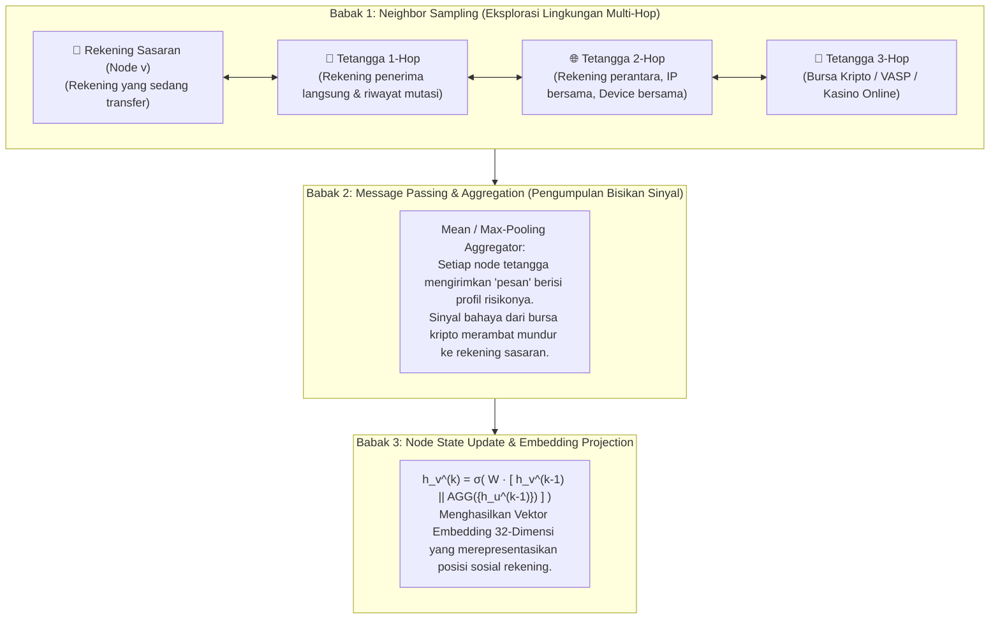
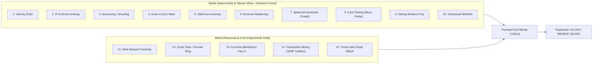
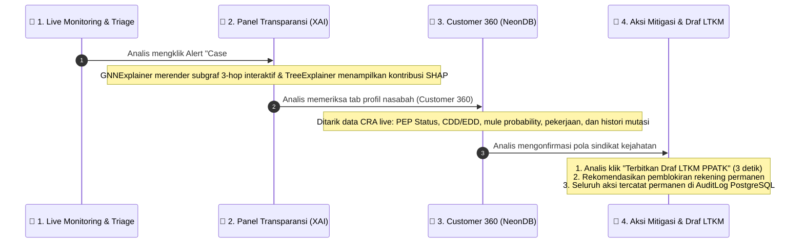

# 🎭 PANDUAN STORYTELLING DEEP-TECH: CARA KERJA GNN, 15 METRIK FRAUD & FORENSIC WORKBENCH
## Crypto-Sentinel 2026 — Master Narrative, Visual Scenarios & Technical Storytelling

> **Buku Saku Storytelling Presentasi & Pitching**: Dirancang khusus untuk Tim EXPRESSO S1251 agar mampu menceritakan konsep kecerdasan buatan canggih (*Deep-Tech Graph Neural Networks*), investigasi forensik, dan kepatuhan perbankan dengan analogi yang hidup, memukau, dan mudah dipahami oleh dewan juri investor, praktisi perbankan, maupun regulator.

---

## 📌 DAFTAR ISI UTAMA
1. [Seni Storytelling: Cara Menjelaskan GNN kepada Dewan Juri Tanpa Bikin Pusing](#1-seni-storytelling-cara-menjelaskan-gnn-kepada-dewan-juri-tanpa-bikin-pusing)
2. [Anatomi Cara Kerja GraphSAGE: Sampling, Message-Passing & Aggregation](#2-anatomi-cara-kerja-graphsage-sampling-message-passing--aggregation)
3. [Simulasi 15 Metrik & Indikator Fraud Hibrida (Aturan Deterministik + Probabilitas GNN)](#3-simulasi-15-metrik--indikator-fraud-hibrida-aturan-deterministik--probabilitas-gnn)
4. [Skenario Visual Kontras di Layar Analis: Transaksi Normal vs Sindikat Smurfing](#4-skenario-visual-kontras-di-layar-analis-transaksi-normal-vs-sindikat-smurfing)
5. [Alur End-to-End Investigasi Forensik di Dashboard FDS (Triage ke LTKM)](#5-alur-end-to-end-investigasi-forensik-di-dashboard-fds-triage-ke-ltkm)
6. [Arsitektur Real-Time Sub-Detik (<25 ms) & Daya Jual Startup B2B](#6-arsitektur-real-time-sub-detik-25-ms--daya-jual-startup-b2b)

---

# 1. Seni Storytelling: Cara Menjelaskan GNN kepada Dewan Juri Tanpa Bikin Pusing

### 🗣️ Analogi "Detektif vs Polisi Lalu Lintas" (Gunakan Narasi Ini Saat Pitching!)
> *"Dewan Juri yang terhormat, bayangkan sistem FDS konvensional saat ini seperti **Polisi Lalu Lintas yang berdiri di lampu merah**. Dia hanya melihat satu mobil yang lewat: 'Apakah mobil ini melaju di atas kecepatan 80 km/jam? Jika tidak, silakan jalan.'  
>  
> Sindikat kejahatan masa kini sangat cerdik. Mereka tidak membawa 1 truk kontainer berisi uang curian Rp 500 juta, melainkan menyewa **100 sepeda motor kecil (rekening mule)** yang masing-masing hanya membawa Rp 4,9 juta. Di mata polisi lalu lintas, setiap motor tampak normal dan legal.  
>  
> **Crypto-Sentinel bekerja seperti Detektif Satelit berbasis Graph Neural Network (GNN)**. Sistem kami tidak hanya melihat satu motor, melainkan memetakan seluruh jaringan jalanan: dari mana motor-motor itu berangkat, siapa yang memberi komando, dan ke gudang mana (bursa kripto) mereka berkumpul secara serentak. Itulah mengapa kami bisa menangkap sindikat yang tidak pernah bisa dilihat oleh sistem lama!"*

---

# 2. Anatomi Cara Kerja GraphSAGE: Sampling, Message-Passing & Aggregation

Bagi dewan juri teknis yang menanyakan detail algoritma, ceritakan **3 Babak Pemrosesan GraphSAGE (Hamilton et al., NIPS 2017)** berikut:



### 🔬 Rincian Tahapan Algoritma:

1. **Tahap 1: Neighbor Sampling (Pengambilan Sampel Tetangga)**:
   - Alih-alih memproses jutaan rekening sekaligus (yang akan membuat server bank *crash*), GraphSAGE mengambil sampel acak tetangga terdekat dalam radius $k$-hop ($k=1, 2, 3$).
   - Menghubungkan rekening berdasarkan: *Aliran Uang Antar-Rekening*, *Kesamaan Device Fingerprint*, dan *Kesamaan Alamat IP*.

2. **Tahap 2: Message Passing & Aggregation (Pengumpulan Pesan Relasi)**:
   - Setiap simpul (*node*) mengumpulkan representasi fitur dari tetangganya menggunakan fungsi agregasi (*Aggregation Function*):
     $$h_{\mathcal{N}(v)}^{(k)} = \text{AGGREGATE}_k \left( \left\{ h_u^{(k-1)}, \forall u \in \mathcal{N}(v) \right\} \right)$$
   - *Cerita di Balik Rumus*: Jika sebuah rekening baru berinteraksi intensif dengan 5 rekening lain yang baru saja menerima dana dari rekening korban pencurian, fungsi agregasi akan menarik sinyal "kontaminasi risiko" tersebut ke rekening sasaran.

3. **Tahap 3: Node State Update (Pembaruan Status & Representasi Vektor)**:
   - Menggabungkan status asal simpul ($h_v^{(k-1)}$) dengan sinyal agregasi lingkungan ($h_{\mathcal{N}(v)}^{(k)}$), lalu dilewatkan ke fungsi aktivasi non-linier $\sigma$ (ReLU) dengan matriks bobot $W$:
     $$h_v^{(k)} = \sigma \left( W^{(k)} \cdot \left[ h_v^{(k-1)} \,\|\, h_{\mathcal{N}(v)}^{(k)} \right] \right)$$
   - Menghasilkan **vektor representasi numerik 32-dimensi**. Vektor ini merefleksikan posisi sosial rekening: apakah ia berada di klaster nasabah wajar (gajian/belanja) atau di episentrum sindikat pencucian uang.

---

# 3. Simulasi 15 Metrik & Indikator Fraud Hibrida (Aturan Deterministik + Probabilitas GNN)

Sistem mengevaluasi **15 sinyal risiko secara simultan** dalam hitungan milidetik menggunakan *sliding time-windows*:



### 📋 Tabel Rinci 15 Metrik Risiko:

| No | Nama Metrik | Kategori | Formula / Logika Evaluasi | Bobot Skor |
|:---:|---|:---:|---|:---:|
| **1** | **Velocity (Kecepatan Pengurasan)** | Konvensional | Akumulasi pengeluaran $> \text{Rp } 20.000.000$ dalam durasi $< 60\text{ detik}$. | **+35 Poin** |
| **2** | **IP & Device Entropy** | Konvensional | Kemunculan $\ge 3$ alamat IP atau Device ID berbeda pada 1 akun dalam 1 jam (indikasi *credential stuffing*). | **+20 Poin** |
| **3** | **Structuring / Smurfing** | Konvensional | Serial transfer berulang bernominal Rp 4.900.000 – Rp 4.990.000 (tepat di bawah threshold audit Rp 5 Juta). | **+45 Poin** |
| **4** | **Drain-to-Zero Ratio** | Konvensional | $\text{Rasio} = \frac{\text{Amount}}{\text{Balance}_{\text{origin}}}$. Jika rasio $\ge 0.98$ (saldo dikuras habis hingga sisa Rp 0). | **+35 Poin** |
| **5** | **Odd-Hour Anomaly** | Konvensional | Transaksi transfer digital yang dieksekusi pada jam tidur nasabah (01:00 – 04:30 WIB). | **+25 Poin** |
| **6** | **Dormant Awakening** | Konvensional | Rekening tidak aktif $> 180\text{ hari}$ tiba-tiba menerima dan mentransfer dana nominal besar dalam $<15\text{ menit}$. | **+30 Poin** |
| **7** | **Impossible Travel (Haversine)** | Konvensional | $d = 2R \arcsin\left(\sqrt{\sin^2(\frac{\Delta\phi}{2}) + \cos\phi_1\cos\phi_2\sin^2(\frac{\Delta\lambda}{2})}\right)$. Kecepatan fisik $> 800\text{ km/jam}$. | **+25 Poin** |
| **8** | **Card Testing (Micro-Probe)** | Konvensional | Transaksi mikro Rp 10.000 (uji validasi PIN/kartu phising), diikuti seketika oleh transfer saldo maksimal. | **+30 Poin** |
| **9** | **Sliding-Window Frequency** | Konvensional | Frekuensi transaksi sukses $> 10\text{ kali}$ dalam rentang jendela bergulir 60 menit terakhir. | **+25 Poin** |
| **10** | **Contextual Whitelist** | Konvensional | Metadata ISO 20022 tujuan lembaga resmi (Bansos, SPP Universitas terdaftar, Pajak Pemda). | **-30 Poin (Diskon)** |
| **11** | **Mule Account Proximity** | Relasional GNN | Jarak kosinus embedding GraphSAGE rekening tujuan terhadap klaster rekening penampung (*mule clusters*). | **Probabilitas GNN (0–100)** |
| **12** | **Cyclic Flow / Circular Trading** | Relasional GNN | Deteksi topologi graf tertutup di mana uang ditransfer berputar ($A \to B \to C \to A$) untuk cuci uang. | **+40 Poin** |
| **13** | **Common Beneficiary Fan-In** | Relasional GNN | $\ge 5$ rekening pengirim yang tidak saling kenal mentransfer serentak ke 1 rekening tujuan yang sama. | **+45 Poin** |
| **14** | **Transaction Mixing (VASP Outflow)**| Relasional GNN | Aliran dana multi-hop yang berujung pada alamat *Virtual Asset Service Provider* (VASP / Indodax / Tokocrypto). | **+30 Poin** |
| **15** | **Threat Intel Graph Match** | Relasional GNN | Kecocokan simpul graf dengan database rekening penipu OJK IASC / Satgas PASTI / PPATK Blacklist. | **+70 Poin (Auto-Block)** |

---

# 4. Skenario Visual Kontras di Layar Analis: Transaksi Normal vs Sindikat Smurfing

Berikut adalah skenario perbandingan visual yang sangat kuat untuk dipresentasikan di hadapan dewan juri:

```
┌────────────────────────────────────────────────────────────────────────────────────────────────────────┐
│                                 PERBANDINGAN VISUAL DI FORENSIC DASHBOARD                              │
├────────────────────────────────────────────────────┬───────────────────────────────────────────────────┤
│ 🟢 SKENARIO A: TRANSAKSI NORMAL (PENCAIRAN GAJI)   │ 🔴 SKENARIO B: SINDIKAT REKENING MULE (SMURFING)  │
├────────────────────────────────────────────────────┼───────────────────────────────────────────────────┤
│ • Status: ALLOW (Risk Score: 12 / 100)             │ • Status: BLOCKED (Risk Score: 100 / 100)         │
│ • Sinyal Rule:                                     │ • Sinyal Rule:                                    │
│   - Nominal wajar (Rp 3.500.000)                   │   - Smurfing Pattern (+45 Poin: 5x Rp 4.900.000)  │
│   - Jam kerja resmi (10:15 WIB)                    │   - Odd-Hour Anomaly (+25 Poin: 02:45 WIB)        │
│   - Device & IP konsisten (Kantor Pemda)           │   - Drain-to-Zero (+35 Poin: Sisa Saldo Rp 0)     │
│   - Purpose Code: SALARY_DISBURSEMENT (-30)        │   - Impossible Travel (+25 Poin: Jakarta-Surabaya)│
│                                                    │                                                   │
│ • Visualisasi Graf GNN:                            │ • Visualisasi Graf GNN (GNNExplainer):            │
│   Simpul tunggal terhubung ke entitas payroll      │   Simpul menyala merah terang 3-hop! Terlihat     │
│   resmi. Topologi bintang hijau (aman), tidak      │   10 rekening pengirim berbeda mentransfer ke     │
│   ada klaster mule di radius 3-hop.                │   rekening penampung 'Mule-9012', lalu diteruskan │
│                                                    │   menuju VASP Bursa Kripto (Tokocrypto/Indodax).  │
│                                                    │                                                   │
│ • Tindakan Sistem:                                 │ • Tindakan Sistem:                                │
│   Lolos seketika (<5 ms), saldo nasabah terkirim.  │   Smart Circuit Breaker memutus transaksi (6 ms), │
│                                                    │   saldo aman 100%, draf goAML terbit otomatis.    │
└────────────────────────────────────────────────────┴───────────────────────────────────────────────────┘
```

---

# 5. Alur End-to-End Investigasi Forensik di Dashboard FDS (Triage ke LTKM)

Ketika transaksi mencurigakan dicegat atau masuk antrean verifikasi, data mengalir ke **Forensic Compliance Console (React 18 + Vite)** melalui 4 tahapan investigasi:



### 1. Antrean Triage (Penyortiran Real-Time):
* Peringatan masuk seketika ke tabel antrean dengan badge status baku: **`BLOCK`** (Merah), **`REVIEW`** (Kuning), atau **`ALLOW`** (Hijau).
* Dilengkapi indikator keparahan (*Severity Level*) dan timer SLA (SLA 4 Jam untuk kasus Block).

### 2. Panel Transparansi Explainable AI (XAI):
* Saat analis mengklik kasus, dashboard membuka workbench investigasi:
  - **Dekomposisi Skor Multi-Model**: Menampilkan rincian kontribusi skor (Rule Engine: 85, Random Forest: 78, GNN: 92 $\to$ Final: 89.2).
  - **SHAP Feature Contribution Bar**: Membedah fitur tabular dominan (misal: `balance_drain_ratio = +38%`, `velocity_1h = +22%`).
  - **Subgraf Relasional GNNExplainer**: Visualisasi graf 3-hop yang menonjolkan simpul rekening pengirim, rekening mule, dan bursa kripto tujuan.

### 3. Customer & Account 360 (Live NeonDB PostgreSQL):
* Menampilkan profil risiko nasabah aktual: Status PEP (*Politically Exposed Person*), Status CDD/EDD (*Customer Due Diligence*), skor *mule probability*, pekerjaan, penghasilan bulanan, dan histori mutasi 30 hari terakhir.

### 4. Aksi Mitigasi Final & Otomasi Regulasi:
* **Tombol Aksi**: Analis dapat mengubah status kasus menjadi `RESOLVED`, memberikan rekomendasi pemblokiran rekening permanen, atau menandai kasus sebagai *False Positive* untuk melatih ulang AI.
* **Otomasi Draf Dokumen goAML LTKM**: Sekali klik tombol **"Terbitkan Draf LTKM PPATK"**, sistem mengompilasi narasi kronologis resmi format goAML XML & formulir PDF hitam-putih dalam waktu **3 detik**.

---

# 6. Arsitektur Real-Time Sub-Detik (<25 ms) & Daya Jual Startup B2B

Bagi dewan juri investor dan praktisi perbankan, jelaskan **keunggulan komputasi dan proposisi nilai bisnis (B2B)** kita:

```mermaid
flowchart LR
    subgraph Edge["Client Layer"]
        MB["Mobile Banking\n(Android / iOS)"]
    end

    subgraph Gateway["Security Gateway (:8080)"]
        SNAP["SNAP BI Verification\n(HMAC-SHA256 & mTLS)"]
        BREAKER["Smart Circuit Breaker\n(Pre-Auth Interceptor)"]
    end

    subgraph Engine["AI Intelligence (:8000)"]
        LOOKUP["Fast Node Embedding Lookup\n(32-dim In-Memory)"]
        FUSION["Hybrid Risk Evaluator\n(Rule + RF + GNN in CPU)"]
    end

    subgraph Data["Database Layer"]
        NEON["NeonDB PostgreSQL\n(Ledger & Audit Trail)"]
    end

    MB -->|1. Transfer Request| SNAP
    SNAP -->|2. Nonce Verified| BREAKER
    BREAKER -->|3. Evaluate (<10ms)| LOOKUP --> FUSION
    FUSION -->|4. Decision: BLOCK / ALLOW| BREAKER
    BREAKER -->|5a. Mutasi Dieksekusi| NEON
    BREAKER -->|5b. Response (<25ms)| MB
```

### 💼 4 Daya Jual Utama Solusi B2B bagi Bank & BPR:
1. **Ultra-Low Latency (<25 ms)**: Rata-rata inferensi 5.67 ms pada CPU lokal biasa tanpa memerlukan server GPU seharga miliaran rupiah di runtime bank.
2. **Non-Intrusive Plug-and-Play**: Terhubung via Bank Integration Kit (`docs/BANK_INTEGRATION_KIT.md`) tanpa membongkar source code Core Banking lama bank.
3. **Efisiensi TCO hingga 70%**: Skema berlangganan SaaS/On-Premise bertingkat (Tier BPR Rp 5 Juta/bln, Tier BPD Rp 25 Juta/bln) jauh lebih terjangkau dibanding vendor global (SAS/Actimize).
4. **Kepatuhan Native Indonesia**: Sudah memenuhi 100% regulasi POJK No. 8/2023, standar pelaporan goAML PPATK, dan UU PDP No. 27/2022.

---

### 🏆 Kesimpulan untuk Tim Presenter:
> *"Dengan menguasai analogi detektif vs polisi lalu lintas, memahami 15 metrik risiko hibrida, dan mampu menunjukkan kontras visual di layar analis, Tim EXPRESSO S1251 akan tampil sebagai pionir AI perbankan yang paling siap, percaya diri, dan tak terkalahkan di panggung PIDI Digdaya 2026!"* 🚀🔥👏
