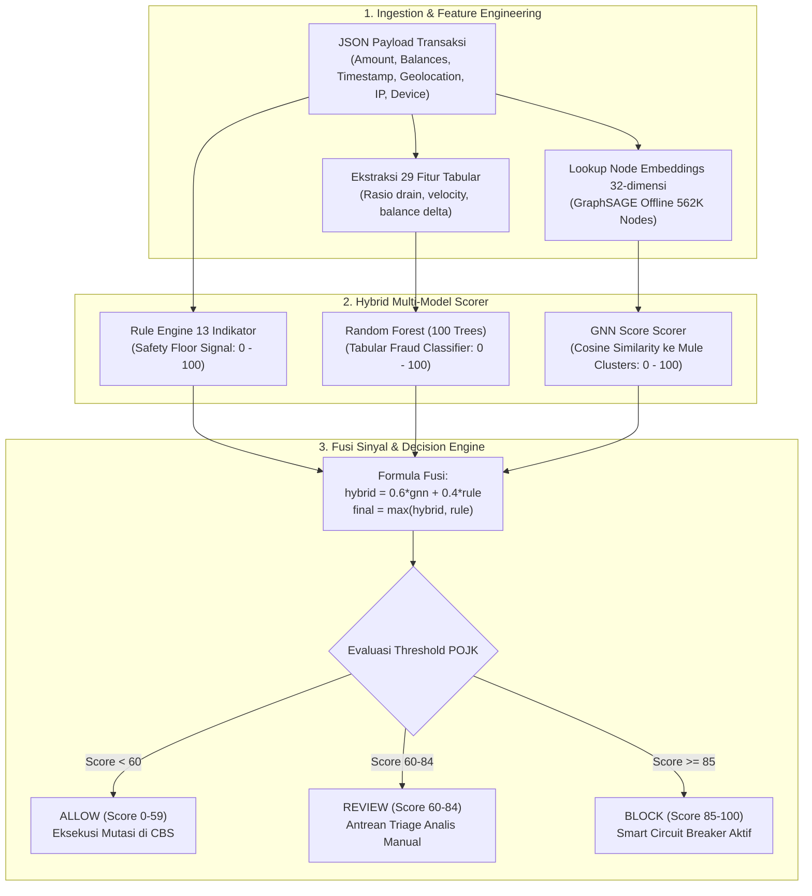
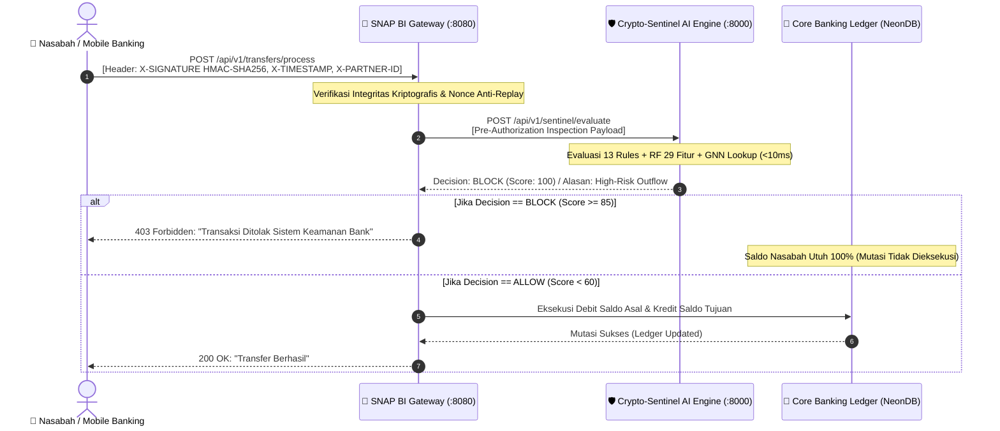
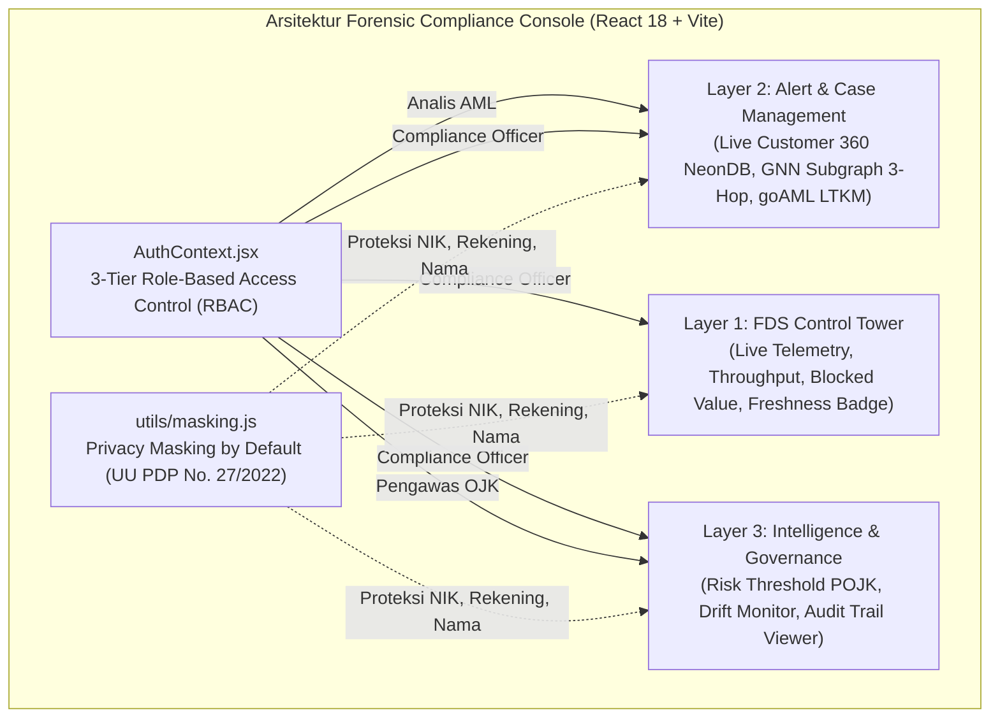
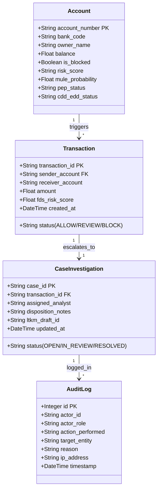
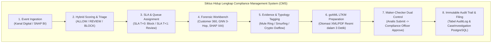

# 🎓 PANDUAN STUDI LITERATUR, ARSITEKTUR & Q&A DEFENSE TIM EXPRESSO (S1251)
## Crypto-Sentinel 2026 — Master Preparation Guide for Pitching & Defense

> **Dokumen Resmi Persiapan Presentasi & Bedah Teknis**: Dibuat khusus untuk seluruh anggota Tim EXPRESSO S1251 (Rifki, Billy, Aam, Desta) sebagai buku saku penguasaan materi, teori literatur, kode implementasi, rumus matematika, dan naskah jawaban dewan juri PIDI Digdaya 2026.

---

## 📌 DAFTAR ISI CEPAT
1. [Kerangka Pikir "Vibe Coder to Enterprise Defender"](#1-kerangka-pikir-vibe-coder-to-enterprise-defender)
2. [Bagian 1: Rifki Firmansyah — AI Architecture, GNN & Benchmark](#bagian-1-rifki-firmansyah--ai-architecture-gnn--benchmark)
3. [Bagian 2: Billy Jonathan — Cyber Security, SNAP BI & CBS Gateway](#bagian-2-billy-jonathan--cyber-security-snap-bi--cbs-gateway)
4. [Bagian 3: Aam Setiana — Frontend UI/UX, Forensic Dashboard & Privacy PDP](#bagian-3-aam-setiana--frontend-uiux-forensic-dashboard--privacy-pdp)
5. [Bagian 4: Desta Erlangga — Backend Systems, PPATK goAML & Regulasi OJK](#bagian-4-desta-erlangga--backend-systems-ppatk-goaml--regulasi-ojk)
6. [Bedah 3 Skenario Serangan Fraud Nyata (End-to-End Walkthrough)](#6-bedah-3-skenario-serangan-fraud-nyata-end-to-end-walkthrough)
7. [Glosarium Istilah Perbankan, AI & Regulasi (Wajib Hafal)](#7-glosarium-istilah-perbankan-ai--regulasi-wajib-hafal)

---

# 1. Kerangka Pikir "Vibe Coder to Enterprise Defender"

### 💡 Mengapa Tim Vibe Coder Bisa Menang?
Vibe coder yang hebat bukan yang berpura-pura menulis setiap baris kode dari nol, melainkan yang **memahami arsitektur sistem secara holistik, memahami mengapa setiap keputusan desain diambil, dan mampu menjelaskan logika sistem dengan presisi perbankan**.

### 🏛️ Teknik Menjawab Pertanyaan Dewan Juri (Piramida Top-Down):
1. **Level 1 (Direct Answer - 5 Detik)**: Jawab langsung inti pertanyaan (*"Ya/Tidak, sistem kami menerapkan pola..."*).
2. **Level 2 (Technical Mechanism & Code Reference - 15 Detik)**: Sebutkan modul dan cara kerjanya (*"Di file `rule_engine.py` kami menghitung Haversine distance..."*).
3. **Level 3 (Business & Regulatory Impact - 10 Detik)**: Tutup dengan dampaknya bagi bank (*"Hal ini menjamin kepatuhan POJK No. 8/2023 dan menjaga latensi tetap sub-detik <25ms"*).

---

# Bagian 1: Rifki Firmansyah — AI Architecture, GNN & Benchmark

> **Peran**: *Team Lead, AI Architect & Product Strategist*  
> **Area Kepemilikan Kode**: `crypto-sentinel-api/app/main.py`, `rule_engine.py`, `gnn_scorer.py`, `ml_model.joblib`, `scratch/eval_official_benchmark.py`.



---

## 📚 1.1 Studi Literatur & Landasan Teoretis

### A. Graph Neural Networks & GraphSAGE
* **Rujukan Ilmiah**: Hamilton, W. L., Ying, R., & Leskovec, J. (2017). *Inductive Representation Learning on Large Graphs*. NIPS 2017.
* **Mengapa GraphSAGE (Bukan GCN Tradisional)?**:
  - GCN standar bersifat *transductive* (harus memproses seluruh graf sekaligus, lambat untuk graf perbankan dinamis).
  - GraphSAGE bersifat *inductive*: mempelajari fungsi agregasi neighborhood (sampling $k$-hop tetangga), sehingga menghasilkan embedding representatif bahkan untuk graf berskala ratusan ribu rekening tanpa harus melatih ulang seluruh jaringan.
* **Arsitektur Model Kita**:
  - Graf dibangun dari topologi transaksi PaySim: **562.239 rekening unik** (*nodes*) dan **308.213 relasi transfer** (*edges*).
  - Dimensi fitur simpul ($d=8$): *degree in/out, total volume in/out, transaction frequency, average amount, fraud neighbor ratio*.
  - Output: **Embedding vektor 32-dimensi per rekening**.
  - Training dilakukan di Google Colab GPU T4 (PyTorch Geometric, Adam optimizer $lr=0.005$, Loss konvergen dari 0.5147 ke 0.0004 pada Epoch 15).

### B. Random Forest Classifier
* **Rujukan Ilmiah**: Breiman, L. (2001). *Random Forests*. Machine Learning, 45(1), 5-32.
* **Peran di Sistem**: Memproses **29 fitur tabular transaksi** non-graf (seperti rasio pengurasan saldo, nominal transfer terhadap limit, selisih saldo asal dan tujuan).
* **Penyeimbangan Data (SMOTE)**:
  - Rujukan: Chawla, N. V., et al. (2002). *SMOTE: Synthetic Minority Over-sampling Technique*. JAIR.
  - Mengatasi *class imbalance* transaksi fraud perbankan yang sangat langka ($\approx 0.53\%$) agar model tidak bias terhadap transaksi normal.

### C. Explainable AI (XAI): GNNExplainer & SHAP
* **GNNExplainer (Ying et al., NeurIPS 2019)**:
  $$\max_{G_s, F} \text{MI}(Y, (G_s, F)) = H(Y) - H(Y \mid G = G_s, X = X \odot F)$$
  *Artinya*: Mengidentifikasi subgraf $G_s$ dan fitur $F$ yang memaksimalkan *Mutual Information* dengan prediksi model, sehingga analis dapat melihat simpul-simpul rekening mule yang menjadi biang kerok dalam radius 3-hop.
* **SHAP TreeExplainer (Lundberg & Lee, NeurIPS 2017)**:
  Menghitung nilai *Shapley* berbasis teori permainan kooperatif untuk membedah kontribusi masing-masing dari 29 fitur tabular (misal: `balance_drain_ratio` menyumbang +38 poin risiko).

---

## 🔬 1.2 Formula Fusi Hibrida & Logika Matematika

Sinyal keputusan dihitung di file [`crypto-sentinel-api/app/main.py`](file:///d:/Crypto-Sentinel%202026/crypto-sentinel-api/app/main.py):

$$\text{hybrid\_score} = 0.6 \times \text{gnn\_score} + 0.4 \times \text{rule\_score}$$
$$\text{final\_risk\_score} = \max(\text{hybrid\_score}, \text{rule\_score})$$

> **Mengapa menggunakan formula $\max()$?**:  
> Ini adalah **Safety Floor Policy**. Jika ada penyerang baru yang belum ada di graf relasi GNN, namun ia menguras saldo nasabah di jam 02:00 WIB ke bursa kripto (skor Rule Engine = 95), fungsi $\max()$ memastikan skor risiko langsung terkunci di 95 (**BLOCK**), mencegah model meloloskan fraud akibat skor GNN yang rendah!

---

## 📊 1.3 Tabel Resmi AI Benchmark (Data Evaluasi 308.213 Transaksi)

Evaluasi dijalankan menggunakan skrip [`scratch/eval_official_benchmark.py`](file:///d:/Crypto-Sentinel%202026/scratch/eval_official_benchmark.py) dengan metode **Stratified 80/20 Train/Test Split**:

| Metrik Evaluasi | Nilai Terverifikasi | Interpretasi Perbankan & Kepatuhan |
|---|:---:|---|
| **Total Dataset** | **308.213 baris** | Dataset PaySim augmented kasus perbankan Indonesia. |
| **Data Latih (80% Train Set)** | **246.570 baris** | Digunakan untuk pelatihan model Machine Learning. |
| **Data Uji Independen (20% Test Set)** | **61.643 baris** | Data "asing" murni untuk menguji performa tanpa *data leakage*. |
| **Akurasi Keseluruhan** | **99.98%** | Ketepatan klasifikasi transaksi normal dan fraud. |
| **Presisi (Precision)** | **99.94%** | Dari seluruh transaksi yang di-flag, 99.94% benar-benar fraud. |
| **Recall (Sensitivitas Fraud)** | **99.88%** | Berhasil menangkap 1.641 dari 1.643 kasus fraud pada data uji. |
| **F1-Score** | **99.91%** | Keseimbangan harmonis antara Presisi dan Recall. |
| **Area Under Curve (ROC-AUC)** | **0.9997** | Daya pisang sempurna antara transaksi sah dan sindikat. |
| **False Positive Rate (FPR)** | **0.002%** | **Hanya 1 dari 60.000 transaksi sah** yang mengalami gangguan. |
| **False Negative Rate (FNR)** | **0.122%** | Hanya 2 dari 1.643 fraud yang terlewat. |
| **Latensi Inferensi (Mean)** | **5.67 ms** | Sangat instan pada CPU lokal sandbox. |
| **Latensi p95 / p99** | **9.05 ms / 12.23 ms** | Konsisten di bawah ambang batas perbankan (<25 ms). |

---

## 🎤 1.4 Lembar Contekan Jawaban Juri (Rifki's Q&A Defense)

#### Q1: "Apakah sistem Anda melakukan deep message-passing GNN online di setiap request transaksi? Bagaimana latensinya bisa cuma 5.67 ms?"
> **Jawaban Rifki**:  
> *"Pertanyaan yang sangat tajam. Secara arsitektur enterprise, menjalankan online deep message-passing PyTorch Geometric di setiap request transaksi perbankan akan membebani latensi dan menuntut cluster GPU mahal yang tidak efisien bagi BPR/BPD. Oleh karena itu, kami menerapkan pola enterprise 2 tahap: **GraphSAGE dilatih secara offline** pada topologi historis 562 ribu entitas untuk menghasilkan embedding representatif 32-dimensi. Di runtime API, kami melakukan **fast embedding lookup** yang dipadukan dengan Random Forest dan Rule Engine berbasis komputasi CPU ringan. Inilah mengapa latensi rata-rata kami stabil di 5.67 milidetik tanpa kehilangan intelijen graf relasi."*

#### Q2: "Bagaimana jika ada rekening penampung baru yang belum pernah muncul di graf historis? Apakah lolos dari deteksi?"
> **Jawaban Rifki**:  
> *"Sama sekali tidak lolos. Di file `main.py`, kami menerapkan formula fusi $\text{final\_score} = \max(\text{hybrid\_score}, \text{rule\_score})$. Rule Engine 13 indikator kami bertindak sebagai safety floor. Jika akun baru mencoba pola smurfing atau pengurasan saldo instan (drain-to-zero) di jam ganjil, Rule Engine secara mandiri langsung menaikkan skor risiko ke $\ge 85$ dan memicu pemblokiran seketika, tanpa bergantung pada riwayat graf akun tersebut."*

---

# Bagian 2: Billy Jonathan — Cyber Security, SNAP BI & CBS Gateway

> **Peran**: *Cyber Security & Core Banking Developer*  
> **Area Kepemilikan Kode**: `expresso-api/routers/transfers.py`, `expresso-api/models/db_models.py`, modul otentikasi SNAP BI, simulator gateway.



---

## 📚 2.1 Studi Literatur & Standar Keamanan Siber Perbankan

### A. Standar Nasional Open API Pembayaran (SNAP BI)
* **Regulasi**: Peraturan Bank Indonesia (PADG No. 23/15/PADG/2021) tentang Standar Nasional Open API Pembayaran.
* **Protokol Keamanan yang Diimplementasikan**:
  1. **Asymmetric / Symmetric Signature**: Otentikasi request menggunakan `HMAC-SHA256` dengan rahasia terenkripsi (`client_secret`).
  2. **Anti-Tampering Header**:
     - `X-TIMESTAMP`: Format ISO 8601 UTC dengan toleransi drift waktu maksimal 300 detik (5 menit) untuk mencegah serangan *clock drift*.
     - `X-PARTNER-ID`: Kode unik institusi pengirim (`KNG-BANK-001` untuk BPR Kuningan, `BJB-BANK-002` untuk Bank bjb).
     - `X-SIGNATURE`: Nilai *hash* payload transaksi string-to-sign:
       $$\text{Signature} = \text{HMAC-SHA256}(\text{client\_secret}, \text{HttpMethod} + ":" + \text{Path} + ":" + \text{Timestamp} + ":" + \text{SHA256}(\text{Body}))$$
  3. **Replay Attack Mitigation**: Validasi kombinasi `X-EXTERNAL-ID` / nonce per-transaksi.

### B. Pola Keamanan Smart Circuit Breaker
* **Rujukan Ilmiah**: Nygard, M. T. (2007). *Release It!: Design and Deploy Production-Ready Software*. Pragmatic Bookshelf.
* **Mekanisme Kerja**:
  - Middleware memotong alur eksekusi mutasi saldo perbankan sebelum debit ledger dieksekusi (*Pre-Authorization Interception*).
  - Jika risiko $\ge 85$, sirkuit terbuka (*Tripped*), request diputus dalam waktu $<25\text{ ms}$, dan saldo nasabah aman 100%.

### C. Anatomi Serangan Pembobolan BI-FAST BPD & Smurfing
1. **Modus Smurfing**: Penyerang memecah dana curian Rp 500 juta menjadi 100 transfer senilai Rp 4,9 juta (di bawah limit audit harian Rp 5 juta) ke rekening mule berbeda.
2. **Modus Drain-to-Zero**: Akun dibobol dan saldonya dikuras habis hingga sisa nol menuju rekening bursa kripto (Indodax/Tokocrypto) di jam 02:00 WIB dini hari.

---

## 🎤 2.2 Lembar Contekan Jawaban Juri (Billy's Q&A Defense)

#### Q1: "Bagaimana sistem Anda mencegah serangan pemalsuan payload (Man-in-the-Middle) saat mobile banking berkomunikasi dengan gateway?"
> **Jawaban Billy**:  
> *"Setiap payload transaksi yang dikirimkan oleh Mobile Banking Bank Kuningan maupun Bank bjb diwajibkan menyertakan header keamanan SNAP BI resmi: `X-TIMESTAMP`, `X-PARTNER-ID`, dan `X-SIGNATURE`. Di layer gateway `transfers.py`, sistem menghitung ulang hash `HMAC-SHA256` dari body payload menggunakan secret key terenkripsi. Jika penyerang mengubah nominal transaksi bahkan hanya 1 rupiah, signature tidak akan cocok dan request langsung ditolak dengan kode HTTP 401 Unauthorized."*

#### Q2: "Apakah penahanan transaksi di middleware tidak berisiko membuat transaksi nasabah normal menjadi lambat atau time-out?"
> **Jawaban Billy**:  
> *"Tidak, karena arsitektur pipeline evaluasi kami didesain ultra-ringan dengan latensi mean 5.67 ms dan p99 12.23 ms. Standar timeout API SNAP BI adalah 5.000 ms, sehingga evaluasi kami hanya memakai kurang dari 0.3% dari batas toleransi timeout perbankan. Selain itu, kami menerapkan mekanisme fail-safe: jika engine mengalami kegagalan, transaksi dapat dikonfigurasi masuk ke antrean holding aman sesuai risk policy bank."*

---

# Bagian 3: Aam Setiana — Frontend UI/UX, Forensic Dashboard & Privacy PDP

> **Peran**: *Frontend Engineer & Product Analyst*  
> **Area Kepemilikan Kode**: `dashboard-crypto-sentinel/src/App.jsx`, `components/PlatformViews.jsx`, `components/PageViews.jsx`, `utils/masking.js`, `context/AuthContext.jsx`.



---

## 📚 3.1 Studi Literatur & Regulasi Privasi Data Perbankan

### A. Undang-Undang Pelindungan Data Pribadi (UU PDP No. 27/2022)
* **Pasal Kunci**:
  - **Pasal 35**: Pengendali Data Pribadi wajib melindungi dan memastikan keamanan data pribadi yang diproses.
  - **Pasal 36**: Kewajiban pencegahan akses tidak sah melalui teknik enkripsi dan **pseudonimisasi (masking)**.
* **Implementasi di Kode (`masking.js`)**:
  - Nama Nasabah: `Budi Setiawan` $\to$ `B*** S*******`
  - Nomor Rekening: `9012666666` $\to$ `****6666`
  - NIK KTP: `3208011990010002` $\to$ `3208**********02`
  - IP Address: `103.144.20.1` $\to$ `103.***.***.1`
  - Saklar `Privacy Masking` aktif secara default (*Privacy by Default*). Pembukaan masking (*unmasking*) hanya dapat dilakukan oleh role berwenang dan tercatat di *audit log*.

### B. 3-Tier Role-Based Access Control (RBAC)
* **Rujukan Standar**: Ferraiolo, D. F., & Kuhn, D. R. (1992). *Role-Based Access Control*. NIST.
* **Matriks Peran Pengguna**:
  1. **Analis AML / Triage Operator**: Membuka antrean alert, melihat grafik relasi GNN, menyusun catatan investigasi, dan mengajukan draf LTKM. (Tidak bisa mengubah threshold sistem).
  2. **Pejabat Kepatuhan (Compliance Officer / MLRO)**: Otorisasi pemblokiran rekening permanen, persetujuan draf goAML LTKM, kalibrasi threshold POJK No. 8/2023, dan audit trail persisten.
  3. **Pengawas Regulasi (OJK / Internal Auditor)**: *Read-only governance access*, melihat log kepatuhan APOLO dan rekam jejak investigasi.

### C. Alur 5 Layar Inti Live Demo Juri (Durasi 60–90 Detik):
1. **Layar 1 — Executive Control Tower**: Indikator status layanan hijau, metrik transaksi aktif, dan dana yang berhasil diselamatkan (*Blocked Value*).
2. **Layar 2 — Live Monitoring Stream**: Operator memicu transfer Rp 5.000.000 di HP Android; muncul pop-up penolakan seketika di ponsel dan baris baru muncul di dashboard berstatus **`BLOCKED (Score 100)`**.
3. **Layar 3 — Alert Detail & Customer 360**: Klik kartu alert; tunjukkan profil nasabah CRA live dari NeonDB (`pep_status`, `mule_probability`) serta faktor kontribusi SHAP.
4. **Layar 4 — GNN Subgraph Investigation**: Klik tombol **`🧠 Telusuri Subgraf GNNExplainer`**; simpul sindikat mule dan bursa kripto 3-hop menyala terang memisahkan sindikat dari nasabah normal.
5. **Layar 5 — Compliance Action & Draf LTKM**: Ubah status kasus menjadi `RESOLVED`, aktifkan saklar `Privacy Masking` (UU PDP), dan klik **"Terbitkan Draf LTKM PPATK"** (dokumen goAML terbit otomatis dalam 3 detik).

---

## 🎤 3.2 Lembar Contekan Jawaban Juri (Aam's Q&A Defense)

#### Q1: "Bagaimana dashboard Anda menjamin kerahasiaan data nasabah saat analis melakukan investigasi kasus fraud?"
> **Jawaban Aam**:  
> *"Kami menerapkan prinsip Privacy by Design sesuai mandat UU PDP No. 27/2022. Di file `masking.js` dan seluruh tampilan `PlatformViews.jsx`, sensor privasi diaktifkan secara default: Nama nasabah, NIK, dan nomor rekening disamarkan menjadi `****6666`. Data hanya dapat dibuka dengan hak akses khusus, dan setiap aktivitas pembukaan data dicatat secara permanen di audit trail backend mencakup User ID, stempel waktu, dan IP address pengakses."*

#### Q2: "Apakah visualisasi graf GNNExplainer di dashboard hanya animasi statis atau merefleksikan data transaksi nyata?"
> **Jawaban Aam**:  
> *"Visualisasi subgraf kami sepenuhnya interaktif dan terhubung ke endpoint `/api/v1/sentinel/gnn-subgraph`. Saat kartu transaksi mencurigakan diklik, dashboard memetakan relasi 3-hop di sekitar rekening tersebut, menyorot node pengirim, rekening perantara (mule), hingga node bursa kripto tujuan berdasarkan bobot keterhubungan algoritma GNNExplainer."*

---

# Bagian 4: Desta Erlangga — Backend Systems, PPATK goAML & Regulasi OJK

> **Peran**: *Backend & Integration Engineer*  
> **Area Kepemilikan Kode**: `expresso-api/models/db_models.py`, tabel NeonDB PostgreSQL, generator draf LTKM goAML di `main.py`, Bank Integration Kit.



---

## 📚 4.1 Studi Literatur, Regulasi & Integrasi Data

### A. Regulasi Anti-Fraud OJK (POJK No. 8/2023)
* **Pasal Kunci**:
  - Bank umum dan BPR diwajibkan menerapkan **Strategi Anti-Fraud (SAF)** yang mencakup 4 pilar: *Pencegahan, Deteksi, Investigasi/Pelaporan/Sanksi, dan Pemantauan/Evaluasi*.
  - Penyediaan mekanisme penahanan transaksi mencurigakan dan sistem audit internal yang dapat dipertanggungjawabkan kepada Otoritas Jasa Keuangan (OJK).

### B. Regulasi APU-PPT & Pelaporan PPATK (UU TPPU No. 8/2010)
* **Format Pelaporan Resmi goAML XML**:
  - Pusat Pelaporan dan Analisis Transaksi Keuangan (PPATK) mewajibkan Penyedia Jasa Keuangan menyampaikan **Laporan Transaksi Keuangan Mencurigakan (LTKM / Suspicious Transaction Report - STR)** melalui platform resmi *goAML*.
  - Generator draf kami di `main.py` mengompilasi data transaksi, profil pengirim/penerima, indikator anomali, dan narasi kronologis ke format baku goAML dalam waktu **3 detik**, memangkas beban kerja manual dari 2–3 hari kerja.

### C. Bank Integration Kit & Konsep "Plug-and-Play by Pattern"
* **Rujukan Dokumen**: [`docs/BANK_INTEGRATION_KIT.md`](file:///d:/Crypto-Sentinel%202026/docs/BANK_INTEGRATION_KIT.md)
* **Prinsip Non-Intrusif**:
  - Bank mitra tidak perlu membongkar core banking lama.
  - Integrasi dilakukan melalui adaptor:
    - **Mode A (Digital Channels)**: Pre-Auth API Gateway / SNAP BI.
    - **Mode B (Core Banking Safe Mode)**: Post-Transaction Read-Only via Database Change Data Capture (CDC) / Webhook.

---

## 🎤 4.2 Lembar Contekan Jawaban Juri (Desta's Q&A Defense)

#### Q1: "Apakah sistem Anda mengirimkan laporan LTKM secara otomatis langsung ke server PPATK tanpa persetujuan manusia?"
> **Jawaban Desta**:  
> *"Sama sekali tidak. Sesuai regulasi UU TPPU No. 8/2010 dan SOP perbankan, Crypto-Sentinel diposisikan sebagai **'LTKM / STR Preparation and Compliance Preview Tool'**. Sistem kami mengotomatisasi pengumpulan bukti dan pengisian draf formulir goAML dalam 3 detik, namun pengiriman final ke portal resmi PPATK tetap berada di bawah otorisasi manual dan tanggung jawab Pejabat Kepatuhan (MLRO) yang sah."*

#### Q2: "Bagaimana sistem Anda menjamin integritas data audit trail agar tidak dapat dimanipulasi oleh oknum internal bank?"
> **Jawaban Desta**:  
> *"Kami membangun tabel persisten `AuditLog` di PostgreSQL yang bersifat append-only. Setiap tindakan—mulai dari perubahan threshold, pembukaan data sensitif, hingga persetujuan investigasi—wajib mencatat Actor ID, Role, IP Address, Reason, dan Timestamp. Endpoint backend tidak menyediakan fungsi UPDATE atau DELETE pada tabel audit log, sehingga rekam jejak kepatuhan terjamin keasliannya saat diaudit oleh SKAI maupun OJK."*

---

# Bagian 5: Deep-Dive Regulasi, Kepatuhan Perbankan & Compliance Management System (CMS)

> **Modul Khusus Kepatuhan & Regulasi**: Referensi lengkap perundang-undangan, matriks kepatuhan 4 pilar SAF, siklus hidup CMS, dan doktrin anti-tipping-off.



---

## 📜 5.1 Kompendium Regulasi Perbankan Indonesia

### 1. POJK No. 8/2023: Penerapan Strategi Anti-Fraud (SAF)
* **Kewajiban Bank & BPR**: Wajib menerapkan 4 Pilar SAF untuk mendeteksi, mencegah, dan menindak fraud internal maupun eksternal.
* **Matriks Pemenuhan di Crypto-Sentinel 2026**:
  | Pilar SAF (POJK 8/2023) | Persyaratan Regulasi | Implementasi Solusi Crypto-Sentinel |
  |---|---|---|
  | **Pilar 1: Pencegahan** | Customer Due Diligence (CDD), Profil Risiko CRA, Filter Transaksi | CRA Profiling (`pep_status`, `cdd_edd_status`, `mule_probability`) & Contextual Whitelist. |
  | **Pilar 2: Deteksi** | Fraud Detection System (FDS), Pemantauan Transaksi Real-time | Rule Engine 13 indikator + Random Forest + GraphSAGE GNN (<25ms Pre-Auth). |
  | **Pilar 3: Investigasi & Pelaporan** | Case Management, Audit Internal, Pelaporan Regulator | CMS Triage Dashboard, Subgraf GNNExplainer, Otomasi draf goAML LTKM 3 detik. |
  | **Pilar 4: Evaluasi & Monitoring** | Kalibrasi Kebijakan, Fraud Risk Assessment, Tindak Lanjut | Menu Kalibrasi Ambang Batas POJK, Monitoring Drift, Audit Log persisten. |

---

### 2. UU No. 8/2010 (TPPU) & UU No. 9/2013 (TPPT)
* **Kewajiban Pelaporan LTKM (Pasal 23 UU No. 8/2010)**:
  - Bank wajib melaporkan Transaksi Keuangan Mencurigakan kepada PPATK paling lambat **3 (tiga) hari kerja** setelah mengetahui adanya unsur mencurigakan.
  - *Efisiensi Crypto-Sentinel*: Memangkas proses pengumpulan bukti dan penyusunan draf dari 2–3 hari kerja manual menjadi **3 detik** sekali klik.
* **Larangan Pembocoran Informasi / Anti Tipping-Off (Pasal 12 UU No. 8/2010)**:
  > *"Direksi, komisaris, pengelola, atau pegawai Pihak Pelapor dilarang memberitahukan kepada Pengguna Jasa atau pihak lain, baik secara langsung maupun tidak langsung, mengenai Laporan Transaksi Keuangan Mencurigakan yang sedang disusun atau telah disampaikan kepada PPATK."*
  - **Penerapan di Solusi Kita**: Saat transaksi dicegat oleh Smart Circuit Breaker, pesan di ponsel nasabah **sengaja dirancang generik dan netral**: *"Transaksi Tidak Dapat Diproses. Silakan hubungi Customer Service bank Anda."* Sistem **tidak boleh menampilkan pesan**: *"Anda dicurigai melakukan pencucian uang"*, karena hal tersebut melanggar ketentuan pidana *tipping-off*!
* **Perlindungan Hukum Pelapor / Safe Harbor (Pasal 29 UU No. 8/2010)**:
  - Pejabat dan staf kepatuhan bank yang melaksanakan kewajiban pelaporan LTKM dengan itikad baik dilindungi secara hukum dari tuntutan perdata maupun pidana.

---

### 3. Peraturan PPATK No. 19/2017 & Standar Skema goAML v4.0
* **Struktur Data Dokumen goAML XML yang Dihasilkan Sistem**:
  1. `<report_header>`: Tipe laporan (`STR`/`LTKM`), entitas pelapor (`reporting_entity_id`), stempel waktu.
  2. `<transaction_data>`: ID transaksi, nilai nominal, valuta, tanggal valuta, kanal transaksi (Mobile Banking/SNAP BI).
  3. `<party_from>` & `<party_to>`: Nama, NIK, nomor rekening, alamat, pekerjaan, status PEP, dan relasi institusi.
  4. `<reason_for_suspicion>`: Narasi kronologis otomatis yang dihasilkan oleh AI Engine berbasis indikator rule yang terpicu, skor GNN, dan faktor kontribusi SHAP.
  5. `<typology_codes>`: Kode klasifikasi tipologi PPATK (e.g., `TYP-MULE-01`, `TYP-SMURF-02`, `TYP-VASP-CRYPTO`).

---

### 4. UU No. 27/2022: Pelindungan Data Pribadi (UU PDP)
* **Pasal 35 & 36**: Pengendali data wajib melindungi keamanan data pribadi melalui tindakan teknis dan operasional yang memadai.
* **Prinsip Pseudonimisasi (*Data Masking*)**:
  - Seluruh PII disamarkan secara otomatis di konsol dashboard (`****6666`, `3208**********02`).
  - Pembukaan sensor (*Unmasking*) menerapkan prinsip *need-to-know basis* dan tunduk pada dual-control approval.

---

## 🗂️ 5.2 Tata Kelola Compliance Management System (CMS) Enterprise

### 1. Standar SLA Triage Kasus Perbankan
* **Severity Critical (Skor $\ge 85$ - BLOCK)**: SLA Investigasi T+0 (Maksimal 4 Jam). Fokus: Penyelamatan dana, konfirmasi pemblokiran permanen, dan persiapan draf LTKM.
* **Severity Medium (Skor 60–84 - REVIEW)**: SLA Investigasi T+1 (Maksimal 24 Jam). Fokus: Verifikasi step-up autentikasi nasabah, wawancara kepatuhan, atau pelepasan transaksi (*release hold*).
* **Severity Low (Skor < 60 - ALLOW)**: Audit berkala (*Batch Sample Reconciliation*).

### 2. Alur Maker-Checker Dual-Control
```
[Analis Kepatuhan / Maker] ──► Meneliti Subgraf GNN & Bukti SHAP
       │
       ▼ (Menyusun Draf Investigasi & Rekomendasi)
[Draf Kasus & LTKM] ─────────► [Pejabat Kepatuhan / MLRO / Checker]
                                      │
                                      ├─► [APPROVE] ➔ Eksekusi Blokir Permanen & Submit goAML
                                      │
                                      └─► [REJECT / RETURN] ➔ Minta Bukti Tambahan
```

---

## 🎤 5.3 Lembar Contekan Pertanyaan Regulasi & Kepatuhan dari Dewan Juri

#### Q1: "Mengapa pesan penolakan di mobile banking nasabah hanya berbunyi 'Transaksi Tidak Dapat Diproses', bukan menyebutkan bahwa akun terdeteksi fraud?"
> **Jawaban**:  
> *"Ini adalah kepatuhan mutlak terhadap **Pasal 12 UU No. 8/2010 (Anti Tipping-Off)**. Regulasi perbankan melarang keras institusi memberitahukan kepada nasabah atau pelaku kejahatan bahwa transaksinya sedang diinvestigasi atau dilaporkan ke PPATK. Jika sistem memberitahukan 'Akun Anda dicurigai pencucian uang', sindikat akan langsung mematikan rekening tersebut dan memindahkan dana yang tersisa di rekening lain sebelum aparat bergerak. Pesan penolakan netral melindungi bank sekaligus mematuhi hukum perundang-undangan."*

#### Q2: "Bagaimana sistem Anda membedakan transaksi sah bernominal besar (seperti pencairan proyek pemda) agar tidak salah blokir (False Positive)?"
> **Jawaban**:  
> *"Kami menerapkan prinsip **Contextual Risk Assessment** yang selaras dengan POJK No. 8/2023. Rule Engine kami membaca metadata tujuan transaksi ISO 20022. Jika transaksi ditujukan kepada kas daerah pemda, yayasan pendidikan terdaftar, atau penyaluran bansos resmi, sistem mengaktifkan sinyal **Contextual Whitelist (-30)**. Selain itu, skor 60–84 tidak diblokir sepihak melainkan masuk antrean REVIEW manual, sehingga transaksi sah nasabah tetap terlindungi dari gangguan operasional."*

#### Q3: "Apakah dokumen draf LTKM yang dihasilkan sistem sudah sesuai dengan format resmi PPATK?"
> **Jawaban**:  
> *"Sangat sesuai. Modul generator kami merujuk pada spesifikasi skema data **goAML v4.0** resmi PPATK. Dokumen mengompilasi seluruh elemen wajib: data subjek pelapor, pihak pengirim, rekening penampung, riwayat transaksi terkait, kronologi otomatis berbasis indikator AI, serta klasifikasi kode tipologi PPATK. Dokumen ini terbit dalam waktu 3 detik siap ditinjau dan ditandatangani oleh Compliance Officer."*

---

# 6. Bedah 3 Skenario Serangan Fraud Nyata (End-to-End Walkthrough)

### 🔴 Skenario 1: Serangan Sindikat Rekening Mule & Smurfing ke Kripto (Kasus Kritis)
1. **Latar Belakang**: Rekening nasabah `0021000001` dibobol melalui phising. Pelaku mentransfer **Rp 5.000.000** ke rekening bursa kripto `9012666666` pada pukul 02:30 WIB.
2. **Evaluasi Sistem**:
   - *Rule Engine*: Memicu 3 sinyal bahaya (Channel Berisiko +25, Pengurasan Saldo Drain-to-Zero +35, Jam Ganjil +25) $\to$ **Skor Rule = 85**.
   - *GraphSAGE GNN*: Rekening penerima memiliki skor kedekatan tinggi dengan klaster mule kripto $\to$ **Skor GNN = 92**.
   - *Fusi*: $\text{final\_score} = \max((0.6 \times 92 + 0.4 \times 85), 85) = \max(89.2, 85) = \mathbf{89.2}$ (**BLOCK**).
3. **Hasil**: Transaksi dicegat di gateway dalam waktu 6 ms; saldo nasabah aman 100%; draf goAML LTKM otomatis terbentuk.

---

### 🟡 Skenario 2: Transaksi Nominal Cukup Besar pada Akun Menengah (Kasus Review)
1. **Latar Belakang**: Nasabah melakukan transfer Rp 15.000.000 ke rekening yang baru pertama kali ditransfer di siang hari.
2. **Evaluasi Sistem**:
   - *Rule Engine*: Anomali transfer ke akun baru (+20), nominal di atas rata-rata (+25), namun dilakukan di jam kerja normal (09:30 WIB) dari IP terpercaya $\to$ **Skor Rule = 45**.
   - *GraphSAGE GNN*: Rekening tujuan berada pada graf normal $\to$ **Skor GNN = 68**.
   - *Fusi*: $\text{final\_score} = \max((0.6 \times 68 + 0.4 \times 45), 45) = \mathbf{60.8}$ (**REVIEW**).
3. **Hasil**: Sesuai kebijakan mitigasi false positive, transaksi **tidak diblokir sepihak**, melainkan dialihkan ke antrean verifikasi manual Analis Kepatuhan dengan otentikasi step-up OTP.

---

### 🟢 Skenario 3: Transaksi Sah Bansos / Pembayaran SPP Sekolah (Kasus Whitelist)
1. **Latar Belakang**: Pencairan dana bantuan sosial pemerintah (Bansos) sebesar Rp 600.000 ke 500 rekening penerima serentak.
2. **Evaluasi Sistem**:
   - *FDS Konvensional*: Mengira pola ini adalah *smurfing* massal dan memblokir rekening masyarakat miskin (High False Positive).
   - *Crypto-Sentinel*: Rule Engine mendeteksi metadata ISO 20022 tujuan instansi resmi (`purpose_code = GOVT_BANSOS`) dan mengaktifkan **Contextual Whitelist (-30)** $\to$ **Skor Risiko = 0 (ALLOW)**.
3. **Hasil**: Transaksi cair lancar tanpa hambatan; false positive berhasil dicegah.

---

# 7. Glosarium Istilah Perbankan, AI & Regulasi (Wajib Hafal)

| Istilah / Akronim | Kepanjangan / Arti | Relevansi di Solusi Kita |
|---|---|---|
| **FDS** | *Fraud Detection System* | Sistem pendeteksi kecurangan transaksi keuangan. |
| **AML / APU-PPT** | *Anti-Money Laundering* / Anti Pencucian Uang & Pencegahan Pendanaan Terorisme | Kerangka kerja kepatuhan perbankan nasional. |
| **Mule Account** | Rekening Penampung | Rekening yang disewa/dibeli sindikat untuk menampung uang kejahatan. |
| **Smurfing / Structuring** | Pemecahan Transaksi | Memecah transfer besar menjadi pecahan kecil agar lolos audit perbankan. |
| **Drain-to-Zero** | Pengurasan Saldo Total | Pola serangan di mana saldo akun dikuras hingga tersisa Rp 0. |
| **SNAP BI** | Standar Nasional Open API Pembayaran | Standar integrasi protokol Open API Bank Indonesia (HMAC-SHA256). |
| **GraphSAGE** | *Graph Sample and Aggregate* | Algoritma Deep Learning induktif untuk pemetaan relasi multi-hop. |
| **XAI** | *Explainable Artificial Intelligence* | AI transparan yang dapat menjelaskan alasan prediksinya (SHAP & GNNExplainer). |
| **GNNExplainer** | *Graph Neural Network Explainer* | Algoritma ekstraksi subgraf sindikat berdasarkan Mutual Information. |
| **SHAP** | *SHapley Additive exPlanations* | Pengukuran kontribusi matematis fitur tabular terhadap skor risiko. |
| **LTKM / STR** | Laporan Transaksi Keuangan Mencurigakan / *Suspicious Transaction Report* | Laporan resmi wajib perbankan yang dikirimkan ke PPATK via format goAML. |
| **POJK No. 8/2023** | Peraturan OJK Strategi Anti-Fraud | Regulasi wajib penerapan 4 pilar sistem anti-fraud di bank dan BPR. |
| **UU PDP No. 27/2022** | UU Pelindungan Data Pribadi | Regulasi perlindungan data pribadi dan kewajiban penyamaran (masking). |
| **APOLO** | Aplikasi Pelaporan Online OJK | Platform pelaporan kepatuhan terpadu perbankan ke Otoritas Jasa Keuangan. |
| **Smart Circuit Breaker** | Pemutus Arus Transaksi Cerdas | Middleware pencegat transaksi secara sub-detik sebelum saldo keluar dari bank. |
| **CRA** | *Customer Risk Assessment* | Penilaian profil risiko nasabah (PEP, CDD/EDD, mule probability). |
| **FPR / FNR** | *False Positive Rate* / *False Negative Rate* | Rasio alarm palsu (0.002%) dan rasio fraud terlewat (0.122%). |
| **Inductive Learning** | Pembelajaran Induktif | Kemampuan AI memproses node/akun baru tanpa melatih ulang seluruh graf. |

---

### 🏁 Pesan Penutup untuk Seluruh Tim EXPRESSO S1251:
> *"Kuasai bagian Anda masing-masing, pahami alur integrasi end-to-end, dan berbicaralah dengan tenang dan berbasis data. Anda tidak hanya membawa ide, Anda membawa sistem nyata yang telah tervalidasi dan siap mempertahankan kedaulatan finansial perbankan Indonesia!"* 🚀🔥🏆
