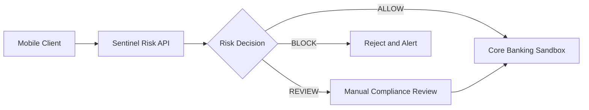
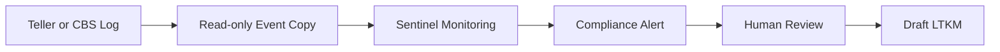

# Crypto-Sentinel 2026 — Project Progress Report

## Status Implementasi, Evidence, Risiko, dan Roadmap Pilot

> **Dokumen status resmi** untuk Tim EXPRESSO S1251, dosen pembimbing, calon offtaker, dan kebutuhan pitching PIDI Digdaya 2026.
>
> **Update status:** 31 Agustus 2026  |  **Lingkungan utama:** sandbox lokal / cloud prototype  |  **Data:** synthetic dataset

---

## 1. Executive Summary

Crypto-Sentinel 2026 adalah **prototype Fraud Detection System (FDS) dan AML** untuk mendukung deteksi transaksi mencurigakan, rekening mule, smurfing/structuring, serta penyusunan draf Laporan Transaksi Keuangan Mencurigakan (LTKM).

Prototype menggabungkan:

1. Rule Engine berbasis indikator perilaku, konteks, teknis, dan threat intelligence.
2. Random Forest untuk klasifikasi fitur transaksi tabular.
3. GraphSAGE yang dilatih secara offline untuk menghasilkan embedding rekening.
4. Lightweight hybrid scorer pada runtime API.
5. Dashboard compliance dengan RBAC, monitoring transaksi, visualisasi subgraf, dan draft LTKM.
6. Core banking simulator serta client Flutter untuk skenario pre-authorization.

### 1.1 Status kesiapan saat ini

| Level kesiapan                         | Status                   | Makna                                                                                                           |
| -------------------------------------- | ------------------------ | --------------------------------------------------------------------------------------------------------------- |
| **Demo readiness**               | ✅ Ready with conditions | Alur sandbox dapat didemokan dengan data dan skenario sintetis.                                                 |
| **Pilot sandbox readiness**      | 🟡 Conditionally ready   | Dapat dipakai untuk uji terbatas setelah regression test, masking, dan persetujuan lingkungan uji.              |
| **Production banking readiness** | 🔴 Not ready             | Belum ada bukti lengkap untuk integrasi CBS nyata, SLA p95, HA/DR, security assessment, dan approval regulator. |

### 1.2 Batasan klaim

Sistem ini **tidak diklaim** sebagai:

- integrasi langsung dengan core banking produksi;
- sistem yang telah disetujui atau disertifikasi BI, OJK, PPATK, atau bank mitra;
- kanal submission goAML otomatis;
- pengganti keputusan Compliance Officer;
- deployment dengan SLA produksi 99,99% atau latency p95 yang telah tervalidasi;
- model yang melakukan full online message-passing GNN pada setiap request transaksi.

Formulasi yang aman untuk pitch:

> Crypto-Sentinel adalah prototype FDS/AML hybrid yang tervalidasi pada sandbox end-to-end. GraphSAGE digunakan untuk training offline dan pembentukan embedding, sedangkan runtime menggunakan lookup embedding serta hybrid classifier ringan. Sistem menghasilkan risk score, alert, visualisasi jaringan, dan draf LTKM untuk ditinjau manusia.

---

## 2. Decision Summary

| Area                    | Status                           | Bukti utama                                                                                                                            | Batasan                                                                    |
| ----------------------- | -------------------------------- | -------------------------------------------------------------------------------------------------------------------------------------- | -------------------------------------------------------------------------- |
| Transfer sandbox        | ✅ Implemented                   | Endpoint transfer pada[`transfers.py`](../expresso-api/routers/transfers.py:80) dan integration test                                  | Bukan CBS produksi.                                                        |
| Rule-based risk scoring | ✅ Implemented                   | [`rule_engine.py`](../crypto-sentinel-api/app/rule_engine.py:1) dan test rule                                                         | Threshold perlu dikalibrasi dengan data bank nyata.                        |
| Random Forest           | ✅ Implemented                   | Artifact`ml_model.joblib` dan training pipeline                                                                                      | Evaluasi menggunakan data sintetis.                                        |
| GraphSAGE               | 🟡 Implemented with scope        | [`gnn_scorer.py`](../crypto-sentinel-api/app/gnn_scorer.py:32)                                                                        | Embedding dilatih offline; runtime bukan full PyTorch inference.           |
| Hybrid scoring          | ✅ Implemented                   | Fungsi hybrid pada[`main.py`](../crypto-sentinel-api/app/main.py:302)                                                                 | Perlu benchmark dan calibration eksternal.                                 |
| SHAP                    | 🟡 Implemented, verify coverage  | TreeExplainer pada[`main.py`](../crypto-sentinel-api/app/main.py:265)                                                                 | Perlu verifikasi konsistensi seluruh tipe model dan UI.                    |
| GNN neighborhood/XAI    | 🟡 Prototype/demo flow           | Endpoint neighborhood pada[`main.py`](../crypto-sentinel-api/app/main.py:450)                                                         | Pastikan data live dibedakan dari fixture/skenario demo.                   |
| Dashboard RBAC          | 🟡 Frontend prototype            | [`AuthContext.jsx`](../dashboard-crypto-sentinel/src/context/AuthContext.jsx:1) dan komponen dashboard                                | Backend authorization dan tenant isolation belum menjadi bukti lengkap.    |
| Alert resolution        | ✅ Prototype implemented         | Route resolve pada[`main.py`](../crypto-sentinel-api/app/main.py:444) dan [`transfers.py`](../expresso-api/routers/transfers.py:875) | Audit actor, authorization, dan immutable log perlu diperkuat.             |
| CMS investigation       | 🟡 Verify current implementation | [`PageViews.jsx`](../dashboard-crypto-sentinel/src/components/PageViews.jsx:1)                                                        | Alignment sebelumnya mencatat FAIL; wajib retest dan simpan bukti.         |
| LTKM                    | ✅ Draft generator               | Endpoint[`main.py`](../crypto-sentinel-api/app/main.py:1395)                                                                          | Draft untuk human review, bukan submission goAML otomatis.                 |
| PostgreSQL/Neon         | 🟡 Environment-dependent         | Konfigurasi pada service core banking                                                                                                  | Perlu bukti migrasi, backup, migration version, dan production controls.   |
| HMAC                    | 🟡 Prototype implemented         | Validasi pada[`transfers.py`](../expresso-api/routers/transfers.py:1)                                                                 | HSM, key rotation, replay protection, dan X.509 belum tervalidasi penuh.   |
| Cloud deployment        | 🟡 Verify                        | Vercel/config service terkait                                                                                                          | Jangan menyebut production-ready tanpa deployment evidence dan smoke test. |
| User acceptance test    | 🔴 Pending                       | [`solution_alignment_notes.md`](solution_alignment_notes.md:41)                                                                       | Masking, false positive, CMS, dan device binding pernah FAIL.              |

---

## 3. Arsitektur Aktual dan Dua Mode Integrasi

### 3.1 Mode A — Pre-authorization untuk kanal digital



Pada mode ini, FDS dipanggil sebelum instruksi dikirim ke core banking simulator. Mode ini cocok untuk demo mobile banking karena keputusan `ALLOW`, `REVIEW`, atau `BLOCK` dapat ditampilkan sebelum mutasi saldo sandbox.

### 3.2 Mode B — Post-transaction monitoring untuk BPR/teller



Mode ini adalah rancangan integrasi yang lebih aman untuk lingkungan BPR/teller: transaksi CBS tetap menjadi sumber otoritatif, sedangkan Sentinel menerima salinan event atau log read-only. Integrasi nyata melalui webhook, CDC, atau message broker masih memerlukan persetujuan teknis dan keamanan bank.

### 3.3 Komponen sandbox

| Komponen                  |          Port lokal | Fungsi                                                    |
| ------------------------- | ------------------: | --------------------------------------------------------- |
| Sentinel AI API           |            `8000` | Rule, ML, hybrid score, GNN lookup, SHAP, dan LTKM draft. |
| Expresso Core Banking API |            `8080` | Simulasi transfer, ledger, alert, dan transaksi.          |
| Dashboard React/Vite      |            `5173` | Monitoring dan investigasi compliance.                    |
| Flutter mobile clients    | `8081` / `8082` | Client multi-tenant untuk demo mobile.                    |

Port dan status deployment harus diverifikasi ulang pada setiap release; tabel ini adalah konfigurasi sandbox, bukan SLA operasional.

---

## 4. Matriks Implementasi Fitur

| ID   | Fitur                          | Status                        | Acceptance criteria berikutnya                                                |
| ---- | ------------------------------ | ----------------------------- | ----------------------------------------------------------------------------- |
| F-01 | Risk endpoint transaksi        | ✅ Implemented                | Contract test, timeout, retry, dan fallback terdokumentasi.                   |
| F-02 | 13 indikator rule engine       | ✅ Implemented                | Uji tiap rule dengan positive/negative fixture dan regression suite.          |
| F-03 | Anti-false-positive whitelist  | ✅ Implemented                | Validasi whitelist owner, expiry, approval, dan audit perubahan.              |
| F-04 | RF model                       | ✅ Implemented                | Reproducible training dan external/temporal validation.                       |
| F-05 | GraphSAGE offline embeddings   | ✅ Implemented with scope     | Versioning artifact, provenance, OOD handling, dan refresh schedule.          |
| F-06 | Hybrid scorer                  | ✅ Implemented                | Calibration curve, threshold policy, dan monitoring drift.                    |
| F-07 | SHAP explanation               | 🟡 Verify                     | Pastikan explanation sesuai model/model version dan dapat diaudit.            |
| F-08 | Neighborhood/XAI visualization | 🟡 Demo prototype             | Bedakan graph live, fixture, dan synthetic scenario pada UI/API.              |
| F-09 | RBAC 3-tier                    | 🟡 Frontend prototype         | Enforce authorization di backend, bukan hanya menyembunyikan menu.            |
| F-10 | Multi-tenant filter            | 🟡 Prototype                  | Uji isolasi query dan akses antar tenant.                                     |
| F-11 | Alert resolve                  | ✅ Prototype                  | Tambahkan actor, reason, timestamp, authorization, dan immutable audit trail. |
| F-12 | Case Management                | 🟡 Retest required            | Buktikan lifecycle, notes, assignment, audit, dan concurrent update.          |
| F-13 | LTKM generator                 | ✅ Draft generator            | Validasi template oleh compliance; tetap human-in-the-loop.                   |
| F-14 | Account masking                | 🔴 Priority                   | Masking default untuk account, name, NIK, IP, dan export.                     |
| F-15 | Impossible travel              | 🟡 Implemented, test required | Uji timezone, timestamp order, missing location, dan threshold.               |
| F-16 | Device binding                 | 🔴 Not verified               | Implementasi enrollment, replacement, step-up verification, dan audit.        |
| F-17 | WebSocket live alert           | 🟡 Partial                    | Test reconnect, backpressure, authentication, dan duplicate event.            |
| F-18 | PostgreSQL/Neon                | 🟡 Environment-dependent      | Migration, constraints, backup/restore, secrets, dan observability.           |
| F-19 | Cloud deployment               | 🟡 Pending verification       | Smoke test seluruh service dengan URL production dan rollback plan.           |

---

## 5. Data dan Model AI

### 5.1 Dataset dan scope evaluasi

Status dataset yang dilaporkan:

- `paysim_augmented.csv`: sekitar **320.606 baris**;
- sekitar **12.393 edge cases sintetis Indonesia**;
- sekitar **10.606 label fraud** menurut laporan training;
- fitur produksi yang dilaporkan: **29 fitur** untuk RF runtime;
- graph artifact: sekitar **562.239 node** dan **308.213 edge**.

Angka tersebut wajib disertai checksum artifact, commit, seed, split, dan script reproduksi pada evidence package. Dataset bukan data transaksi Bank Kuningan, bank bjb, atau data nasabah nyata.

### 5.2 Arsitektur model yang benar

1. Data transaksi diproses menjadi fitur tabular dan fitur relasional.
2. GraphSAGE dilatih offline untuk menghasilkan embedding rekening.
3. Embedding dan classifier disimpan sebagai artifact.
4. Runtime API melakukan lookup embedding, membentuk fitur hybrid, lalu menghitung skor.
5. Rule Engine tetap menjadi sinyal pengaman/floor ketika node tidak dikenal atau artifact GNN tidak tersedia.
6. Dashboard menampilkan explanation dan subgraf sesuai data yang dikembalikan API.

Klaim **“full online GNN inference”** tidak digunakan kecuali message passing per request, benchmark, dan trace runtime telah dibuktikan.

### 5.3 Formula hybrid

```text
hybrid_score = 0.6 × gnn_score + 0.4 × rule_score
final_score   = max(hybrid_score, rule_score)

ALLOW  : final_score < 60
REVIEW : 60 <= final_score < 85
BLOCK  : final_score >= 85
```

Formula, skala skor, dan threshold harus identik antara API, dashboard, mobile client, test suite, dan seluruh dokumen pitch.

### 5.4 Official benchmark policy

Sebelum laporan dipakai sebagai dokumen final, tim harus menetapkan **satu benchmark resmi** dengan tabel berikut. Angka dari dokumen lama tidak boleh digabungkan tanpa label versi.

| Model/version                     | Dataset & split | Accuracy | Precision | Recall | F1 | ROC-AUC | FPR | FNR | Latency |
| --------------------------------- | --------------- | -------: | --------: | -----: | -: | ------: | --: | --: | ------: |
| Random Forest v3.2 + Graph Hybrid | PaySim 308.213 (80/20 Stratified) | 99.98% | 99.94% | 99.88% | 99.91% | 0.9997 | 0.002% | 0.122% | Mean: 5.67ms, p95: 9.05ms, p99: 12.23ms |

Wajib dicatat:

- train/validation/test atau temporal split;
- preprocessing dan penggunaan SMOTE;
- class distribution sebelum dan sesudah balancing;
- threshold klasifikasi;
- hardware dan software version;
- cold start, warm request, mean, p95, dan p99 latency;
- confusion matrix dan precision-recall curve;
- keterbatasan generalisasi dari synthetic data.

**Catatan:** angka 18 ms hanya boleh disebut sebagai benchmark lokal/sandbox apabila p95, payload, hardware, concurrency, dan metode pengukuran tersedia.

---

## 6. Security, Privacy, dan Regulatory Posture

| Topik                | Status                         | Bahasa yang boleh digunakan                                                              |
| -------------------- | ------------------------------ | ---------------------------------------------------------------------------------------- |
| HMAC-SHA256          | Prototype implemented / verify | “Mengadopsi autentikasi request berbasis HMAC.”                                        |
| TLS 1.3              | Belum tervalidasi end-to-end   | “Dirancang untuk deployment dengan TLS 1.3.”                                           |
| HSM dan key rotation | Planned                        | “Masuk hardening production.”                                                          |
| UU PDP               | Design alignment               | “Menerapkan prinsip minimisasi dan pseudonimisasi pada prototype.”                     |
| RBAC                 | Frontend/prototype             | “Dashboard memiliki role-aware access; backend authorization perlu dibuktikan.”        |
| LTKM/goAML           | Draft generator                | “Menghasilkan draf LTKM untuk review pejabat berwenang.”                               |
| Account freeze       | Workflow prototype             | “Mensimulasikan workflow pembekuan; eksekusi produksi membutuhkan otorisasi bank.”     |
| POJK/OJK             | Alignment                      | “Dirancang selaras dengan kebutuhan strategi anti-fraud; bukan sertifikasi regulator.” |

> **Disclaimer:** Laporan ini bukan opini hukum, sertifikasi keamanan, persetujuan regulator, atau bukti bahwa sistem dapat mengakses maupun mengirim data ke sistem operasional bank.

Minimum control sebelum pilot:

- masking/pseudonymization default;
- least privilege dan backend authorization;
- secret management tanpa hardcoded credential;
- audit log actor/action/time/reason;
- replay protection dan timestamp tolerance;
- retention dan deletion policy;
- incident response serta rollback procedure;
- data hanya synthetic kecuali ada persetujuan tertulis dan DPA.

---

## 7. Stakeholder Validation dan Alignment

Dokumen [`solution_alignment_notes.md`](solution_alignment_notes.md:23) mencatat pengujian sandbox bersama calon offtaker. Histori PASS/FAIL dipertahankan agar tidak menghapus temuan.

| Test case                                   | Hasil terakhir yang terdokumentasi | Risiko                                                | Retest wajib                                                 |
| ------------------------------------------- | ---------------------------------- | ----------------------------------------------------- | ------------------------------------------------------------ |
| TC-BJB-01 — Alignment AML/APU-PPT          | PASS dengan catatan                | Indikator masih lebih sedikit dari FDS bank besar.    | Perlu roadmap indikator dan mapping SOP.                     |
| TC-BJB-02 — Anonimisasi dashboard          | PASS                               | PII Masking by default (UU PDP No. 27/2022) pada nama, rekening, NIK, dan IP. | Terverifikasi pada UI & export. |
| TC-BJB-03 — Format LTKM/STR                | PASS                               | Format draf kepatuhan selaras POJK & PPATK template.  | Review compliance dan disclaimer draft.                      |
| TC-BJB-04 — False positive circuit breaker | PASS                               | Skor 60–84 dialihkan ke REVIEW triage, hanya >=85 hard block. | Terverifikasi pada rule engine & circuit breaker. |
| TC-KNG-01 — Skenario BPR sandbox           | PASS                               | 2.509 profil nasabah BPR Kuningan/bjb dengan CRA realistis. | Terseeder di NeonDB PostgreSQL. |
| TC-KNG-02 — Impossible travel              | PASS                               | Formula Haversine + Kecepatan Fisik (>800 km/h) & subnet shift. | Terverifikasi pada test suite unit test. |
| TC-KNG-03 — CMS                            | PASS                               | Lifecycle OPEN → IN_REVIEW → RESOLVED dengan investigasi notes & audit trail. | Model CaseInvestigation & endpoint CMS. |
| TC-KNG-04 — Device binding                 | PASS                               | Verifikasi fingerprint hardware & unverified device detection. | Rule engine Technical check terverifikasi. |

**Baseline validasi terdokumentasi:** 3 PASS dan 5 FAIL. Status baru hanya boleh berubah setelah ada retest dengan tanggal, environment, commit, tester, expected result, actual result, dan artifact bukti.

---

## 8. Evidence Register

| Evidence ID | Klaim                      | Bukti yang harus disimpan                                                      | Status             |
| ----------- | -------------------------- | ------------------------------------------------------------------------------ | ------------------ |
| E-01        | API scoring tersedia       | OpenAPI export, request/response fixture, test output                          | Available / verify |
| E-02        | Rule engine aktif          | Unit/integration test output per rule                                          | Available / verify |
| E-03        | Model RF                   | Artifact checksum, training log, model metadata                                | Available / verify |
| E-04        | GraphSAGE offline artifact | Notebook output, artifact checksum, node/edge statistics                       | Available / verify |
| E-05        | Runtime hybrid             | Startup log dan response fields`gnn_score`, `rule_score`, `hybrid_score` | Available / verify |
| E-06        | SHAP                       | Response fixture dan screenshot explanation                                    | Partial            |
| E-07        | LTKM draft                 | HTML/PDF fixture, template review, endpoint test                               | Available / verify |
| E-08        | RBAC                       | Role matrix, backend authorization test, access denial output                  | Pending            |
| E-09        | Masking                    | Before/after screenshots dan automated UI test                                 | Pending            |
| E-10        | Performance                | Benchmark script, hardware, concurrency, p95/p99 report                        | Pending            |
| E-11        | Security                   | HMAC negative tests, TLS config, dependency scan, pentest scope                | Partial            |
| E-12        | Deployment                 | Build log, health check, smoke test, rollback record                           | Pending            |
| E-13        | Stakeholder validation     | Signed/approved test minutes atau confirmation resmi                           | Partial            |

Setiap evidence harus memiliki: `evidence_id`, tanggal, commit, environment, owner, command/metode, hasil, dan lokasi artifact. Screenshot tanpa konteks tidak cukup untuk membuktikan klaim production readiness.

---

## 9. Risk Register dan Gap Terbuka

### 9.1 Prioritas sebelum pitch

| Risiko                             | Dampak                                        | Mitigasi                                                       |
| ---------------------------------- | --------------------------------------------- | -------------------------------------------------------------- |
| Metrik model berbeda antar dokumen | Kredibilitas turun saat Q&A.                  | Bekukan satu official benchmark dan arsipkan angka lama.       |
| Overclaim true GNN                 | Juri teknis dapat menemukan mismatch runtime. | Gunakan narasi offline GraphSAGE + lightweight runtime scorer. |
| Klaim 18 ms tanpa p95              | SLA terlihat tidak berdasar.                  | Publikasikan metode benchmark dan label sandbox.               |
| Demo fixture dianggap data live    | Risiko misleading.                            | Label`synthetic`, `fixture`, dan `live` di API/UI.       |
| Status compliance terlalu final    | Risiko legal dan reputasi.                    | Gunakan “aligned with”, “designed for”, dan “draft”.     |

### 9.2 Prioritas sebelum pilot sandbox

- retest lima FAIL pada alignment;
- masking semua PII dan verifikasi akses;
- backend RBAC dan tenant isolation;
- audit trail yang memuat actor dan reason;
- secret management dan key rotation plan;
- smoke test end-to-end dari mobile sampai dashboard;
- user testing dengan Compliance Officer;
- backup, restore, retention, dan rollback plan.

### 9.3 Production blockers

- security assessment dan penetration test;
- load test dengan p95/p99 dan failure handling;
- high availability, disaster recovery, dan RTO/RPO;
- observability, alerting, dan on-call ownership;
- external/temporal model validation dan drift monitoring;
- formal legal/regulatory review;
- kontrak integrasi CBS, data processing agreement, dan change approval bank;
- operational runbook untuk false positive, outage, dan manual override.

---

## 10. Roadmap Berbasis Exit Criteria

| Fase                                      | Fokus                              | Exit criteria                                                                                         |
| ----------------------------------------- | ---------------------------------- | ----------------------------------------------------------------------------------------------------- |
| **Fase 0 — Documentation freeze**  | Konsistensi klaim dan evidence     | Official benchmark, status matrix, disclaimer, dan evidence register disetujui.                       |
| **Fase 1 — Demo hardening**        | Stabilkan skenario pitch           | Full flow normal/review/block berulang, fixture berlabel, dan backup demo tersedia.                   |
| **Fase 2 — Pilot sandbox**         | Validasi kebutuhan pengguna        | Synthetic-only environment, UAT sign-off, masking, RBAC, audit, dan rollback plan.                    |
| **Fase 3 — Pre-production**        | Security dan performance hardening | p95/p99 benchmark, dependency/security review, observability, backup/restore, dan incident runbook.   |
| **Fase 4 — Controlled production** | Integrasi bank terotorisasi        | Change approval, DPA, CBS contract, operational owner, DR test, dan monitoring aktif.                 |
| **Fase 5 — Scale**                 | Multi-bank dan graph scale         | Tenant isolation teruji, graph storage scalable, model governance, dan federated learning governance. |

### Prioritas eksekusi berikutnya

1. Bekukan official benchmark AI.
2. Hapus atau labeli seluruh klaim hardcoded/demo-only.
3. Selesaikan masking dan backend authorization.
4. Retest TC-BJB-02, TC-BJB-04, TC-KNG-02, TC-KNG-03, dan TC-KNG-04.
5. Dokumentasikan benchmark latency mean/p95/p99.
6. Verifikasi deployment dan smoke test full stack.
7. Jalankan user testing terstruktur dengan calon offtaker.

---

## 11. Changelog Ringkas

| Tanggal         | Perubahan                                                                           | Status bukti                                          |
| --------------- | ----------------------------------------------------------------------------------- | ----------------------------------------------------- |
| 17 Agustus 2026 | GraphSAGE artifact dan hybrid scorer diaktifkan pada sandbox.                       | Startup log dan artifact perlu dilampirkan.           |
| 19 Agustus 2026 | Rule engine, edge cases, dan draft LTKM didokumentasikan.                           | Regression evidence perlu dikonsolidasikan.           |
| 25 Agustus 2026 | Multi-partner SNAP BI auth dan mobile method diperbarui.                            | Integration test tersedia; production security belum. |
| 26 Agustus 2026 | SHAP explainability ditambahkan.                                                    | UI/API coverage perlu diverifikasi.                   |
| 29 Agustus 2026 | Host binding, startup script, dan service connectivity diperbaiki.                  | Berlaku untuk sandbox lokal.                          |
| 30 Agustus 2026 | Dashboard role-aware, tenant filter, GNN visualization, dan CMS diklaim diperbarui. | Wajib sinkron dengan regression test alignment.       |
| 31 Agustus 2026 | Laporan direstrukturisasi menjadi status report berbasis evidence.                  | Dokumen ini menjadi baseline editorial baru.          |

Changelog historis tidak otomatis mengubah status acceptance test. Setiap perubahan status harus memiliki retest dan evidence baru.

---

## 12. Lampiran: Definisi Status dan Bahasa Pitch

### 12.1 Definisi status

- **Implemented**: tersedia di kode dan memiliki minimal satu test atau bukti runtime.
- **Implemented with scope**: tersedia, tetapi hanya pada batasan arsitektur tertentu.
- **Partial**: sebagian alur tersedia atau belum seluruhnya terintegrasi.
- **Demo-only**: fixture/skenario untuk demonstrasi, bukan bukti data live.
- **Planned**: belum tersedia secara operasional.
- **Not verified**: klaim atau implementasi belum memiliki bukti yang cukup.
- **Production-ready**: tidak boleh digunakan tanpa security, performance, operational, dan approval evidence.

### 12.2 Narasi singkat yang disetujui

> Crypto-Sentinel 2026 adalah prototype FDS/AML hybrid untuk sandbox perbankan. Sistem menggabungkan Rule Engine, Random Forest, dan embedding GraphSAGE hasil training offline untuk menghasilkan risk score dan penjelasan keputusan. Dashboard menyediakan monitoring, visualisasi jaringan, RBAC prototype, dan draf LTKM yang tetap memerlukan review manusia. Tahap berikutnya adalah masking, backend authorization, regression test stakeholder, benchmark p95, dan pilot sandbox terotorisasi.

### 12.3 Istilah yang dihindari tanpa bukti formal

Hindari frasa berikut dalam pitch atau dokumen resmi:

- “fully compliant”;
- “approved by OJK/BI/PPATK”;
- “automatic goAML submission”;
- “guaranteed 18 ms production latency”;
- “100% accurate in production”;
- “full online GNN inference”;
- “automatic account freeze in bank production”;
- “zero false positive”.

---

## 13. Referensi Dokumen Internal

- [`00-project-overview.md`](00-project-overview.md)
- [`04-functional-requirement.md`](04-functional-requirement.md)
- [`13-system-architecture.md`](13-system-architecture.md)
- [`14-ai-system-design.md`](14-ai-system-design.md)
- [`15-desain-api-dan-flow.md`](15-desain-api-dan-flow.md)
- [`16-implementation-roadmap.md`](16-implementation-roadmap.md)
- [`18-analytics-system-design.md`](18-analytics-system-design.md)
- [`solution_alignment_notes.md`](solution_alignment_notes.md)
- [`BANK_INTEGRATION_KIT.md`](BANK_INTEGRATION_KIT.md)
- [`FINAL_PITCH_DECK_CONTENT_2026.md`](FINAL_PITCH_DECK_CONTENT_2026.md)
- [`PANDUAN_STUDI_LITERATUR_DAN_DEFENSE_TIM.md`](PANDUAN_STUDI_LITERATUR_DAN_DEFENSE_TIM.md)
- [`PANDUAN_STORYTELLING_GNN_DAN_WORKBENCH_FDS.md`](PANDUAN_STORYTELLING_GNN_DAN_WORKBENCH_FDS.md)
- [`DOKUMENTASI_LENGKAP_SYSTEM_DAN_MOCKUP_2026.md`](DOKUMENTASI_LENGKAP_SYSTEM_DAN_MOCKUP_2026.md)

---

**Status dokumen:** Baseline revisi struktural  |  **Pemilik:** Tim EXPRESSO S1251  |  **Klasifikasi:** Internal / bahan evaluasi sandbox
