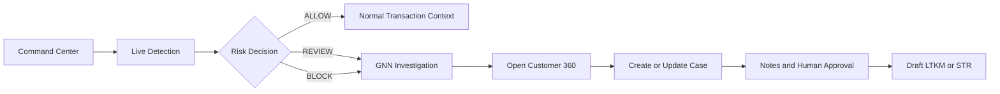
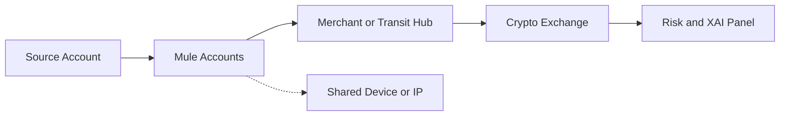

# Implementation Plan — Dashboard GNN-First + FDS Ringkas

> **Blueprint reference:** [`crypto-sentinel-blueprint.html`](../crypto-sentinel-blueprint.html)
>
> Dokumen blueprint awal menetapkan arah produk yang lebih luas: Crypto-Sentinel sebagai security middleware di antara aplikasi nasabah dan core banking, dengan GNN sebagai otak analitik, smart circuit breaker sebagai enforcement layer, dan forensic dashboard sebagai antarmuka investigasi/XAI. Rencana ini mempertahankan visi tersebut, tetapi membatasi implementasi hackathon pada alur yang dapat didemokan dan dibuktikan oleh prototype saat ini.

## 1. Tujuan Produk

Menyederhanakan dashboard Crypto-Sentinel untuk kebutuhan PIDI Digdaya x Hackathon dan validasi awal inkubasi startup, dengan **GNN sebagai fitur pembeda utama** serta FDS sebagai konteks operasional yang singkat, jelas, dan dapat didemokan.

Positioning yang digunakan:

> Crypto-Sentinel adalah platform investigasi AML berbasis graf yang membantu FDS bank menemukan rekening mule dan jaringan transaksi mencurigakan, kemudian memprioritaskan tindakan `ALLOW`, `REVIEW`, atau `BLOCK` dengan human-in-the-loop.

Dashboard tidak akan diposisikan sebagai CBS atau sistem bank produksi. Semua data dan metrik demo harus diberi label `LIVE`, `SYNTHETIC`, atau `DEMO FIXTURE` sesuai sumbernya.

## 2. Prinsip Desain

1. **GNN-first:** analisis relasi rekening menjadi pusat alur demo, bukan sekadar submenu tambahan.
2. **FDS ringkas:** tampilkan input transaksi, risk score, decision, alasan, dan tindak lanjut.
3. **Satu alur kerja:** deteksi → investigasi graf → customer context → case/compliance.
4. **Tanpa menu tumpang tindih:** satu fungsi hanya memiliki satu tempat utama.
5. **Evidence-driven:** hanya menampilkan klaim yang benar-benar dapat dibuktikan oleh API, model, atau test.
6. **Human-in-the-loop:** skor 60–84 masuk `REVIEW`; `BLOCK` hanya untuk sinyal risiko tinggi sesuai kebijakan sandbox.
7. **Privacy by default:** nama, rekening, NIK, IP, dan device ditampilkan masked kecuali ada otorisasi eksplisit.
8. **Progressive disclosure:** fitur enterprise tetap tersedia sebagai advanced view, tetapi tidak mengganggu demo utama.
9. **Blueprint fidelity:** visualisasi mengikuti bahasa visual blueprint: alur kiri-ke-kanan, zona investigasi, legend node/edge, dan panel risiko/XAI di sisi kanan.
10. **Truthful explainability:** gunakan `SHAP explanation` untuk feature attribution yang tersedia; gunakan `edge importance` atau `investigation relevance` untuk highlight graf kecuali backend benar-benar menghasilkan attention coefficient.

## 3. Arsitektur Navigasi Final

### 3.1 Menu utama yang terlihat oleh jalur demo

| Urutan | Label Menu | ID Konsep | Peran dalam Demo |
|---:|---|---|---|
| 1 | Command Center | `dashboard` | Ringkasan volume, alert, decision, dan entry point skenario |
| 2 | Live Detection | `monitoring` | Stream transaksi, risk score, decision, rule/model reason |
| 3 | GNN Network Investigation | `analysis` | Fitur hero: node, edge, mule hub, path, neighborhood, XAI |
| 4 | Cases & Compliance | `alerts` | Triage alert, case lifecycle, notes, approval, draft LTKM/STR |

### 3.2 Panel detail, bukan menu utama terpisah

| Panel | Fungsi | Cara Dibuka |
|---|---|---|
| Customer / Account 360 | Profil CRA, risk score, mule probability, CDD/EDD, device context | Klik node, rekening, atau transaksi |
| Transaction Detail | Payload, alasan rule, model score, status data | Klik baris transaksi |
| Case Detail | Status, notes, assignment, audit events | Klik alert/case |
| Privacy & Data Source | Masking state dan asal data | Header/status badge |

Customer 360 tetap dipertahankan karena berguna untuk bank, tetapi diperlakukan sebagai **context panel** dalam investigasi GNN, bukan sebagai alur terpisah yang bersaing dengan analisis graf.

### 3.3 Advanced Platform

Fitur berikut dipindahkan ke kelompok sekunder bernama `Advanced Platform` atau `Platform Governance`:

- Risk Controls & Policies
- Model Governance & XAI metadata
- Integrations & Data Quality
- Administration & RBAC
- APOLO/OJK preview
- Audit log teknis lengkap
- Threshold calibration

Fitur ini tetap penting untuk narasi inkubasi dan roadmap enterprise, tetapi tidak menjadi fokus layar pertama atau demo hackathon.

## 4. Alur Pengguna Utama



### 4.1 Skenario demo utama: mule ring dan crypto off-ramp

1. Presenter membuka **Command Center**.
2. Presenter memilih skenario `Bank bjb High-Velocity Crypto Smurfing`.
3. **Live Detection** menampilkan beberapa transfer kecil dan satu tujuan hub.
4. Satu transaksi berstatus `REVIEW` atau `BLOCK` dipilih.
5. Dashboard membuka **GNN Network Investigation** secara otomatis.
6. Presenter menyorot:
   - rekening sumber;
   - rekening perantara/mule hub;
   - banyak inbound edge;
   - jalur menuju VASP/crypto exchange;
   - degree atau centrality;
   - mule probability;
   - GNN explanation/feature attribution.
7. Presenter membuka **Customer 360** dari node mule hub.
8. Dashboard menampilkan CRA score, occupation, income, PEP, CDD/EDD, device context, dan data source.
9. Presenter membuat atau memperbarui case.
10. Presenter menambahkan investigation note dan menunjukkan audit event.
11. Presenter membuka draft LTKM/STR sebagai output compliance.

### 4.2 Skenario pembanding: transaksi Bansos legitimate

1. Presenter membuka transaksi penyaluran resmi dengan purpose code dan tujuan resmi.
2. Dashboard menampilkan contextual trust signal.
3. Transaksi tidak boleh diblokir hanya karena volume penyaluran massal.
4. Jika terdapat sinyal kuat yang bertentangan, hasil yang tepat adalah `REVIEW`, bukan whitelist buta.
5. Narasi yang digunakan:

> Sistem tidak melakukan whitelist buta. Metadata resmi menurunkan risiko transaksi legitimate, sedangkan anomali kuat tetap diarahkan ke review manusia agar celah penyalahgunaan tidak terbuka.

## 5. Struktur Halaman

### 5.1 Command Center

**Komponen P0:**

- total transaksi dianalisis;
- alert aktif;
- jumlah `ALLOW`, `REVIEW`, `BLOCK`;
- top risk network/account;
- tombol `Open GNN Investigation`;
- badge data source dan system health.

**Yang tidak ditonjolkan:** grafik dekoratif yang tidak mendukung keputusan atau investigasi.

### 5.2 Live Detection

**Komponen P0:**

- tabel transaksi terbaru;
- timestamp;
- masked sender/destination;
- amount;
- risk score;
- decision;
- reasons;
- data source;
- tombol buka detail.

**Aturan tampilan:** jangan mencampur fixture dengan data live tanpa label yang terlihat.

### 5.3 GNN Network Investigation

**Komponen P0:**

- graph canvas yang readable dengan lima zona: `Source`, `Smurfing Layer`, `Aggregation Layer`, `Crypto Destination`, dan `Device/IP`;
- legend node dan edge sesuai blueprint;
- selected node dan selected edge state;
- 1-hop, 2-hop, dan 3-hop neighborhood;
- filter bank/tenant;
- path to VASP atau crypto exchange;
- mule probability;
- inbound/outbound degree;
- risk propagation atau cluster highlight;
- panel risiko/XAI di sisi kanan;
- source badge: `LIVE`, `SYNTHETIC`, atau `DEMO`.

**Pola yang wajib tersedia pada fixture demo:**

- fan-out: satu source account → banyak mule accounts;
- fan-in: banyak mule accounts → satu merchant/transit hub;
- layering: beberapa lapisan transfer sebelum off-ramp;
- crypto off-ramp: hub → exchange/wallet;
- shared device/IP: beberapa akun → device atau IP yang sama;
- circular flow sebagai pola lanjutan/roadmap bila belum tersedia pada data runtime.

**Bahasa visual edge:** transfer biasa berupa garis netral berarah; transfer menuju kripto berupa garis putus-putus merah; relasi device/IP berupa garis titik-titik abu-abu; edge dengan relevansi investigasi tinggi menjadi lebih tebal dan lebih terang.

**Panel kanan minimum:** risk score 0–100, decision, label pola, tiga sampai lima alasan teratas, jumlah inbound/outbound, jumlah hop ke kripto, nominal agregat, rentang waktu, device/IP linkage count, skor GNN/rule/ML/hybrid, explanation source, source badge, dan aksi sesuai permission.

**Komponen P1:**

- search account/NIK dengan masking;
- Customer 360 side panel;
- export evidence yang sudah masked;
- snapshot graph untuk case.

### 5.4 Cases & Compliance

**Komponen P0:**

- alert queue;
- create/open case;
- lifecycle `OPEN → IN_REVIEW → ESCALATED → RESOLVED/CLOSED`;
- assignment;
- investigation notes;
- audit timeline;
- draft LTKM/STR.

**Komponen P1:**

- approval/override flow;
- evidence attachment;
- case filtering dan SLA indicator.

### 5.5 Advanced Platform

Tampilan ini digunakan ketika juri atau calon offtaker ingin melihat kesiapan enterprise:

- model governance;
- rule calibration;
- RBAC matrix;
- tenant isolation concept;
- integration health;
- regulatory preview.

Setiap halaman advanced harus menampilkan status prototype dan batasan implementasinya.

## 6. Prioritas Implementasi

### P0 — Wajib untuk hackathon demo

1. Menyederhanakan sidebar menjadi empat menu utama.
2. Menjadikan GNN Network Investigation sebagai menu hero.
3. Menyatukan navigasi dari transaksi ke graph ke Customer 360 ke case.
4. Memastikan graph memiliki selected-node state dan hubungan yang dapat dijelaskan.
5. Menampilkan risk score, decision, rule reason, GNN score, dan data source.
6. Menambahkan skenario demo smurfing yang dapat diulang secara konsisten.
7. Menambahkan skenario Bansos legitimate sebagai pembanding false-positive.
8. Menjaga masking PII default pada semua halaman demo dan export.
9. Menampilkan disclaimer synthetic/demo dan batasan GraphSAGE offline.
10. Menyiapkan fallback apabila API tidak tersedia tanpa menyamarkan fixture sebagai live.

### P1 — Wajib untuk validasi calon bank/offtaker

1. Customer 360 yang mengambil profil dari API backend.
2. Case lifecycle, notes, assignment, dan audit timeline.
3. Review workflow untuk skor menengah.
4. Device/IP context yang dapat ditelusuri.
5. Filter multi-bank dan tenant context.
6. Draft LTKM/STR dari case.
7. Test contract frontend-backend untuk transaksi, graph, akun, case, dan audit.
8. Evidence package berisi screenshot, request/response fixture, dan hasil test.

### P2 — Roadmap enterprise, bukan blocker hackathon

1. Backend authorization berbasis token/identity provider.
2. Tenant isolation pada query dan storage.
3. HSM, key rotation, TLS hardening, dan replay protection.
4. WebSocket production dengan reconnect dan backpressure.
5. Benchmark temporal/external dan drift monitoring.
6. Deployment HA/DR, backup/restore, observability, dan rollback.
7. Federated learning orchestrator nyata menggunakan framework khusus.
8. Integrasi CBS bank melalui kontrak, CDC, webhook, atau message broker resmi.

## 7. Narasi Presentasi yang Disetujui

### Pembuka

> “Masalah yang kami selesaikan bukan hanya mendeteksi transaksi mencurigakan, tetapi memahami hubungan antar rekening. Sindikat memecah transaksi agar setiap transfer terlihat kecil. Crypto-Sentinel menggunakan analisis graf untuk menemukan rekening hub dan jaringan mule di balik transaksi tersebut.”

### Saat membuka GNN

> “Node ini terlihat berisiko bukan hanya karena nominal satu transaksi, tetapi karena menerima aliran dari banyak rekening dan kemudian terhubung ke off-ramp kripto. GraphSAGE kami dilatih offline untuk mempelajari struktur jaringan; runtime menggabungkan embedding dengan rule score dan model tabular.”

### Saat menjelaskan FDS

> “GNN memberi konteks relasional, sementara FDS memberi keputusan operasional. Skor menengah masuk review manusia, dan block otomatis hanya digunakan untuk kombinasi indikator risiko tinggi sesuai kebijakan sandbox.”

### Saat menjelaskan Bansos

> “Transaksi Bansos resmi tidak otomatis diblokir hanya karena massal. Purpose code dan entitas tujuan yang tervalidasi menurunkan risiko. Namun kami tidak menggunakan whitelist buta; sinyal anomaly kuat tetap dapat memicu review.”

### Saat menjelaskan kesiapan enterprise

> “Dashboard ini adalah prototype investigasi untuk sandbox. Enterprise controls seperti authorization backend, tenant isolation, security assessment, HA/DR, dan integrasi CBS resmi adalah tahap berikutnya sebelum produksi.”

## 8. Status Implementasi Saat Ini

| Area | Status | Evidence |
|---|---|---|
| GNN investigation, BFS neighborhood, selected edge, tenant filter | Implemented prototype | `GNNVisualization.jsx` |
| Case creation dan graph snapshot persistence | Implemented prototype | `App.jsx`, `api.js`, `transfers.py`, `db_models.py` |
| MLRO block/resolve dengan reason dan audit | Implemented prototype | `PageViews.jsx`, `transfers.py` |
| Dua akun demo operasional; regulator read-only preview | Implemented | `AuthContext.jsx` |
| Token identity, tenant-enforced backend queries, masked evidence export | Roadmap | Memerlukan hardening production |

> Frontend build dan kompilasi Python berhasil. Header identity, tenant isolation penuh, export evidence masked, serta sebagian output compliance masih memerlukan hardening sebelum produksi.

## 9. Pemetaan Blueprint Awal ke Implementasi Dashboard

| Elemen blueprint awal | Keputusan implementasi |
|---|---|
| GNN sebagai `The Brain` | Menjadi menu hero dan pusat investigasi, dengan GraphSAGE runtime dijelaskan sebagai embedding lookup bila itu yang tersedia |
| Smart Circuit Breaker | Dipresentasikan sebagai decision/enforcement layer `ALLOW`, `REVIEW`, `BLOCK`; aksi mutatif tetap dibatasi role dan audit |
| Forensic Dashboard | Diwujudkan melalui empat menu ringkas: Command Center, Live Detection, GNN Network Investigation, dan Cases & Compliance |
| SHAP Explainer | Menampilkan feature attribution yang benar-benar dikembalikan oleh backend; jangan mengubahnya menjadi klaim node-level explainer tanpa evidence |
| STR Generator | Ditempatkan sebagai draft output pada Cases & Compliance; bukan klaim pengiriman otomatis ke PPATK/OJK |
| React Flow atau D3.js | Gunakan library yang benar-benar ada di project; bila belum terpasang, implementasikan layout SVG/CSS atau fixture graph tanpa menambah dependency berisiko |
| NetworkX graph | Dipakai sebagai sumber analitik/fixture lokal sesuai kemampuan backend saat ini, bukan klaim graph database enterprise |
| 15 sub-indikator | Ditampilkan sebagai Graph Metrics drawer dengan source dan periode observasi |
| API `/dashboard/graph/{cluster_id}` | Dipetakan ke endpoint graph yang tersedia saat ini atau adapter frontend; kontrak endpoint blueprint menjadi target kompatibilitas, bukan bukti endpoint sudah ada |

## 9. Klaim yang Boleh dan Tidak Boleh Digunakan

### Boleh

- “Prototype FDS/AML hybrid untuk sandbox.”
- “GraphSAGE digunakan untuk training offline dan embedding lookup.”
- “Dashboard memprioritaskan investigasi rekening mule.”
- “Draf LTKM/STR tetap memerlukan review manusia.”
- “Data demo bersifat synthetic dan diberi source badge.”

### Tidak boleh tanpa evidence tambahan

- “Fully compliant.”
- “Approved OJK/BI/PPATK.”
- “Automatic goAML submission.”
- “Full online GNN inference.”
- “Zero false positive.”
- “Production-ready banking FDS.”
- “Federated learning multi-bank sudah berjalan penuh.”
- “Bansos pasti tidak pernah masuk review.”

## 10. Kriteria Selesai Sebelum Implementasi Dinilai Berhasil

- Sidebar utama hanya menampilkan empat jalur demo yang tidak tumpang tindih.
- GNN dapat dicapai maksimal dalam satu klik dari transaksi atau alert.
- Customer 360 dibuka sebagai konteks node/transaction, bukan halaman yang terisolasi.
- Satu demo smurfing selesai tanpa perpindahan halaman yang membingungkan.
- Satu demo Bansos legitimate menunjukkan tidak ada hard block tanpa sinyal kuat.
- Semua angka benchmark pada layar dan dokumen menggunakan dataset/split yang sama atau diberi label skenario berbeda.
- Semua data PII tersamarkan secara default.
- Semua output live/demo memiliki source badge.
- Build frontend, unit test backend, dan smoke test alur demo lulus.
- Dokumen pitch, progress report, dan storytelling menggunakan terminologi arsitektur yang sama.

## 11. Keputusan Arsitektur

Keputusan final untuk fase berikutnya:

> **Bangun dashboard sebagai GNN-first AML Investigation Workbench, bukan replika penuh FDS enterprise.**

FDS tetap hadir sebagai lapisan keputusan dan compliance, sedangkan fitur enterprise menjadi advanced preview dan roadmap. Dengan begitu, dashboard relevan untuk hackathon, tetap kredibel bagi calon bank/offtaker, dan tidak membuat klaim production readiness yang belum terbukti.

## 11. Spesifikasi Kanvas GNN Berdasarkan Blueprint Visual

Blueprint utama layar investigasi mengikuti alur kiri-ke-kanan berikut:



### 11.1 Struktur visual kanvas

Kanvas harus memprioritaskan keterbacaan pola jaringan, bukan menampilkan seluruh graf tanpa penyaringan. Layout default dibagi menjadi lima zona:

| Zona | Representasi | Tujuan investigasi |
|---|---|---|
| `Source` | Akun utama atau originator | Menunjukkan asal dana dan saldo awal |
| `Smurfing Layer` | Banyak akun perantara/mule | Menunjukkan fan-out, nominal seragam, dan aktivitas beruntun |
| `Aggregation Layer` | Merchant atau akun transit | Menunjukkan fan-in atau konsolidasi dana |
| `Crypto Destination` | Exchange, wallet, atau VASP | Menunjukkan off-ramp/tujuan akhir berisiko |
| `Device and IP` | Device fingerprint, IP, atau subnet | Menunjukkan relasi tersembunyi lintas rekening |

Node menggunakan bentuk dan warna konsisten:

- akun sumber: lingkaran biru;
- akun mule/perantara: lingkaran hijau;
- merchant atau transit hub: lingkaran oranye;
- exchange/wallet kripto: lingkaran ungu;
- device/IP: lingkaran abu-abu;
- bank atau institusi: ikon institusi.

Edge menggunakan arah panah dan label nominal/waktu. Transfer biasa ditampilkan sebagai garis netral, transfer menuju kripto sebagai garis putus-putus merah, dan relasi device/IP sebagai garis titik-titik abu-abu. Edge yang paling berpengaruh terhadap investigasi diberi ketebalan serta intensitas warna lebih tinggi.

### 11.2 Pola graf yang wajib dapat didemokan

1. **Fan-out / smurfing:** satu sumber mengirim dana ke banyak akun perantara dalam interval pendek.
2. **Fan-in / aggregation:** banyak akun perantara mengumpulkan dana ke satu merchant atau transit hub.
3. **Structuring:** nominal transfer kecil, seragam, atau berulang untuk menghindari ambang pelaporan.
4. **Layering:** dana berpindah melalui beberapa lapisan akun sebelum mencapai tujuan akhir.
5. **Crypto off-ramp:** aliran dari hub atau merchant menuju exchange/wallet kripto.
6. **Device/IP linkage:** banyak akun berbeda memakai device fingerprint, IP, atau subnet yang sama.
7. **Circular flow:** aliran dana berputar kembali ke akun atau komunitas awal.

Kanvas harus menyediakan kontrol `1-hop`, `2-hop`, dan `3-hop`, filter arah `inbound/outbound`, filter node type, serta tombol `Fit to Investigation`. Saat pengguna memilih transaksi dari **Live Detection**, kanvas memusatkan transaksi tersebut dan menyorot subgraf paling relevan.

### 11.3 Attention weight dan batasan klaim model

Secara UX, edge importance divisualisasikan dengan ketebalan garis, warna merah, dan label kontribusi. Nilai tersebut harus memiliki sumber yang eksplisit:

- jika berasal dari output model atau explainer yang benar-benar tersedia, labeli `Model attribution`;
- jika berasal dari kombinasi feature edge, rule score, centrality, dan jalur menuju kripto, labeli `Investigation relevance`;
- jangan menyebutnya sebagai `GAT attention weights` apabila runtime saat ini menggunakan GraphSAGE embedding lookup dan belum mengeluarkan attention coefficients.

Implementasi tahap demo dapat memakai `edge_importance` terstruktur pada payload graph untuk mengurutkan edge yang disorot. Tahap lanjutan dapat menambahkan GAT/GNNExplainer atau explainer kompatibel lainnya. Panel harus selalu menampilkan `model type`, `scoring mode`, `explanation source`, dan disclaimer bahwa highlight graf adalah bantuan investigasi, bukan bukti tunggal tindak pidana.

### 11.4 Panel risiko dan XAI di sisi kanan

Panel kanan menjadi ringkasan keputusan untuk node atau transaksi yang dipilih. Komponen minimum:

- risk score `0–100` dan risk level;
- decision `ALLOW`, `REVIEW`, atau `BLOCK`;
- classification label, misalnya `SMURFING + CRYPTO OFF-RAMP`;
- tiga sampai lima alasan teratas;
- ringkasan topologi: jumlah inbound/outbound, hub degree, dan jumlah hop ke exchange;
- nominal agregat dan rentang waktu aktivitas;
- device/IP linkage count;
- model score: GNN, rule, ML, dan hybrid bila tersedia;
- explanation source dan source badge;
- tombol `Open Customer 360`, `Create Case`, dan `Generate Draft LTKM` sesuai permission role.

Contoh copy UI yang disetujui:

> **Blokir direkomendasikan — Skor Risiko 94.** Subgraf menunjukkan fan-out dari satu sumber, nominal transfer berulang, konsolidasi pada akun transit, dan jalur berdekatan menuju exchange kripto. Keputusan akhir tetap mengikuti kebijakan dan review manusia.

Contoh transaksi normal harus menghasilkan panel yang kontras: graf lebih sederhana, edge tipis, tidak ada hub berlebihan, tidak ada shared device/IP yang mencurigakan, dan keputusan `ALLOW` atau `REVIEW` sesuai sinyal yang tersedia.

## 12. Spesifikasi 15 Metrik Fraud Hibrida

Metrik berikut ditampilkan pada panel ringkasan atau drawer `Graph Metrics`. Setiap metrik harus memiliki definisi, periode observasi, nilai, dan status apakah berasal dari data live, synthetic, atau demo fixture.

| No. | Metrik | Kategori | Interpretasi |
|---:|---|---|---|
| 1 | Transaction velocity | Temporal | Jumlah transaksi atau nominal dalam jendela waktu tertentu |
| 2 | Balance drain ratio | Transactional | Proporsi saldo yang keluar dalam satu rangkaian aktivitas |
| 3 | Amount similarity | Structuring | Keseragaman nominal yang dapat mengindikasikan pemecahan dana |
| 4 | Fan-out degree | Graph topology | Jumlah tujuan unik dari satu node sumber |
| 5 | Fan-in degree | Graph topology | Jumlah sumber unik yang masuk ke satu node hub |
| 6 | Inbound/outbound ratio | Graph topology | Perbandingan dana masuk dan keluar pada node |
| 7 | Weighted transaction volume | Graph topology | Total nominal berbobot pada neighborhood atau subgraf |
| 8 | Betweenness centrality | Network analysis | Peran node sebagai penghubung lintasan antar kelompok |
| 9 | PageRank or influence score | Network analysis | Pengaruh relatif node dalam jaringan transaksi |
| 10 | Community concentration | Community analysis | Kepadatan dan dominasi node dalam komunitas berisiko |
| 11 | K-hop distance to crypto | Path analysis | Jarak graf terpendek menuju exchange atau wallet kripto |
| 12 | Cycle or circular-flow score | Pattern analysis | Kekuatan indikasi aliran dana berputar |
| 13 | Device/IP entropy | Identity linkage | Keragaman device/IP dan anomali penggunaan lintas akun |
| 14 | Shared-device account count | Identity linkage | Jumlah akun yang terhubung pada device atau subnet yang sama |
| 15 | Mule and threat proximity | Risk context | Kedekatan ke mule score, threat intel, atau node berisiko |

Metrik tidak boleh ditampilkan sebagai bukti fraud secara terpisah. Sistem harus memperlihatkan kontribusi metrik terhadap investigasi dan menggabungkannya dengan rule, model tabular, CRA, serta konteks tujuan transaksi.

## 13. Kontrak Data Graph dan Interaksi

Payload graph yang direncanakan minimal memiliki struktur konseptual berikut:

```js
{
  nodes: [
    {
      id,
      type,
      label,
      maskedLabel,
      riskScore,
      muleProbability,
      degree,
      centrality,
      communityId,
      source
    }
  ],
  edges: [
    {
      id,
      source,
      target,
      amount,
      timestamp,
      channel,
      edgeType,
      importance,
      explanationSource,
      source
    }
  ],
  investigation: {
    pattern,
    riskScore,
    decision,
    metrics,
    explanation,
    modelType,
    scoringMode
  }
}
```

Interaksi minimum:

1. klik transaksi membuka subgraf terkait dan memilih edge transaksi;
2. klik node membuka ringkasan node dan Customer 360 sebagai side panel;
3. klik edge membuka nominal, waktu, channel, dan alasan relevansi;
4. klik `Explain` mengurutkan alasan dan edge paling berpengaruh;
5. klik `Create Case` menyimpan snapshot subgraf, selected entity, alasan, dan actor;
6. reset mengembalikan layout serta filter ke skenario awal.

Jika endpoint live belum mengembalikan semua atribut, frontend harus mengisi hanya field yang memiliki sumber valid dan menandai field simulasi sebagai `DEMO FIXTURE`. Jangan membuat angka centrality, attention, atau explanation terlihat seperti output produksi apabila sebenarnya dihitung di frontend sebagai visual aid.

## 14. Penyesuaian Prioritas Implementasi

### P0 tambahan — Kanvas GNN untuk demo utama

1. Implementasikan layout lima zona dan legend node/edge sesuai blueprint.
2. Hubungkan klik baris transaksi ke kanvas GNN dengan selected transaction state.
3. Tampilkan pola fan-out, fan-in, layering, crypto off-ramp, dan device/IP linkage pada fixture demo yang konsisten.
4. Tambahkan edge direction, label nominal/waktu, edge thickness, dan highlight subgraf.
5. Tambahkan panel risiko/XAI kanan dengan decision, alasan, metrik, model type, dan source badge.
6. Implementasikan drawer 15 metrik dengan definisi singkat dan periode observasi.
7. Sediakan skenario kontras normal versus smurfing tanpa mencampur keduanya dalam satu fixture ambigu.
8. Pastikan istilah `attention weight` hanya digunakan bila sumber modelnya dapat dibuktikan; selain itu gunakan `edge importance` atau `investigation relevance`.

### P1 tambahan — Bukti investigasi dan compliance

1. Simpan snapshot graph dan daftar edge penting pada case.
2. Hubungkan explanation panel dengan Customer 360, notes, audit timeline, dan draft LTKM/STR.
3. Tambahkan filter bank, tenant, node type, hop depth, dan rentang waktu.
4. Tambahkan export evidence yang mempertahankan masking dan source metadata.
5. Tambahkan contract test untuk schema graph, selected-node interaction, dan decision-to-case flow.

### P2 tambahan — Peningkatan model dan skala

1. Implementasikan explainer model yang menghasilkan attribution berbasis model secara reproducible.
2. Evaluasi GAT atau mekanisme attention yang benar apabila attention coefficient ingin diklaim.
3. Bangun heterogeneous graph untuk account, device, IP, merchant, bank, dan exchange.
4. Tambahkan temporal graph, drift monitoring, dan evaluasi lintas periode.
5. Validasi metrik terhadap data bank nyata melalui sandbox terotorisasi sebelum klaim enterprise.

## 15. Kriteria Penerimaan Khusus Layar GNN

- Klik transaksi berisiko dari **Live Detection** membuka kanvas pada subgraf yang benar.
- Kanvas dapat memperlihatkan sedikitnya satu skenario fan-out dan satu skenario fan-in secara terbaca.
- Jalur menuju exchange/wallet kripto terlihat berbeda dari transfer biasa.
- Shared device/IP dapat ditampilkan tanpa membuka PII mentah secara default.
- Edge yang disorot memiliki tooltip atau panel yang menjelaskan dasar relevansinya.
- Panel kanan menampilkan risk score, decision, alasan, metrik utama, model type, dan source badge.
- Normal transaction dan smurfing transaction memiliki visual serta penjelasan yang kontras.
- Tombol block, resolve final, dan generate report mengikuti permission role serta membutuhkan reason jika bersifat mutatif.
- Tidak ada klaim GAT attention atau GNNExplainer apabila output tersebut belum tersedia dari backend/model.
- Snapshot graph dan penjelasan dapat ditelusuri kembali dari case dan audit event.

## 16. File Target Saat Implementasi

- [`Sidebar.jsx`](../dashboard-crypto-sentinel/src/components/Sidebar.jsx)
- [`App.jsx`](../dashboard-crypto-sentinel/src/App.jsx)
- [`PageViews.jsx`](../dashboard-crypto-sentinel/src/components/PageViews.jsx)
- [`PlatformViews.jsx`](../dashboard-crypto-sentinel/src/components/PlatformViews.jsx)
- [`GNNVisualization.jsx`](../dashboard-crypto-sentinel/src/components/GNNVisualization.jsx)
- [`api.js`](../dashboard-crypto-sentinel/src/services/api.js)
- [`mockData.js`](../dashboard-crypto-sentinel/src/data/mockData.js)
- [`project_progress_report.md`](../docs/project_progress_report.md)
- [`FINAL_PITCH_DECK_CONTENT_2026.md`](../docs/FINAL_PITCH_DECK_CONTENT_2026.md)

Dokumen ini telah diperbarui sebagai rancangan implementasi berdasarkan blueprint visual GNN. Tidak ada perubahan kode dashboard yang dilakukan pada tahap perencanaan ini.
