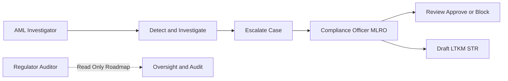

# Role & Access Recommendation — PIDI Digdaya x Hackathon

## Executive Recommendation

Gunakan **2 role utama untuk mode demo/hackathon**, tetapi pertahankan **3 role secara konseptual untuk roadmap enterprise**.

### Dua role yang ditampilkan di demo

1. **AML Investigator**
   - Fokus: monitoring, triage, GNN investigation, Customer 360 read-only, dan pembuatan catatan kasus.
   - Tidak boleh: memblokir final, mengubah threshold, mengubah model, mengekspor laporan regulator, atau menghapus audit log.

2. **Compliance Officer / MLRO**
   - Fokus: seluruh kemampuan Investigator ditambah review, approval, block/unblock, threshold policy, LTKM/STR draft, dan governance preview.
   - Menjadi role dengan otorisasi keputusan akhir di demo.

### Role ketiga untuk roadmap, bukan login utama demo

3. **Regulator / Auditor**
   - Fokus: read-only oversight, model transparency, audit trail, dan regulatory reporting preview.
   - Ditampilkan sebagai **persona/roadmap atau read-only preview**, bukan sebagai role yang harus didemokan penuh.

## Alasan Memilih 2 Role untuk Hackathon

### 1. Lebih mudah dipahami juri

Demo memiliki dua aktor yang jelas:

Juri tidak perlu mengingat tiga menu dan tiga matriks permission sejak awal. Konflik peran juga langsung terlihat: orang yang menemukan indikasi tidak otomatis menjadi orang yang menyetujui tindakan final.

### 2. Tetap menunjukkan segregation of duties

Dua role sudah cukup untuk membuktikan prinsip penting FDS/AML:

- Investigator mendeteksi dan mengumpulkan evidence.
- Compliance Officer menilai, menyetujui, atau menolak tindakan.
- Regulator tidak perlu ikut dalam alur transaksi untuk membuktikan bahwa sistem memiliki auditability.

### 3. Lebih cocok untuk tahap prototype

Tim belum sedang membangun IAM enterprise lengkap, identity federation, entitlement management, atau regulator portal. Menampilkan banyak role dapat membuat juri meminta bukti backend authorization yang belum menjadi fokus utama.

### 4. Mengurangi menu dan fitur semu

Role ketiga yang hanya membuka beberapa halaman sering terlihat seperti fitur tambahan yang tidak terhubung dengan core value. Pada hackathon, lebih baik mengutamakan alur yang benar-benar berjalan daripada memperbanyak persona.

## Mapping Role ke Dashboard GNN-First

### AML Investigator

#### Menu utama

1. **Command Center**
2. **Live Detection**
3. **GNN Network Investigation**
4. **Cases & Compliance** — tanpa final approval

#### Permission

| Permission | Akses |
|---|---|
| View dashboard | Ya |
| View live transactions | Ya |
| View graph/GNN/XAI | Ya |
| Open Customer 360 | Ya, PII masked |
| Search account | Ya, tenant-scoped |
| Add investigation note | Ya |
| Create case | Ya |
| Change case to `IN_REVIEW` | Ya |
| Escalate to MLRO | Ya |
| Resolve/block account | Tidak |
| Override decision | Tidak |
| Edit rules/threshold | Tidak |
| Generate LTKM/STR final | Tidak; boleh request draft |
| Export unmasked data | Tidak |
| View audit events | Case-scoped read-only |

### Compliance Officer / MLRO

#### Menu utama

1. **Command Center**
2. **Live Detection**
3. **GNN Network Investigation**
4. **Cases & Compliance**
5. **Advanced Platform**

#### Permission tambahan

| Permission | Akses |
|---|---|
| Review escalated cases | Ya |
| Approve/deny action | Ya |
| Block/unblock account | Ya, wajib reason |
| Resolve alert | Ya, wajib reason |
| Override circuit breaker | Ya, dua-step confirmation dan audit |
| Generate LTKM/STR draft | Ya |
| Configure risk thresholds | Ya, versioned/audited |
| View model governance | Ya |
| View integration health | Ya |
| Export compliance evidence | Ya, masked by default |
| Unmask sensitive PII | Terbatas, explicit reason dan audit |
| Delete audit logs | Tidak |

### Regulator / Auditor — Roadmap Read-Only

| Permission | Akses |
|---|---|
| View compliance summary | Ya |
| View model card and validation | Ya |
| View audit trail | Ya, immutable read-only |
| View LTKM/STR draft | Ya sesuai scope |
| View GNN explanation | Ya |
| Change alert or case | Tidak |
| Block/unblock account | Tidak |
| Edit threshold/model | Tidak |
| View raw PII | Tidak secara default |

## Status Implementasi Role

- Dua akun operasional demo aktif: AML Investigator dan Compliance Officer / MLRO.
- Persona Regulator / Auditor tetap tersedia sebagai konfigurasi RBAC roadmap/read-only, tetapi tidak ditampilkan sebagai login demo.
- Endpoint mutatif backend masih perlu token identity provider dan tenant enforcement sebelum produksi.

## Implementasi Role di Produk

### Mode demo

Login hanya menampilkan dua akun/persona:

- `AML Investigator`
- `Compliance Officer / MLRO`

Tambahkan switch atau badge kecil:

> `Demo Mode · 2 operational roles`

Jangan menghapus konsep regulator dari dokumentasi. Tampilkan di halaman `Advanced Platform` sebagai kartu:

> `Regulator Oversight — Roadmap / Read-only preview`

### Mode enterprise roadmap

Gunakan tiga role internal yang lebih formal:

- `analyst`
- `compliance_officer`
- `admin_regulator`

Namun role tersebut harus didukung oleh backend authorization nyata, bukan hanya `allowedMenus` pada frontend.

## Permission Matrix untuk Alur Demo

| Tahap | Investigator | MLRO |
|---|---:|---:|
| Melihat alert | ✓ | ✓ |
| Membuka graph 3-hop | ✓ | ✓ |
| Membuka Customer 360 | ✓ masked | ✓ masked / authorized unmask |
| Membuat case | ✓ | ✓ |
| Menambahkan note | ✓ | ✓ |
| Mengubah `OPEN → IN_REVIEW` | ✓ | ✓ |
| Escalate case | ✓ | ✓ |
| Menyetujui block | — | ✓ |
| Resolve alert | — | ✓ |
| Membuat draft LTKM | Request | ✓ |
| Mengubah threshold | — | ✓ |
| Menghapus audit trail | — | — |

## Alur Demo dengan 2 Role

### Babak 1 — Investigator menemukan pola

1. Login sebagai `AML Investigator`.
2. Buka **Command Center**.
3. Masuk ke **Live Detection**.
4. Pilih transaksi smurfing.
5. Buka **GNN Network Investigation**.
6. Tunjukkan mule hub, banyak inbound edges, tujuan VASP, dan explanation.
7. Buka Customer 360 dalam keadaan masked.
8. Buat case dan tambahkan note.
9. Ubah status menjadi `IN_REVIEW` dan eskalasi.

### Babak 2 — MLRO mengambil keputusan

1. Logout/login sebagai `Compliance Officer / MLRO`.
2. Buka **Cases & Compliance**.
3. Baca graph evidence, CRA score, model reason, dan investigator note.
4. Pilih `REVIEW`, `BLOCK`, atau `RESOLVE` sesuai skenario.
5. Masukkan alasan wajib.
6. Tunjukkan audit event yang mencatat actor, role, action, timestamp, target, dan reason.
7. Generate draft LTKM/STR.

### Babak 3 — Bansos legitimate

1. Kembali ke **Live Detection**.
2. Buka transaksi Bansos resmi.
3. Tunjukkan contextual signal.
4. Hasil `ALLOW` atau `REVIEW`, bukan hard block hanya karena transaksi massal.
5. Jelaskan sistem tidak menggunakan whitelist buta.

## Desain Akses yang Harus Dihindari

1. Jangan menjadikan `admin_regulator` sebagai role paling kuat yang dapat memblokir akun. Regulator seharusnya oversight/read-only.
2. Jangan mengandalkan penyembunyian menu untuk keamanan.
3. Jangan membuat Investigator dan MLRO memiliki UI identik tetapi hanya berbeda label.
4. Jangan mengizinkan unmask PII tanpa reason, actor, scope, dan audit event.
5. Jangan memberikan hak edit threshold kepada semua pengguna.
6. Jangan mengklaim RBAC production-ready jika permission masih hanya di React.
7. Jangan menampilkan regulator sebagai operator transaksi.

## Prioritas Implementasi Role

### P0 — Hackathon

- Dua login demo.
- Investigator tidak memiliki tombol block/final resolve.
- MLRO memiliki approval/block dengan reason wajib.
- Perbedaan menu dan tombol terlihat jelas.
- GNN dan Customer 360 bisa digunakan oleh Investigator.
- Kasus dapat dieskalasikan dari Investigator ke MLRO.
- Audit event untuk semua tindakan mutasi.

### P1 — Pilot sandbox

- Backend enforcement untuk semua permission.
- Token/session claims untuk role dan tenant.
- Tenant-scoped query untuk accounts, transactions, graph, cases, dan exports.
- PII masking berdasarkan role dan purpose.
- Approval state machine dan optimistic concurrency.
- Immutable audit store.
- Regulator read-only portal/preview.

### P2 — Enterprise

- SSO/OIDC atau SAML.
- Fine-grained ABAC selain RBAC.
- Dual control untuk tindakan kritis.
- Just-in-time privileged access.
- HSM/key rotation.
- SIEM integration.
- Segregated regulator tenancy.
- Formal access review dan recertification.

## Keputusan Akhir

**Untuk PIDI Digdaya x Hackathon:** gunakan **2 role yang benar-benar didemokan**:

1. `AML Investigator`
2. `Compliance Officer / MLRO`

**Untuk positioning enterprise:** pertahankan `Regulator / Auditor` sebagai role konseptual dan roadmap read-only. Jangan jadikan role ketiga sebagai pusat implementasi sekarang.

Dengan pendekatan ini, dashboard tetap menunjukkan segregation of duties, selaras dengan proses AML/FDS, lebih mudah dipahami juri, dan tidak membebani produk dengan IAM enterprise yang belum diperlukan pada fase hackathon.

## Status Dokumen

Rekomendasi ini telah dipetakan ke prototype aplikasi: login demo menampilkan dua role operasional, Investigator tidak memiliki aksi final, MLRO memiliki aksi mutatif dengan reason dan audit, serta Regulator dipertahankan sebagai persona read-only roadmap. Backend token/session identity, ABAC, dan tenant isolation penuh tetap merupakan pekerjaan pilot/enterprise.
