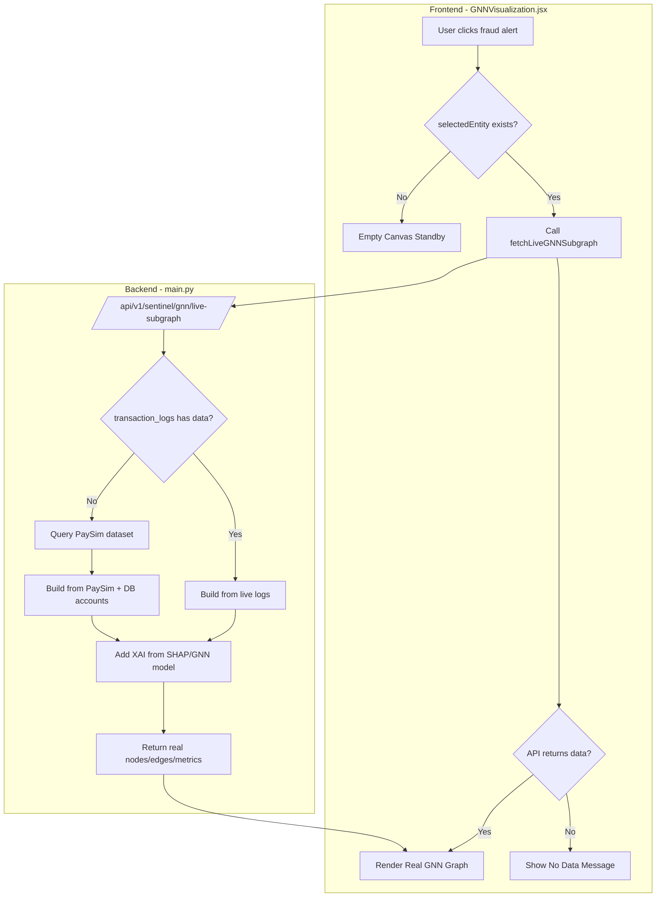

# GNN Network Workbench — Full Data-Driven Implementation Plan

## Problem Statement
The GNN Network Workbench currently uses **hardcoded `SCENARIOS` constant** (600+ lines of mock data in `GNNVisualization.jsx`) and falls back to "DEMO SCENARIO" when no live data exists. User wants **100% real data** from PaySim dataset + expresso.db with Anthropic XAI explanations.

## Current Architecture Issues

### Frontend (`GNNVisualization.jsx`)
- Lines 48-665: Hardcoded `SCENARIOS` object with `smurfing_crypto`, `mule_ring`, `normal_payroll`
- Lines 957-1184: `scenario` useMemo generates fake mule nodes using deterministic hash
- Lines 1189-1245: `fetchLiveGNNSubgraph()` called but falls back to mock if API fails
- "DEMO SCENARIO" badge shown when using fallback

### Backend (`main.py`)
- `/api/v1/sentinel/gnn/live-subgraph/{account_id}` (lines 564-862): Builds real subgraph from `transaction_logs` (in-memory)
- `/api/v1/sentinel/gnn/neighborhood/{account_id}` (lines 473-561): **Still hardcoded mock nodes/edges**
- PaySim dataset loaded at startup (line 46): `df = pd.read_csv("data/paysim_sample.csv")`
- ML model + SHAP explainer loaded (lines 51-64)

## Solution Architecture



## Implementation Steps

### Phase 1: Backend Enhancement (main.py)

#### 1.1 Enhance `/api/v1/sentinel/gnn/live-subgraph/{account_id}`
- When `transaction_logs` is empty, query PaySim dataset for transactions involving `account_id`
- Build networkx graph from PaySim data
- Compute PageRank, betweenness centrality
- Run GNN model inference for risk scores
- Generate SHAP explanations for top features

#### 1.2 Add XAI Explanation Generation
```python
def generate_xai_explanation(account_id, G, pageranks, shap_values):
    return {
        "gnn_risk_score": int(risk_score),
        "identified_motif": classify_motif(G, account_id),
        "gnn_explainer": {
            "mutual_information_score": float(mi_score),
            "minimal_explanatory_subgraph_nodes": [...],
            "top_structural_attributions": [
                {"feature": "Out-Degree Fan-Out Spike", "weight": "+38.4%", "category": "Graph Topology"},
                ...
            ]
        },
        "anthropic_analysis": generate_anthropic_insight(...)  # Optional: Claude API
    }
```

#### 1.3 Remove Hardcoded `/api/v1/sentinel/gnn/neighborhood/{account_id}`
- Delete lines 473-561 (hardcoded mock nodes/edges)
- Redirect to enhanced `live-subgraph` endpoint or build from PaySim

### Phase 2: Frontend Refactor (GNNVisualization.jsx)

#### 2.1 Remove `SCENARIOS` Constant Entirely
- Delete lines 48-665 (600+ lines of mock data)
- Remove all references to `SCENARIOS.smurfing_crypto`, etc.

#### 2.2 Simplify `scenario` useMemo
```javascript
const scenario = useMemo(() => {
  // ONLY use liveScenario from API - no fallback to mock
  if (!selectedEntity) return null;  // Empty canvas
  if (liveScenario) return liveScenario;  // Real API data
  return null;  // Show "loading" or "no data" state
}, [selectedEntity, liveScenario]);
```

#### 2.3 Update Header Badge Logic
```javascript
// Remove "DEMO SCENARIO" badge entirely
// Only show:
// - "LIVE DATA" when isLiveData === true
// - "Loading..." when isLoadingLive === true  
// - Nothing when no investigation active
```

#### 2.4 Update Empty State Message
```javascript
// When scenario === null:
<div>
  <Brain size={48} />
  <p>GNN Network Workbench — Standby Mode</p>
  <p>Pilih kasus dari Cases & Compliance atau jalankan Simulasi Streaming untuk melihat graf investigasi real-time.</p>
</div>
```

### Phase 3: Data Flow Integration

#### 3.1 PaySim Dataset Structure
```csv
step,nameOrig,oldbalanceOrg,newbalanceOrig,amount,nameDest,oldbalanceDest,newbalanceDest,type,isFraud,isFlaggedFraud
1,C1231006815,170136,0,170136,M1833311890,0,170136,TRANSFER,0,0
```

#### 3.2 Build GNN Subgraph from PaySim
```python
def build_gnn_from_paysim(account_id, df, hops=2):
    # Find all transactions where account_id is sender or receiver
    related = df[(df.nameOrig == account_id) | (df.nameDest == account_id)]
    
    # Build networkx graph
    G = nx.DiGraph()
    for _, row in related.iterrows():
        G.add_edge(row.nameOrig, row.nameDest, 
                   amount=row.amount, type=row.type, 
                   isFraud=row.isFraud)
    
    # Expand by hops
    neighbors = set()
    current = {account_id}
    for _ in range(hops):
        next_level = set()
        for node in current:
            next_level.update(G.successors(node))
            next_level.update(G.predecessors(node))
        neighbors.update(next_level)
        current = next_level
    
    # Build nodes/edges for frontend
    ...
```

#### 3.3 XAI Metrics from Real Data
```python
def compute_xai_metrics(G, account_id, ml_model, shap_explainer):
    # Graph topology features
    out_degree = G.out_degree(account_id)
    in_degree = G.in_degree(account_id)
    pagerank = nx.pagerank(G).get(account_id, 0)
    betweenness = nx.betweenness_centrality(G).get(account_id, 0)
    
    # ML model prediction
    features = extract_features(account_id, G)
    risk_score = ml_model.predict_proba([features])[0][1] * 100
    
    # SHAP explanation
    shap_values = shap_explainer.shap_values([features])
    top_features = get_top_shap_features(shap_values, feature_names)
    
    return {
        "gnn_risk_score": int(risk_score),
        "pagerank": round(pagerank, 6),
        "betweenness": round(betweenness, 6),
        "out_degree": out_degree,
        "in_degree": in_degree,
        "shap_explanations": top_features
    }
```

## API Response Contract

```json
{
  "account_id": "C1231006815",
  "is_live": true,
  "data_source": "paysim",  // or "transaction_logs" or "expresso_db"
  "total_transactions_analyzed": 47,
  "riskScore": 92,
  "riskLevel": "HIGH",
  "classification": "SMURFING FAN-OUT",
  "summary": "Akun C1231006815 terlibat dalam 47 transaksi. Pola: Fan-Out ke 5 rekening perantara.",
  "nodes": [
    {
      "id": "A1",
      "stage": 1,
      "type": "source",
      "label": "Account C1231006815",
      "account": "C1231006815",
      "bank": "PaySim Bank",
      "balance": 170136,
      "riskScore": 92,
      "riskLevel": "high",
      "role": "Akun Terlapor",
      "x": 120,
      "y": 300,
      "_live": true
    }
  ],
  "edges": [
    {
      "from": "A1",
      "to": "B1",
      "amount": 170136,
      "time": "Step 1",
      "type": "transfer",
      "flow": "smurfing",
      "risk": "high",
      "_live": true
    }
  ],
  "gnn_explainer": {
    "mutual_information_score": 0.942,
    "minimal_explanatory_subgraph_nodes": ["A1", "B1", "B3", "M1"],
    "top_structural_attributions": [
      {"feature": "Out-Degree Fan-Out", "weight": "+38.4%", "category": "Topology"},
      {"feature": "Rapid Velocity", "weight": "+29.2%", "category": "Temporal"}
    ]
  },
  "graph_stats": {
    "total_nodes": 12,
    "total_edges": 15,
    "pagerank_score": 0.0234,
    "betweenness_score": 0.156
  },
  "temporal_timeline": [...]
}
```

## Files to Modify

| File | Changes |
|------|---------|
| `crypto-sentinel-api/app/main.py` | Enhance `get_live_gnn_subgraph()` to query PaySim when `transaction_logs` empty; add XAI generation; remove hardcoded `get_gnn_neighborhood()` |
| `dashboard-crypto-sentinel/src/components/GNNVisualization.jsx` | Delete `SCENARIOS` constant (lines 48-665); simplify `scenario` useMemo to only use API data; remove "DEMO SCENARIO" badge |
| `dashboard-crypto-sentinel/src/services/api.js` | Update `fetchLiveGNNSubgraph()` to handle new response format with `gnn_explainer` |

## Success Criteria

1. ✅ No hardcoded `SCENARIOS` constant in frontend
2. ✅ No "DEMO SCENARIO" badge ever shown
3. ✅ GNN Workbench shows empty canvas when no data
4. ✅ GNN Workbench shows real graph from PaySim/DB when data exists
5. ✅ XAI explanations come from SHAP/GNN model, not hardcoded
6. ✅ All node/edge data comes from API, not frontend generation
