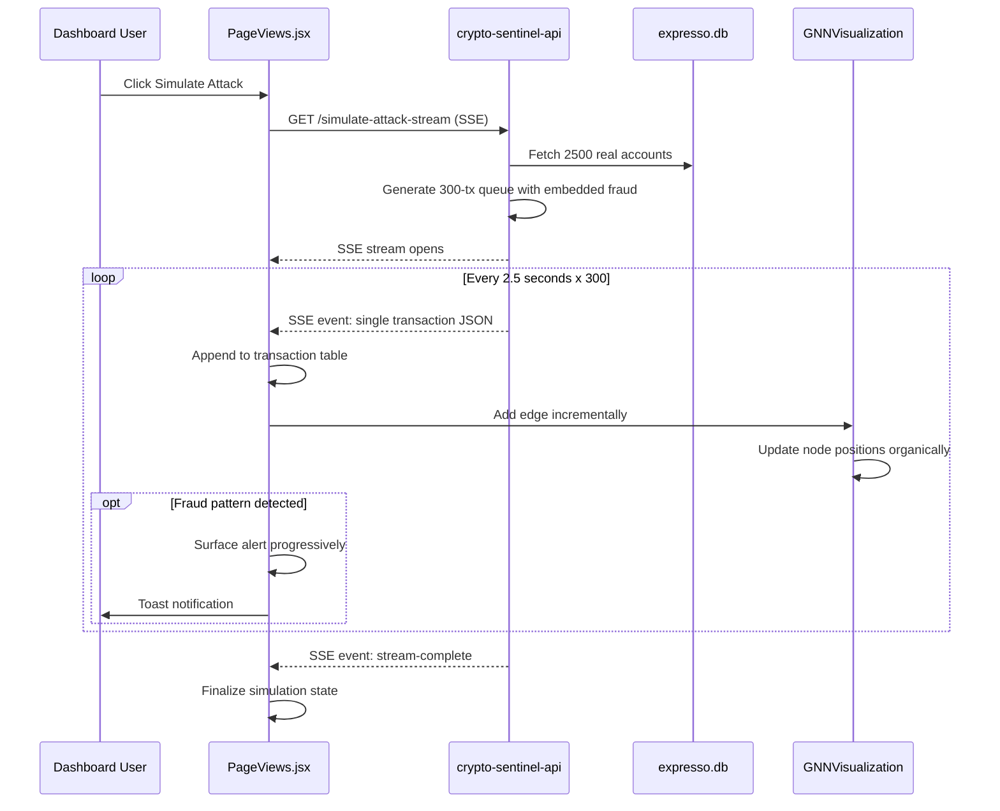

# Streaming Attack Simulation Implementation Plan

## Overview

Redesign the 150-transaction attack simulation to stream ~300 transactions one-by-one every 2.5 seconds via Server-Sent Events (SSE), using real accounts from expresso.db, with incremental GNN graph building and progressive fraud detection.

---

## Current Architecture Problems

| Problem | Location | Impact |
|---------|----------|--------|
| Batch generation | `attack_simulation.py:327` | All 150 tx created at once, no streaming |
| Hardcoded mockup accounts | `attack_simulation.py` NORMAL_NAMES | Only 20 names, fake IDs like `320800{random}` |
| Instant GNN mapping | `PageViews.jsx:87` | `setTransactions()` sets all at once |
| Pre-mapped fraud alerts | `main.py:1450-1491` | All 15 fraud extracted upfront |
| No real account pool | `attack_simulation.py` | Doesn't query expresso.db's 2500+ accounts |

---

## Target Architecture



---

## Phase 1: Backend SSE Endpoint with Account Pool

### Files to Modify
- `crypto-sentinel-api/app/attack_simulation.py` — New streaming generator
- `crypto-sentinel-api/app/main.py` — New SSE endpoint

### 1.1 Account Pool Loader

Add function to load real accounts from expresso.db:

```python
# In attack_simulation.py

import sqlite3
import os

def load_account_pool():
    """Load ~2500 real accounts from expresso.db for realistic simulation."""
    current_dir = os.path.dirname(__file__)
    db_path = os.path.abspath(os.path.join(current_dir, "..", "..", "expresso-api", "expresso.db"))
    
    if not os.path.exists(db_path):
        # Fallback: generate deterministic pool if DB missing
        return _generate_fallback_pool()
    
    conn = sqlite3.connect(db_path)
    conn.row_factory = sqlite3.Row
    cursor = conn.execute("""
        SELECT account_id, owner_name, national_id, balance, risk_profile,
               registered_device, registered_ip
        FROM accounts
        WHERE is_active = 1 AND is_blocked = 0
    """)
    
    accounts = [dict(row) for row in cursor.fetchall()]
    conn.close()
    
    if len(accounts) < 100:
        return _generate_fallback_pool()
    
    return accounts
```

### 1.2 Streaming Transaction Generator

Replace batch `generate_150_attack_dataset()` with streaming generator:

```python
def generate_streaming_attack_sequence(total_tx=300, fraud_ratio=0.15):
    """
    Generate a sequence of 300 transactions with embedded fraud indicators.
    Yields one transaction dict at a time.
    
    Fraud embedding strategy:
    - ~45 fraud-tinged transactions (15% of 300) spread throughout stream
    - Each carries 1-3 indicator flags but looks normal initially
    - Patterns emerge progressively (fan-out, dormant activation, etc.)
    """
    accounts = load_account_pool()
    account_count = len(accounts)
    
    # Pre-plan fraud injection points (distributed across stream)
    fraud_count = int(total_tx * fraud_ratio)
    fraud_indices = set(random.sample(range(total_tx), fraud_count))
    
    # Track sender behavior for pattern-based indicators
    sender_history = {}  # account_id -> list of (tx_index, receiver_id)
    
    for i in range(total_tx):
        # Select random sender/receiver from real pool
        sender_idx = hash(f"sender-{i}") % account_count
        receiver_idx = hash(f"receiver-{i}") % account_count
        
        # Ensure sender != receiver
        while receiver_idx == sender_idx:
            receiver_idx = (receiver_idx + 1) % account_count
        
        sender = accounts[sender_idx]
        receiver = accounts[receiver_idx]
        
        is_fraud = i in fraud_indices
        
        tx = {
            "index": i,
            "transaction_id": f"STR-{datetime.now().strftime('%Y%m%d')}-{i:04d}",
            "timestamp": datetime.now().isoformat(),
            "sender_account": sender["account_id"],
            "sender_name": sender["owner_name"],
            "destinationAccount": receiver["account_id"],
            "receiver_name": receiver["owner_name"],
            "amount": _generate_amount(is_fraud),
            "is_fraud": is_fraud,
            "indicators": _assign_indicators(i, sender, receiver, sender_history, is_fraud),
            # ... additional fields
        }
        
        # Update sender history for pattern detection
        sender_history.setdefault(sender["account_id"], []).append((i, receiver["account_id"]))
        
        yield tx
```

### 1.3 SSE Endpoint

```python
# In main.py

from fastapi.responses import StreamingResponse
import json
import asyncio

@app.get("/api/v1/sentinel/simulate-attack-stream")
async def simulate_attack_stream():
    """SSE endpoint that streams 300 transactions one-by-one every 2.5 seconds."""
    
    async def event_generator():
        generator = generate_streaming_attack_sequence(total_tx=300)
        
        for tx in generator:
            # Format as SSE event
            event_data = json.dumps(tx)
            yield f"data: {event_data}\n\n"
            
            # Wait 2.5 seconds between transactions
            await asyncio.sleep(2.5)
        
        # Signal completion
        yield f"data: {json.dumps({'type': 'stream-complete', 'total': 300})}\n\n"
    
    return StreamingResponse(
        event_generator(),
        media_type="text/event-stream",
        headers={
            "Cache-Control": "no-cache",
            "Connection": "keep-alive",
            "X-Accel-Buffering": "no",  # Disable nginx buffering
        }
    )
```

### 1.4 Fraud Indicator Embedding Strategy

Instead of 15 separate fraud transactions, weave IND-01 through IND-15 into the stream:

| Indicator | Pattern | Detection Trigger |
|-----------|---------|-------------------|
| IND-01 Fan-Out | Same sender → 5+ receivers in 10 tx window | Out-degree spike |
| IND-02 Dormant | Account inactive for 50+ tx, then active | History gap |
| IND-03 Drain | Balance drops >80% in 3 tx | Amount pattern |
| IND-04 Nocturnal | Transactions between 00:00-05:00 | Timestamp check |
| IND-05 Layering | Chain A→B→C→D within 15 tx | Path length |
| IND-06 Cyclic | A→B→C→A within 20 tx | Cycle detection |
| IND-07 PageRank | High centrality node emerges | Graph metric |
| IND-08 Betweenness | Bridge node in mule network | Graph metric |
| IND-09 Blacklist | Known threat account involved | DB lookup |
| IND-10 Cosine | Similar transaction patterns | Vector similarity |
| IND-11 Structuring | Multiple tx just below threshold | Amount clustering |
| IND-12 Purpose Mismatch | Business code vs actual pattern | Rule mismatch |
| IND-13 Pass-Through | Money in → money out same day | Velocity check |
| IND-14 Impossible Travel | Different IPs/cities in short time | Geo velocity |
| IND-15 Rooted/VPN | Suspicious device/IP fingerprint | Device telemetry |

---

## Phase 2: Frontend SSE Client

### Files to Modify
- `dashboard-crypto-sentinel/src/services/api.js` — New SSE client function
- `dashboard-crypto-sentinel/src/components/PageViews.jsx` — Stream handler

### 2.1 SSE Client Function

```javascript
// In api.js

export function subscribeToAttackStream(onTransaction, onComplete, onError) {
  const eventSource = new EventSource(
    `${API_BASE_URL}/api/v1/sentinel/simulate-attack-stream`
  );
  
  eventSource.onmessage = (event) => {
    const data = JSON.parse(event.data);
    
    if (data.type === 'stream-complete') {
      onComplete(data.total);
      eventSource.close();
      return;
    }
    
    onTransaction(data);
  };
  
  eventSource.onerror = (error) => {
    onError(error);
    eventSource.close();
  };
  
  // Return close function for cleanup
  return () => eventSource.close();
}
```

### 2.2 Stream Handler in PageViews.jsx

```javascript
// In MonitoringView component

const [streamProgress, setStreamProgress] = useState({ current: 0, total: 300 });
const [isStreaming, setIsStreaming] = useState(false);
const streamCleanupRef = useRef(null);

const handleSimulateAttackStream = () => {
  if (isStreaming) {
    // Stop existing stream
    streamCleanupRef.current?.();
    setIsStreaming(false);
    return;
  }
  
  setIsStreaming(true);
  setStreamProgress({ current: 0, total: 300 });
  
  streamCleanupRef.current = subscribeToAttackStream(
    // onTransaction
    (tx) => {
      setTransactions(prev => [mapStreamTx(tx), ...prev].slice(0, 100)); // Keep last 100
      setStreamProgress(prev => ({ ...prev, current: tx.index + 1 }));
      
      // Incremental GNN update
      addGnnEdge({
        source: tx.sender_account,
        target: tx.destinationAccount,
        amount: tx.amount,
        indicators: tx.indicators,
      });
      
      // Progressive alert surfacing
      if (tx.indicators?.length > 0 && tx.is_fraud) {
        const alert = buildAlertFromTx(tx);
        setAlerts(prev => [alert, ...prev]);
        addToast(`Fraud detected: ${tx.indicators.join(', ')}`, 'warning');
      }
    },
    // onComplete
    (total) => {
      setIsStreaming(false);
      addToast(`Simulation complete: ${total} transactions processed`, 'success');
    },
    // onError
    (error) => {
      setIsStreaming(false);
      addToast('Stream error: ' + error.message, 'error');
    }
  );
};

// Cleanup on unmount
useEffect(() => {
  return () => streamCleanupRef.current?.();
}, []);
```

---

## Phase 3: Incremental GNN Graph Building

### Files to Modify
- `dashboard-crypto-sentinel/src/components/GNNVisualization.jsx` — Live edge accumulator

### 3.1 Live Edge Accumulator State

```javascript
// In GNNVisualization component

const [liveEdges, setLiveEdges] = useState([]);
const [liveNodes, setLiveNodes] = useState(new Map()); // accountId -> node data

const addGnnEdge = useCallback(({ source, target, amount, indicators }) => {
  // Add/update nodes
  setLiveNodes(prev => {
    const next = new Map(prev);
    
    if (!next.has(source)) {
      next.set(source, {
        id: source,
        type: 'originator',
        txCount: 0,
        totalAmount: 0,
        outDegree: 0,
        inDegree: 0,
      });
    }
    if (!next.has(target)) {
      next.set(target, {
        id: target,
        type: 'receiver',
        txCount: 0,
        totalAmount: 0,
        outDegree: 0,
        inDegree: 0,
      });
    }
    
    // Update metrics
    const srcNode = next.get(source);
    srcNode.txCount++;
    srcNode.totalAmount += amount;
    srcNode.outDegree++;
    
    const tgtNode = next.get(target);
    tgtNode.txCount++;
    tgtNode.totalAmount += amount;
    tgtNode.inDegree++;
    
    return next;
  });
  
  // Add edge
  setLiveEdges(prev => [
    ...prev,
    {
      id: `${source}-${target}-${Date.now()}`,
      source,
      target,
      amount,
      indicators,
      timestamp: Date.now(),
    }
  ]);
}, []);
```

### 3.2 Organic Node Positioning

New nodes should appear near related nodes, not at random positions:

```javascript
const getNodePosition = (nodeId, existingPositions) => {
  // Find connected nodes
  const connectedEdges = liveEdges.filter(
    e => e.source === nodeId || e.target === nodeId
  );
  
  if (connectedEdges.length === 0) {
    // First appearance: place in spiral pattern
    const angle = liveNodes.size * 0.5;
    const radius = 100 + liveNodes.size * 20;
    return {
      x: Math.cos(angle) * radius,
      y: Math.sin(angle) * radius,
    };
  }
  
  // Place near most recent connected node
  const latestEdge = connectedEdges[connectedEdges.length - 1];
  const neighborId = latestEdge.source === nodeId ? latestEdge.target : latestEdge.source;
  const neighborPos = existingPositions[neighborId];
  
  if (neighborPos) {
    // Offset slightly from neighbor
    return {
      x: neighborPos.x + (Math.random() - 0.5) * 100,
      y: neighborPos.y + (Math.random() - 0.5) * 100,
    };
  }
  
  // Fallback
  return { x: 0, y: 0 };
};
```

---

## Phase 4: Progressive Fraud Alert Surfacing

### Files to Modify
- `dashboard-crypto-sentinel/src/components/PageViews.jsx` — Alert builder
- `dashboard-crypto-sentinel/src/services/api.js` — Alert mapping

### 4.1 Alert Builder from Stream Transaction

```javascript
function buildAlertFromTx(tx) {
  return {
    id: tx.transaction_id,
    transaction_id: tx.transaction_id,
    timestamp: tx.timestamp,
    sender_account: tx.sender_account,
    sender_name: tx.sender_name,
    destination_account: tx.destinationAccount,
    amount: tx.amount,
    risk_score: calculateRiskScore(tx.indicators),
    risk_level: tx.indicators.length >= 3 ? 'CRITICAL' : 
                tx.indicators.length >= 2 ? 'HIGH' : 'MEDIUM',
    indicators: tx.indicators,
    status: 'NEW',
    decision: 'REVIEW',
  };
}

function calculateRiskScore(indicators) {
  const weights = {
    'IND-01': 15, 'IND-02': 12, 'IND-03': 18, 'IND-04': 8,
    'IND-05': 20, 'IND-06': 22, 'IND-07': 16, 'IND-08': 14,
    'IND-09': 25, 'IND-10': 10, 'IND-11': 13, 'IND-12': 11,
    'IND-13': 17, 'IND-14': 19, 'IND-15': 14,
  };
  
  return indicators.reduce((sum, ind) => sum + (weights[ind] || 10), 0);
}
```

---

## Phase 5: Speed Controls and Stream Management UI

### Files to Modify
- `dashboard-crypto-sentinel/src/components/PageViews.jsx` — Control panel

### 5.1 Stream Control Panel

```jsx
{isStreaming && (
  <div style={{
    position: 'fixed',
    bottom: 24,
    right: 24,
    background: 'rgba(15, 23, 42, 0.95)',
    borderRadius: 12,
    padding: '16px 20px',
    display: 'flex',
    alignItems: 'center',
    gap: 16,
    zIndex: 1000,
    border: '1px solid rgba(59, 130, 246, 0.3)',
  }}>
    {/* Progress */}
    <div>
      <div style={{ fontSize: '0.85rem', color: '#94a3b8' }}>
        Transaction {streamProgress.current}/{streamProgress.total}
      </div>
      <div style={{
        width: 120,
        height: 4,
        background: '#1e293b',
        borderRadius: 2,
        marginTop: 4,
      }}>
        <div style={{
          width: `${(streamProgress.current / streamProgress.total) * 100}%`,
          height: '100%',
          background: '#3b82f6',
          borderRadius: 2,
          transition: 'width 0.3s ease',
        }} />
      </div>
    </div>
    
    {/* Speed Control */}
    <select
      value={streamSpeed}
      onChange={(e) => setStreamSpeed(Number(e.target.value))}
      style={{
        background: '#1e293b',
        border: '1px solid #334155',
        borderRadius: 6,
        padding: '6px 10px',
        color: '#e2e8f0',
        fontSize: '0.85rem',
      }}
    >
      <option value={1}>1x (2.5s)</option>
      <option value={2}>2x (1.25s)</option>
      <option value={4}>4x (0.6s)</option>
      <option value={0}>Paused</option>
    </select>
    
    {/* Stop Button */}
    <button
      onClick={() => {
        streamCleanupRef.current?.();
        setIsStreaming(false);
      }}
      style={{
        background: '#ef4444',
        border: 'none',
        borderRadius: 6,
        padding: '8px 16px',
        color: 'white',
        cursor: 'pointer',
        fontWeight: 600,
      }}
    >
      Stop
    </button>
  </div>
)}
```

### 5.2 Backend Speed Support

Modify SSE endpoint to accept speed parameter:

```python
@app.get("/api/v1/sentinel/simulate-attack-stream")
async def simulate_attack_stream(speed: float = 1.0):
    """SSE endpoint with adjustable speed (0 = paused, 1 = normal, 2 = 2x, 4 = 4x)."""
    
    base_interval = 2.5  # seconds
    
    async def event_generator():
        generator = generate_streaming_attack_sequence(total_tx=300)
        
        for tx in generator:
            event_data = json.dumps(tx)
            yield f"data: {event_data}\n\n"
            
            interval = base_interval / max(speed, 0.1) if speed > 0 else float('inf')
            if speed > 0:
                await asyncio.sleep(interval)
        
        yield f"data: {json.dumps({'type': 'stream-complete', 'total': 300})}\n\n"
    
    return StreamingResponse(...)
```

Note: For dynamic speed changes during stream, use WebSocket or have frontend manage timing client-side by buffering events.

---

## Implementation Checklist

### Phase 1: Backend SSE
- [ ] Add `load_account_pool()` to `attack_simulation.py`
- [ ] Create `generate_streaming_attack_sequence()` generator
- [ ] Implement fraud indicator embedding logic
- [ ] Add SSE endpoint to `main.py`
- [ ] Test with curl/httpie

### Phase 2: Frontend SSE Client
- [ ] Add `subscribeToAttackStream()` to `api.js`
- [ ] Add stream state management to `PageViews.jsx`
- [ ] Implement `handleSimulateAttackStream()`
- [ ] Add cleanup on unmount

### Phase 3: Incremental GNN
- [ ] Add `liveEdges` and `liveNodes` state to `GNNVisualization.jsx`
- [ ] Implement `addGnnEdge()` callback
- [ ] Add organic node positioning
- [ ] Update canvas rendering to use live data

### Phase 4: Progressive Alerts
- [ ] Implement `buildAlertFromTx()`
- [ ] Add progressive alert insertion
- [ ] Wire up toast notifications

### Phase 5: Stream Controls
- [ ] Add progress bar UI
- [ ] Add speed selector
- [ ] Add stop button
- [ ] Backend speed parameter support

---

## Key Design Decisions

| Decision | Choice | Rationale |
|----------|--------|-----------|
| Delivery mechanism | SSE | True server-side timing, single connection, FastAPI native |
| Account source | expresso.db query | 2500+ real accounts, already accessible via relative path |
| Fraud ratio | 15% (~45 of 300) | Enough for demo, not overwhelming |
| Stream interval | 2.5s base | Matches user requirement, allows comfortable viewing |
| Total transactions | 300 | Double original, more realistic demo |
| GNN update | Incremental edge add | Organic graph growth, matches user vision |
| Alert timing | On fraud tx arrival | Progressive detection, not pre-mapped |

---

## Files Changed Summary

| File | Changes |
|------|---------|
| `crypto-sentinel-api/app/attack_simulation.py` | Add account pool loader, streaming generator, fraud embedding |
| `crypto-sentinel-api/app/main.py` | Add SSE endpoint `/simulate-attack-stream` |
| `dashboard-crypto-sentinel/src/services/api.js` | Add `subscribeToAttackStream()` |
| `dashboard-crypto-sentinel/src/components/PageViews.jsx` | Stream handler, progress UI, controls |
| `dashboard-crypto-sentinel/src/components/GNNVisualization.jsx` | Live edge accumulator, organic positioning |

---

## Testing Strategy

1. **Backend unit test**: Verify generator yields 300 tx with correct fraud distribution
2. **SSE test**: `curl -N http://localhost:8000/api/v1/sentinel/simulate-attack-stream`
3. **Frontend integration**: Start stream, verify transactions appear one-by-one
4. **GNN visual**: Confirm edges build incrementally, nodes appear organically
5. **Alert test**: Verify fraud alerts surface progressively, not all at once
6. **Speed test**: Change speed mid-stream, verify timing adjusts
