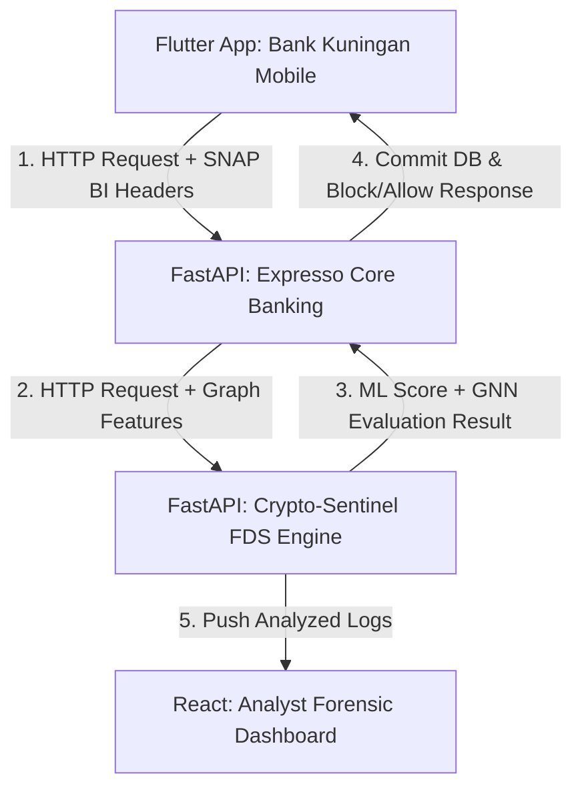
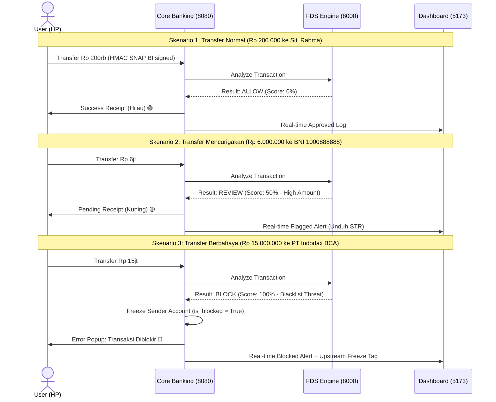

# 🛡️ Laporan Akhir Progres Proyek & Kajian Ilmiah: Crypto-Sentinel FDS

Laporan ini disusun sebagai dokumen panduan serah-terima teknis (*technical handoff*) komprehensif, tinjauan ilmiah, dan spesifikasi arsitektur proyek **Crypto-Sentinel Fraud Detection System (FDS)**. 

Dokumen ini memuat status kemajuan terkini agar agen kecerdasan buatan (AI Agent) berikutnya dapat melanjutkan pengembangan tanpa kehilangan konteks.

---

## 1. Kajian Literatur & Landasan Teoritis

### A. SNAP BI (Standar Nasional Open API Pembayaran Indonesia)
**SNAP BI** adalah standarisasi teknologi Open API pembayaran yang ditetapkan oleh Bank Indonesia berdasarkan Peraturan Anggota Deputi Gubernur (PADG) No. 23/18/PADG/2021. Standar ini bertujuan menciptakan ekosistem pembayaran yang interkonektif, aman, dan efisien di Indonesia.

* **Metode Keamanan & Kriptografi:**
  * SNAP BI mewajibkan penggunaan kriptografi dua tingkat: **Asymmetric Signature** (menggunakan SHA256withRSA untuk registrasi token) dan **Symmetric Signature** (menggunakan HMAC-SHA256 untuk setiap transaksi transfer dana).
  * HMAC-SHA256 dibentuk dengan menggabungkan kunci rahasia (*client secret*) dan string pesan terstruktur yang terdiri dari parameter identitas partner, stempel waktu, dan data transaksi.
* **Standardisasi Header HTTP:**
  Setiap request API transfer wajib menyertakan:
  * `X-Partner-Id`: ID identitas unik partner bank/fintech.
  * `X-Timestamp`: Stempel waktu transaksi dengan format ISO 8601 UTC (e.g. `2026-07-22T02:00:00Z`).
  * `X-Signature`: Tanda tangan digital hasil kalkulasi HMAC-SHA256 untuk memvalidasi integritas payload.
* **Standardisasi Response Code:**
  Mengadopsi format kode terstandardisasi, misalnya status sukses didefinisikan dengan struktur kode berawalan `200` (e.g. `2001100` untuk transaksi transfer dana domestik sukses).

### B. Standar ISO 20022
**ISO 20022** adalah standar global modern untuk pertukaran pesan keuangan (*financial messaging*) yang menggantikan standar lama SWIFT MT. ISO 20022 menggunakan skema XML atau JSON yang sangat kaya akan metadata (*rich metadata*).

* **Penerapan Fitur Kunci:**
  * **Purpose Code:** Menyediakan kolom klasifikasi tujuan penggunaan dana yang terstandardisasi secara global. Contoh: `SALA` (Salary/Pembayaran Gaji), `DEBT` (Debt Payment/Pembayaran Utang), `TREA` (Treasury/Transfer internal kas).
  * **Identitas Tambahan:** Mendukung penulisan koordinat geografis (GPS lat/long), alamat IP terperinci, data identitas KTP (NIK), dan ID perangkat keras pengirim.

### C. Standar ISO 8583
**ISO 8583** adalah standar pesan transaksi keuangan tradisional berbasis transmisi bitmapped yang digunakan secara luas pada jaringan kartu kredit, mesin EDC, dan jaringan ATM.
* **Switching Lokal:** Standar ini menjadi dasar komunikasi bagi perusahaan switching lokal di Indonesia seperti **PRIMA, ALTO, dan ATM Bersama** untuk memproses otorisasi tarik tunai dan transfer instan antarbank.

### D. Perbandingan BI-FAST vs RTOL (Real-Time Online)
Di Indonesia, transfer antarbank ritel dilayani oleh dua infrastruktur utama:

| Parameter | BI-FAST | RTOL (Real-Time Online) |
| :--- | :--- | :--- |
| **Infrastruktur** | Dikelola oleh Bank Indonesia | Dikelola oleh Jaringan Switching (Prima, Alto, ATM Bersama) |
| **Dasar Pesan** | ISO 20022 (Rich Metadata) | ISO 8583 (Bitmap Payload) |
| **Limit Nominal** | Hingga Rp 250.000.000 / transaksi | Maksimal Rp 50.000.000 / transaksi |
| **Biaya Maksimal** | Rp 2.500 | Rp 6.500 |
| **Kelebihan** | Memuat informasi detail tujuan penggunaan dana | Kompatibilitas tinggi dengan ATM tradisional |

### E. Graph Neural Network (GNN) & Graph Feature Engineering
Pada deteksi kejahatan keuangan (AML/FDS), sindikat pencucian uang sering memecah aliran dana mereka melalui banyak akun perantara (*mule accounts*) dengan pola transaksi berantai (*layering*).
* **Teori Agregasi:** GNN bekerja dengan cara **Neighborhood Aggregation / Message Passing** di mana representasi numerik suatu akun diperbarui secara iteratif berdasarkan transaksi yang masuk dan keluar dari tetangganya.
* **Graph Feature Engineering:** Dalam prototype kita, FDS mengekstrak properti grafis topologi:
  * **In-Degree:** Jumlah transaksi masuk unik. Akun mule biasanya memiliki In-Degree tinggi sebelum cash-out.
  * **Out-Degree:** Jumlah transaksi keluar unik.
  * **PageRank Centrality:** Mengukur tingkat pengaruh akun dalam grafik jaringan transaksi. Rekening bursa kripto atau penampung gelap akan memiliki PageRank yang sangat tinggi karena menjadi simpul pusaran dana.

---

## 2. Arsitektur Sistem & Aliran Data (Data Flow)

Sistem **Crypto-Sentinel** dibangun di atas arsitektur terdistribusi empat komponen utama:

### Detail Alur Transaksi:
1. **Inisiasi:** Nasabah Billy Jonathan mengklik transfer Rp 15.000.000 ke PT Indodax BCA di aplikasi HP.
2. **SNAP BI Signature:** HP mengkalkulasi signature HMAC-SHA256 dan menyisipkannya ke header HTTP, lalu mengirimkannya ke `/bri/transfer` (`expresso-api`).
3. **Verifikasi Core Banking:** Core Banking memvalidasi signature. Jika lolos, ia membaca database SQLite untuk mengambil data 5 transaksi terakhir pengirim (termasuk status SUCCESS, PENDING, dan REVIEW), lalu meneruskan transaksi + koordinat + riwayat tersebut ke FDS API (`crypto-sentinel-api`).
4. **FDS Assessment:** FDS memasukkan transaksi ke graf in-memory (NetworkX) untuk menghitung PageRank, menggabungkannya dengan ML Random Forest, mengevaluasi aturan anomali lokasi (Haversine), deteksi baseline historis (>5x avg), dan deteksi pola Smurfing.
5. **Freeze & Lock:** Core Banking menerima keputusan `BLOCK`. Core banking membatalkan transfer, mencatat alarm, membekukan rekening Billy secara berantai (*Upstream Freezing*), dan mengirim respons error ke HP. Dashboard memperbarui datanya secara real-time.

---

## 3. Struktur Database Prototype (`expresso.db`)

Database core banking kita dikelola menggunakan SQLite dengan rincian skema tabel sebagai berikut:

### A. Tabel `accounts` (Data Rekening Nasabah)
| Nama Kolom | Tipe Data | Keterangan |
| :--- | :--- | :--- |
| `account_id` | `VARCHAR(20)` [PK] | Nomor rekening unik 10-digit, 13-digit, atau 15-digit. |
| `national_id` | `VARCHAR(16)` [Unique] | NIK KTP pemilik (digunakan untuk KYC & STR PPATK). |
| `owner_name` | `VARCHAR(100)` | Nama lengkap pemilik rekening. |
| `balance` | `BIGINT` | Saldo riil nasabah (dalam satuan Rupiah). |
| `risk_profile` | `VARCHAR(10)` | Profil risiko bawaan (`LOW`, `MEDIUM`, `HIGH`). |
| `is_blocked` | `BOOLEAN` | Status pemblokiran otomatis akibat FDS. |
| `registered_device`| `VARCHAR(50)` | Hardware ID perangkat HP terdaftar milik nasabah. |
| `registered_ip` | `VARCHAR(45)` | Alamat IP jaringan terdaftar. |

### B. Tabel `transactions` (Log Transaksi Transfer)
| Nama Kolom | Tipe Data | Keterangan |
| :--- | :--- | :--- |
| `transaction_id` | `VARCHAR(30)` [PK] | ID Transaksi unik berformat `TXN-YYYYMMDD-XXXX`. |
| `sender_account` | `VARCHAR(20)` | Nomor rekening pengirim. |
| `receiver_account`| `VARCHAR(20)` | Nomor rekening penerima. |
| `amount` | `BIGINT` | Nominal dana yang dikirimkan. |
| `purpose_code` | `VARCHAR(10)` | Kode tujuan transfer ISO 20022 (e.g. `SALA`). |
| `sentinel_score` | `FLOAT` | Skor risiko FDS terhitung (0-100%). |
| `sentinel_decision`| `VARCHAR(10)` | Hasil evaluasi FDS (`ALLOW`, `REVIEW`, `BLOCK`). |
| `status` | `VARCHAR(15)` | Status transaksi akhir (`SUCCESS`, `PENDING`, `FAILED`, `REVIEW`). |
| `latitude` / `longitude` | `FLOAT` | Titik koordinat GPS lokasi pengirim saat transaksi. |

### C. Tabel `sentinel_alerts` (Alarm FDS)
| Nama Kolom | Tipe Data | Keterangan |
| :--- | :--- | :--- |
| `alert_id` | `INTEGER` [PK, Auto] | ID Alert alarm FDS. |
| `transaction_id` | `VARCHAR(30)` | Menghubungkan alarm ke transaksi terdeteksi. |
| `risk_score` | `FLOAT` | Skor risiko FDS. |
| `indicators_json` | `JSON` | List teks aturan FDS yang dilanggar (*reasons*). |
| `resolved` | `BOOLEAN` | Status peninjauan manual analis bank. |

### D. Tabel `str_drafts` (Laporan Transaksi Kepatuhan PPATK)
| Nama Kolom | Tipe Data | Keterangan |
| :--- | :--- | :--- |
| `str_id` | `VARCHAR(30)` [PK] | Nomor referensi dokumen laporan LTKM PPATK. |
| `alert_id` | `INTEGER` | Menghubungkan dokumen ke alert FDS terkait. |
| `summary_text` | `TEXT` | Narasi kronologi anomali keuangan buatan AI FDS. |
| `status` | `VARCHAR(20)` | Status laporan (`DRAFT` atau `SENT`). |

---

## 4. Rincian Data Akun Seeder (111 Akun Aktif)

Database lokal kita telah di-seed dengan total **111 akun aktif** untuk mensimulasikan lingkungan graf perbankan secara realistis.

### A. Daftar 11 Akun Inti & Blacklist Strategis
| Nomor Rekening | Nama Pemilik | Bank | Risk Profile | Saldo Awal | Peran / Deskripsi |
| :--- | :--- | :--- | :--- | :--- | :--- |
| **`1234567890`** | Billy Jonathan | Bank Kuningan | LOW | Rp 125.750.000 | Nasabah pengirim utama (uji HP). |
| **`0123456789`** | Rifki Firmansyah | Bank Kuningan | LOW | Rp 85.000.000 | Akun anggota tim 1. |
| **`1122334455`** | Desta Erlangga | Bank Kuningan | LOW | Rp 62.000.000 | Akun anggota tim 2. |
| **`5544332211`** | Aam Setiana | Bank Kuningan | LOW | Rp 74.000.000 | Akun anggota tim 3. |
| **`9876543210`** | Siti Rahma | Bank Kuningan | LOW | Rp 45.000.000 | Akun tujuan transfer domestik aman. |
| **`987654`** | Budi Santoso | Bank Kuningan | MEDIUM | Rp 15.000.000 | Rekening keledai (*Mule Account*) lokal. |
| **`9012666666`** | PT Indodax Nasional Indonesia | BCA | HIGH | Rp 15.000.000 | Rekening Escrow Indodax (Blacklist HIGH). |
| **`9012999999`** | PT Tokocrypto Indonesia | Mandiri | HIGH | Rp 25.000.000 | Rekening Escrow Tokocrypto (Blacklist HIGH). |
| **`9012123456`** | PT Binance Exchange Indonesia | CIMB Niaga | MEDIUM | Rp 50.000.000 | Rekening Escrow Binance (Medium Risk). |
| **`9012777777`** | Indodax Fraud Receiver | BRI | HIGH | Rp 10.000.000 | Akun terlarang/Scam (Blacklist HIGH). |
| **`9012888888`** | PT Pintu Kemakmuran Bersama | BNI | MEDIUM | Rp 12.000.000 | Rekening Escrow Pintu Exchange. |

### B. 100 Rekening Dummy dengan Prefiks Bank Asli
Sistem secara otomatis memproduksi 100 akun nasabah realistis Indonesia dengan properti matematika deterministik menggunakan prefiks rekening bank ril di Indonesia:
* **BCA (Awalan `8012`):** total 20 akun.
* **Mandiri (Awalan `13700`):** total 20 akun.
* **BNI (Awalan `0912`):** total 20 akun.
* **BRI (Awalan `888801`):** total 20 akun.
* **CIMB Niaga (Awalan `7054`):** total 20 akun.

---

## 5. Fitur Mutakhir & Pembaruan Terkini

Berikut adalah fungsionalitas yang telah berhasil diselesaikan dan diintegrasikan secara penuh pada iterasi terakhir:

### A. Autodeteksi Dropdown Bank di Aplikasi Mobile App
* Di file **[transfer_screen.dart](file:///d:/Crypto-Sentinel%202026/crypto-sentinel-bank-kng/lib/screens/menus/transfer_screen.dart)**, saat pengirim mengetik nomor rekening tujuan, sistem secara dinamis mendeteksi prefiks nomor (e.g. `8012` BCA, `888801` BRI) dan **secara otomatis mengubah pilihan bank tujuan di dropdown** agar selaras dengan nomor rekening, menghilangkan risiko *mismatch bank* pada layar konfirmasi.
* Sistem juga memanggil endpoint `/api/v1/bri/account/{account_id}` untuk melakukan **live query nama nasabah** dari database SQLite.

### B. Pendeteksian Pola Smurfing/Structuring
* Di file **[rule_engine.py](file:///d:/Crypto-Sentinel%202026/crypto-sentinel-api/app/rule_engine.py)**, kami mengimplementasikan aturan deteksi smurfing dengan meneliti parameter `past_transactions`.
* Aturan menyaring seluruh transaksi pengirim dalam kurun waktu **1 jam terakhir** dengan status `SUCCESS`, `PENDING`, dan `REVIEW` menggunakan struktur data `set()` untuk mengukur jumlah penerima unik (*distinct destinations*).
* Jika jumlah rekening tujuan unik mencapai $\ge 4$ rekening berbeda, skor risiko naik sebesar `+45`, memicu status **`BLOCK`** pada transaksi ke-4 dan seterusnya.

### C. Script Simulator Smurfing (`simulate_smurfing.py`)
* Kami menyediakan file **[simulate_smurfing.py](file:///d:/Crypto-Sentinel%202026/expresso-api/simulate_smurfing.py)** that simulates rapid transfers from Rifki's account (`0123456789`) to 6 different recipients.
* Saat dijalankan (`python simulate_smurfing.py`), transaksi 1-3 berhasil lolos (status `REVIEW`), sementara transaksi 4-6 **langsung terblokir otomatis** oleh FDS.

### D. Perbaikan Pemetaan Tipe Node pada Grafik Visualizer FDS
* Di file **[main.py](file:///d:/Crypto-Sentinel%202026/crypto-sentinel-api/app/main.py)** endpoint `/demo-graph`, kami memperbaiki deteksi tipe node. Seluruh nomor rekening numerik lokal kini dipetakan dengan benar sebagai simpul **`"bank"` (berwarna biru)**, bukan terdeteksi salah sebagai `"exchange"` (oranye), sehingga grafis peta forensik di dashboard terwujud sempurna.

---

## 6. Panduan Demo Uji Coba Hackathon

Gunakan tiga skenario teruji berikut untuk mendemonstrasikan pertahanan FDS di hadapan juri:

---

## 6. Rencana Target & Rekomendasi Industri (Real-World FDS Standard)

Untuk meningkatkan sistem prototype ini agar setara dengan standar operasional riil di industri perbankan nasional, berikut adalah rekomendasi arsitektur fase selanjutnya:

### A. Fitur Step-Up Authentication Flow (OTP & Liveness Biometrics)
* **Tantangan Industri:** Pencegahan *False Positive* (memblokir nasabah jujur yang kebetulan melakukan transfer besar mendadak).
* **Solusi Lapangan:** Jika status FDS bernilai **`REVIEW` (Skor 50-79)**, core banking tidak langsung menahan dana selamanya. Aplikasi HP nasabah akan memicu tantangan otentikasi tambahan:
  1. **OTP SMS/WhatsApp** otomatis.
  2. **Liveness Face Verification** (mencocokkan biometrik wajah depan dengan basis data e-KTP dukcapil secara live).
* **Hasil:** Jika nasabah berhasil menyelesaikan tantangan tersebut, FDS mengubah status dari `REVIEW` menjadi `ALLOW` secara instan dan memproses transfer secara otomatis tanpa membebani analis bank.

### B. Implementasi Device Fingerprinting SDK (SHIELD / ThreatMetrix)
* **Tantangan Industri:** Penipu profesional sering menggunakan emulator, melakukan kloning aplikasi, atau mengganti `device_id` palsu dengan mudah.
* **Solusi Lapangan:** Mengintegrasikan SDK pihak ketiga tingkat lanjut untuk mengumpulkan sidik jari perangkat keras yang tidak bisa dipalsukan:
  * Sidik jari kanvas HTML5 (*Canvas Fingerprint*).
  * Analisis sensor fisik (gyroscope, accelerometer) untuk memastikan HP dipegang oleh manusia asli, bukan robot/macro.
  * Status deteksi root (Android Magisk) atau jailbreak (iOS).

### C. Behavioral Biometrics (Analisis Perilaku Sentuhan Layar)
* **Tantangan Industri:** Akun nasabah asli diambil alih paksa oleh pelaku kejahatan (*Account Takeover*) atau terhipnotis oleh sindikat penipuan (*Social Engineering*).
* **Solusi Lapangan:** Menganalisis cara berinteraksi dengan layar HP:
  * Kecepatan ketikan PIN/Nominal.
  * Sudut kemiringan HP saat memegang.
  * Pola geseran layar (*swipe speed* dan *pressure*).
  * Penipu biasanya mengetik nominal transfer dengan sangat terburu-buru atau menggunakan fungsi *copy-paste*, sementara nasabah asli mengetik dengan ritme natural.

### D. Federated Learning untuk Perlindungan Data Privasi (GDPR / UU PDP)
* **Tantangan Industri:** Peraturan UU Pelindungan Data Pribadi (UU PDP No. 27/2022) melarang bank membagikan data identitas dan transaksi nasabah keluar sistem internal secara bebas.
* **Solusi Lapangan:** Menerapkan **Federated Machine Learning**.
  * Model GNN dilatih secara lokal di server internal masing-masing bank partner.
  * Hanya parameter matematis (bobot model / gradien) yang dikirim ke server cloud Crypto-Sentinel untuk diagregasikan.
  * Model FDS pusat menjadi cerdas secara kolektif tanpa pernah melihat satu pun data transaksi mentah atau identitas pribadi nasabah bank.

### E. Graph Pipeline End-to-End dengan Graph Database (Neo4j / Amazon Neptune)
* **Tantangan Industri:** Memori RAM tidak akan cukup memuat miliaran transaksi graf jika hanya menggunakan array in-memory NetworkX saat bank mulai go-live.
* **Solusi Lapangan:** Menghubungkan log transaksi ke database grafis terdistribusi berskala besar seperti **Neo4j** or **Amazon Neptune**, dan menjalankan pipeline GNN secara end-to-end menggunakan **PyTorch Geometric** or **DGL (Deep Graph Library)** untuk melatih arsitektur **GraphSAGE / GCN** secara asinkron.

