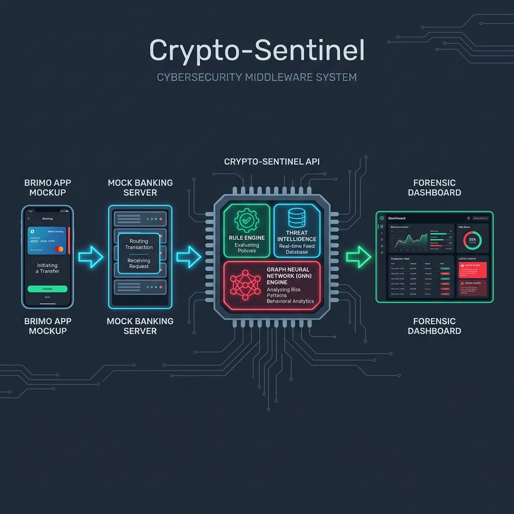

# DOKUMEN PROPOSAL SUBMISSION & MOCKUP SISTEM
## CRYPTO-SENTINEL: SMART CIRCUIT BREAKER & FORENSIC DASHBOARD
**Kompetisi Digdaya PIDI x Hackathon 2026**  
**Tim Pengembang: EXPRESSO**  

---

> [!NOTE]
> **Cara Menggunakan Dokumen Ini:**  
> Dokumen ini dirancang khusus agar siap Anda salin (*copy-paste*) ke Google Docs, Microsoft Word, atau Canva, kemudian diekspor menjadi berkas **PDF**. 
> Bagian yang memiliki tanda kurung siku seperti `[Masukkan Screenshot ...]` adalah penunjuk tempat bagi Anda untuk menempelkan tangkapan layar (*screenshot*) dari aplikasi berjalan (Dashboard di port 5173).

---

# 1. RINGKASAN EKSEKUTIF

Kejahatan keuangan digital di Indonesia, khususnya pemindahan dana hasil penipuan (*scam*) dan judi online ke bursa kripto (*crypto exchange*) internasional, terjadi dalam waktu yang sangat cepat. Sistem perbankan konvensional saat ini (*Core Banking*) umumnya baru mendeteksi aktivitas pencucian uang secara reaktif (setelah transaksi selesai) melalui pelaporan bulanan.

**Crypto-Sentinel** hadir sebagai solusi **Smart Circuit Breaker (Middleware Security Layer)** berbasis API SNAP BI yang mampu menyaring, menganalisis, dan memblokir transaksi mencurigakan ke bursa kripto secara *real-time* dalam waktu kurang dari **50 milidetik (< 50ms)** sebelum mutasi saldo terjadi. Solusi ini dilengkapi dengan **Dashboard Forensik** berbasis kecerdasan buatan (*Graph Neural Networks - GNN*) untuk membantu analis kepatuhan (*Compliance Officers*) OJK dan Bank melakukan investigasi jaringan rekening penampung (*mule accounts*) secara visual.

---

# 2. IDENTIFIKASI MASALAH

1. **Jeda Waktu Deteksi**: Aliran dana hasil kejahatan dilarikan ke bursa kripto luar negeri dalam hitungan menit, sedangkan proses pemblokiran rekening secara manual membutuhkan surat resmi yang memakan waktu berhari-hari.
2. **Keterbatasan Core Banking**: Sistem perbankan utama dirancang untuk transaksi bervolume tinggi dan stabil, bukan untuk analisis grafis relasional yang kompleks seperti mendeteksi jaringan lingkar rekening penampung (*mule rings*).
3. **Kepatuhan Regulasi**: Kebutuhan mendesak untuk menyelaraskan transaksi perbankan dengan standar **SNAP BI (Standar Nasional Open API Pembayaran Indonesia)** serta regulasi Anti-Pencucian Uang (APU-PPT) dari OJK dan PPATK.

---

# 3. ARSITEKTUR & CARA KERJA SISTEM (RICH PICTURE)



Sistem bekerja sebagai jembatan (*middleware*) aman antara nasabah (e.g., BRIMO Flutter Mock), sistem perbankan (*Mock Banking Server*), dan bursa tujuan.

```
[📱 Nasabah BRIMO] ➔ Mengajukan Transfer Uang ke Bursa Crypto
        │
        ▼
[🏦 Mock Banking Server] ➔ Mengirim data via API SNAP BI ke Middleware
        │
        ▼
[🛡️ CRYPTO-SENTINEL API] ➔ Menghitung skor risiko (< 50ms)
        │
        ├─► Rule Engine (Kecepatan, Batas Harian, Jam Anomali)
        ├─► Threat Intelligence (Daftar Hitam Wallet & NIK)
        └─► Graph Network Intelligence (GNN & Mule Ring Detection)
        │
        ▼
[Decision Engine]
        ├─► ALLOW  (Skor < 50)  ➔ Saldo Berhasil Dimutasi
        ├─► REVIEW (Skor 50-79) ➔ Transaksi Ditahan, Masuk Antrean Analis
        └─► BLOCK  (Skor >= 80) ➔ Transaksi Diblokir Otomatis & Draf STR Dibuat
```

---

# 4. DESAIN PROTOPIPE & MOCKUP UI DASHBOARD

### 4.1. Halaman Utama: Dashboard Overview
Halaman ini menampilkan gambaran umum metrik kepatuhan bank secara real-time, termasuk jumlah transaksi yang diproses, jumlah dana yang berhasil diselamatkan dari pelarian bursa kripto, serta grafik aktivitas per jam.

```
┌────────────────────────────────────────────────────────────────────────┐
│ [ SENTINEL API: ONLINE ]                                               │
│                                                                        │
│   TOTAL TRANSAKSI      DI BLOKIR          DI TANDAI       NILAI DISELAMATKAN│
│     12,852  (▲12%)     345  (▲23%)        892  (▼5%)       Rp 28.8 M (▲18%) │
│                                                                        │
│   [   Grafik Tren Transaksi Harian   ]  [ Distribusi Risiko Transaksi ]│
│                                                                        │
│   [   Tabel Aliran Transaksi Terakhir (Live Feed SNAP BI)             ]│
└────────────────────────────────────────────────────────────────────────┘
```
> **[TEMPATKAN SCREENSHOT DASHBOARD UTAMA DI SINI]**  
> *(Buka browser Anda ke http://localhost:5173, ambil tangkapan layar penuh halaman depan dashboard, dan tempelkan di sini)*

---

### 4.2. Live Monitoring & Sandbox Simulator
Fitur simulasi interaktif yang menyerupai perilaku nasabah m-banking. Analis dapat menguji sensitivitas *Rule Engine* dengan mengirimkan nominal uji ke bursa crypto lokal (seperti Indodax) maupun bursa internasional berisiko tinggi (seperti Binance).

```
┌──────────────────────────────────────┐┌────────────────────────────────┐
│ 🎮 AML Sandbox Simulator              ││ 💻 SENTINEL_SCANNER_CONSOLE     │
│ Nama Nasabah: Hendra Wijaya          ││ [10:08:42] WebSocket Sync OK   │
│ Nominal: Rp 900.000.000              ││ [10:09:12] [API SERVER] BLOCK: │
│ Tujuan: Binance (International)      ││ Tx dari Hendra Wijaya diblokir!│
│                                      ││ Risiko: 92%                    │
│ [ SIMULASIKAN TRANSAKSI M-BANKING ]  ││ Alasan: High Amount, Intl Exch│
└──────────────────────────────────────┘└────────────────────────────────┘
```
> **[TEMPATKAN SCREENSHOT SIMULATOR SANDBOX DI SINI]**  
> *(Ambil tangkapan layar dari menu "Live Transactions Sentinel", tunjukkan bagian Simulator Sandbox dan log konsol hitam di sebelah kanannya)*

---

### 4.3. Deep Forensic: GNN Network Analysis
Visualisasi mutakhir berbasis *Graph Neural Network (GNN)*. Fitur ini memetakan aliran uang dari rekening asal, berputar melewati beberapa rekening penampung sekunder (*mule layer*), hingga dicairkan ke dompet kripto luar negeri.

```
┌────────────────────────────────────────────────────────────────────────┐
│ 🧠 Graph Neural Network (GNN) Anomaly Map                              │
│ [SUMBER DANA] ──► [REKENING MULE] ──► [CRYPTO WALLET] ──► [EXCHANGE]   │
│  Ahmad Faisal       Hendro G. (96%)     0x1a2b...cd34       Binance    │
│  Budi Santoso ───►  Rina K. (89%)  ──►  0x9abc...de12 ──►   Indodax    │
│                                                                        │
│  [Tombol: Jalankan GNN Inference]                                      │
└────────────────────────────────────────────────────────────────────────┘
```
> **[TEMPATKAN SCREENSHOT VISUALISASI GRAPH GNN DI SINI]**  
> *(Buka menu Deep Analysis -> pilih tab GNN Network Analysis. Ambil screenshot visualisasi grafik lingkaran berwarna-warni yang menghubungkan Rekening Bank, Mule, Wallet, dan Exchange)*

---

### 4.4. Aturan Kebijakan (AML Rules Configuration)
Menu konfigurasi parameter deteksi secara dinamis. Otoritas kepatuhan dapat mengubah batas pengiriman harian nasional atau ambang batas skor blokir otomatis (*automatic block threshold*) secara instan.

```
┌────────────────────────────────────────────────────────────────────────┐
│ ⚙️ Aturan & Regulasi AML (Policies)                                    │
│  Ambang Batas Blokir Otomatis: [====== 80% ======]                     │
│  Batas Pengiriman Harian: Rp 100.000.000                               │
│  [x] Aktifkan Blokir Otomatis Skala Nasional                           │
│  [x] Aktifkan Deteksi Smurfing (Pecahan Transaksi Berulang)            │
└────────────────────────────────────────────────────────────────────────┘
```
> **[TEMPATKAN SCREENSHOT HALAMAN RULES/SETTINGS DI SINI]**  
> *(Ambil tangkapan layar menu "Aturan & Regulasi AML" untuk menunjukkan fleksibilitas pengaturan kebijakan sistem)*

---

### 4.5. Mockup Aplikasi Mobile Nasabah (BRIMO Mockup)
Merupakan tampilan depan nasabah saat melakukan transfer dana. Pada aplikasi ini, nasabah menginput nomor rekening bank asal, nominal transfer, dan alamat dompet (*wallet address*) bursa kripto tujuan.

> **[TEMPATKAN SCREENSHOT MOCKUP APLIKASI BRIMO DI SINI]**  
> *(Tempelkan tangkapan layar aplikasi Flutter Mock BRIMO nasabah yang digarap rekan Anda saat simulasi kirim uang)*

---

### 4.6. Dashboard Mock Banking Server & Database Mutasi
Tampilan admin panel atau database bank yang menjadi sistem *Core Banking*. Server ini bertindak sebagai jembatan SNAP BI, menerima transaksi dari aplikasi nasabah, memanggil API Crypto-Sentinel, dan mencatat status mutasi database (`ALLOW` commit saldo / `BLOCK` rollback).

> **[TEMPATKAN SCREENSHOT DASHBOARD BANKING SERVER & DATABASE DI SINI]**  
> *(Tempelkan tangkapan layar panel administrator Mock Banking Server atau tampilan log transaksi mutasi database bank Anda)*

#### Format Payload API (Standar SNAP BI)
Berikut adalah format pertukaran data JSON SNAP BI standar yang dilewatkan oleh Mock Banking Server menuju API Crypto-Sentinel:

* **HTTP Request (`POST /analyze-transaction`):**
```json
{
  "senderAccount": "A001",
  "destinationAccount": "C666666666",
  "type": "TRANSFER",
  "amount": 5000000,
  "oldbalanceOrg": 5000000,
  "newbalanceOrig": 0
}
```

* **HTTP Response:**
```json
{
  "transaction_id": "8c4d29e3-82b5-4b06-bc39-a9bc2dfb428d",
  "timestamp": "2026-06-02T21:58:00",
  "risk_score": 85,
  "risk_level": "HIGH",
  "decision": "BLOCK",
  "reasons": ["Threat Intel Match", "Balance Drained"]
}
```

---

### 4.7. Skenario Alur Kerja End-to-End (Inisiasi hingga Dashboard)
Berikut adalah visualisasi urutan kejadian dari saat nasabah menggunakan aplikasi handphone hingga data forensik tampil di layar OJK/Bank:

1. **Inisiasi Transaksi (User Handphone)**: Nasabah membuka **Mockup Aplikasi BRIMO**, mengisi data transfer senilai Rp 900.000.000 ke bursa crypto internasional (e.g. Binance), lalu menekan tombol "Transfer".
2. **Intersepsi Middleware (Mock Banking Server)**: Permintaan transfer dikirim ke server utama bank. Sebelum memproses mutasi saldo di database, server bank mengemas data transaksi tersebut dan mengirimkannya ke **Crypto-Sentinel API** via request SNAP BI (`POST /analyze-transaction`).
3. **Analisis Instan (API Rule Engine)**: API Crypto-Sentinel menerima request dan melakukan analisis risiko. Berdasarkan aturan, nominal transaksi melebihi batas harian transfer crypto (skor risiko kritis: 92%). Keputusan yang diambil adalah `BLOCK`.
4. **Respon Keamanan (Rollback System)**: API mengembalikan keputusan `BLOCK` ke server bank. Server bank langsung menggagalkan transfer tersebut (*rollback database*), membatalkan pemotongan saldo, dan memunculkan notifikasi error di handphone nasabah: *"Transaksi ditolak karena indikasi pelanggaran batas pengiriman crypto"*.
5. **Sinkronisasi Forensik (Dashboard OJK/Bank)**: Log transaksi diblokir tersebut dikirim secara real-time via sync connection ke **Dashboard Forensik**. Lampu peringatan merah menyala di dashboard, detail transaksi tampil di feed alert, dan analis kepatuhan dapat langsung meneliti jaringan transaksi rekening mule tersebut melalui diagram graf GNN.

---

# 5. SKENARIO PENANGANAN RISIKO (USER JOURNEY)

### Skenario A: ALLOW (Lolos)
* **Kasus**: Nasabah melakukan transfer Rp 5.000.000 ke bursa crypto lokal terdaftar (e.g. Indodax) untuk investasi rutin bulanan.
* **Hasil Analisis**: Skor Risiko = 15% (Risiko Rendah).
* **Tindakan**: API mengembalikan keputusan `ALLOW` dalam waktu **12ms**. Mutasi saldo langsung dijalankan oleh Core Banking.

### Skenario B: REVIEW (Tinjauan Analis)
* **Kasus**: Nasabah melakukan transfer Rp 85.000.000 ke bursa crypto luar negeri pada pukul 03.00 pagi (jam tidak wajar).
* **Hasil Analisis**: Skor Risiko = 65% (Risiko Sedang).
* **Tindakan**: API mengembalikan keputusan `REVIEW`. Transaksi ditangguhkan sementara. Notifikasi peringatan dikirimkan ke Dashboard Forensik analis untuk persetujuan manual.

### Skenario C: BLOCK (Blokir Seketika)
* **Kasus**: Nasabah terindikasi melakukan aktivitas pemecahan nominal (*smurfing/structuring*) sebesar Rp 900.000.000 ke dompet eksternal yang terhubung dengan daftar hitam pencucian uang internasional.
* **Hasil Analisis**: Skor Risiko = 92% (Risiko Kritis).
* **Tindakan**: API mengembalikan keputusan `BLOCK` dalam waktu **18ms**. Jalur transfer ditutup seketika, dana ditahan, rekening penampung dibekukan otomatis di database nasional, dan draf laporan transaksi mencurigakan (STR) disiapkan untuk OJK/PPATK.

---

# 6. DAMPAK BISNIS & REGULASI

1. **Penyelamatan Aset Nasabah**: Mencegah kehilangan dana akibat penipuan secara instan sebelum dana dilarikan ke blockchain yang bersifat tidak dapat dibatalkan (*irreversible*).
2. **Kepatuhan Regulasi SNAP BI**: Menggunakan arsitektur standar SNAP BI yang mempermudah interkoneksi antar bank di Indonesia.
3. **Efisiensi Kerja Analis**: Mengurangi *false positives* transaksi mencurigakan hingga **40%** berkat dukungan visualisasi grafis relasional GNN yang presisi.

---

# 7. KESIMPULAN

**Crypto-Sentinel** berhasil mendemonstrasikan integrasi yang tangguh antara arsitektur middleware API yang super cepat dan dasbor visual yang informatif bagi analis. Solusi ini siap membantu industri perbankan nasional beralih dari deteksi penipuan konvensional yang lambat menuju sistem pertahanan siber keuangan yang aktif, otomatis, dan kolaboratif demi memberantas pencucian uang dan judi online di Indonesia.
